# BandFuzz: Collaborative Fuzzing Framework

## Overview

BandFuzz is a collaborative fuzzing framework designed for large-scale parallel fuzzing campaigns, originally developed at Northwestern University. It uses reinforcement learning to dynamically schedule fuzzing strategies for adaptive and efficient fuzzing of real-world targets.

## Key Features from Paper vs. AIxCC Implementation

### Academic Paper Claims
- **Collaborative Fuzzing**: Multiple fuzzer instances work together sharing seeds and discoveries
- **Reinforcement Learning**: Dynamic scheduling using multi-armed bandits with Thompson Sampling
- **Large-scale Support**: Designed for real-world targets including Google OSS-Fuzz
- **Adaptive Strategy Selection**: Intelligently coordinates the use of multiple fuzzers

### AIxCC Implementation Reality
**Note**: The current AIxCC implementation does **NOT** include the sophisticated RL/multi-armed bandit algorithm described in the academic paper. Instead, it uses a simplified factor-based scheduling system with static weights and basic heuristics. The Thompson Sampling, Beta distributions, reward learning, and bandit parameter updates are absent from this codebase.

## Implementation Architecture

### Core Components

#### Main Entry Point
- **Location**: [cmd/b3fuzz/main.go](../components/bandfuzz/cmd/b3fuzz/main.go)
- Uses dependency injection framework (go.uber.org/fx) to wire components
- Sets up ASLR configuration (`vm.mmap_rnd_bits=28`) for ASAN compatibility
- Integrates PostgreSQL, RabbitMQ, Redis, and OpenTelemetry for telemetry

#### Fuzzlet Concept
- **Location**: [internal/types/fuzzlet.go](../components/bandfuzz/internal/types/fuzzlet.go#L4-L10)
- Core abstraction: small, self-contained fuzzing unit
- Contains: `TaskId`, `Harness`, `Sanitizer`, `FuzzEngine`, `ArtifactPath`
- Represents a single fuzzing job targeting a specific harness with specific configuration

#### Scheduler System
- **Main Logic**: [internal/scheduler/scheduler.go](../components/bandfuzz/internal/scheduler/scheduler.go)
- **Picker Logic**: [internal/scheduler/pick.go](../components/bandfuzz/internal/scheduler/pick.go)
- **Scoring Factors**: [internal/scheduler/simpleFactors.go](../components/bandfuzz/internal/scheduler/simpleFactors.go)

**Scheduling Algorithm**:
1. Retrieves available fuzzlets from Redis
2. Uses factor-based scoring system to prioritize fuzzlets
3. Currently implements two factors:
   - **TaskFactor**: Balances load across different tasks
     - Groups fuzzlets by `TaskId`
     - Assigns score = `1/number_of_fuzzlets_in_same_task`
     - Ensures fair distribution across tasks regardless of task size
   - **SanitizerFactor**: Prioritizes different sanitizers
     - AddressSanitizer (`"address"`): score = 5
     - UndefinedBehaviorSanitizer (`"undefined"`): score = 1
     - MemorySanitizer (`"memory"`): score = 1
     - Default/others: score = 1
     - Heavily favors ASAN for vulnerability detection
4. Combines weighted scores (both factors weighted at 1.0) and uses probabilistic selection
5. Runs fuzzing with configurable timeout intervals

#### Seed Management System
- **Main Implementation**: [internal/seeds/seeds.go](../components/bandfuzz/internal/seeds/seeds.go)
- **Architecture**: Fan-in pattern with batched processing
- **Storage Location**: `/crs/b3fuzz/seeds/` directory

**Seed Processing Pipeline**:
1. **Collection**: Gathers seeds from multiple fuzzer instances via channels
2. **Batching**: Groups seeds by (TaskID, Harness) pairs
   - Batch size: 1024 seeds or 1-minute intervals
   - Prevents overwhelming downstream components
3. **Bundling**: For each (TaskID, Harness) group:
   - Creates temporary directory with UUID-renamed seed files
   - Compresses into `.tar.gz` bundle: `{harness}-{uuid}.tar.gz`
   - Stores in shared seed directory
4. **Distribution**:
   - Publishes `CminMessage` to `cmin_queue` (RabbitMQ) for corpus minimization
   - Saves seed metadata to database with `GeneralFuzz` type
5. **Concurrency**: Processes multiple harness groups in parallel with goroutines

#### AFL++ Integration
- **Main Implementation**: [internal/fuzz/aflpp/aflpp.go](../components/bandfuzz/internal/fuzz/aflpp/aflpp.go)
- Supports multiple AFL++ fuzzing modes: `afl`, `aflpp`, `directed`
- **Multi-core Orchestration**: Runs one master instance + (core_count-1) slave instances
- **Local Optimization**: Copies harness binaries to local temp directories for reduced I/O latency
- **Crash/Seed Monitoring**: Uses file system watchers to detect new crashes and seeds

#### Corpus Management
- **Interface**: [internal/corpus/corpus.go](../components/bandfuzz/internal/corpus/corpus.go)
- Multiple seed grabbing strategies:
  - CminSeedGrabber: Corpus minimization
  - RandomSeedGrabber: Random seed selection
  - DBSeedGrabber: Database-backed seeds
  - LibCminCorpusGrabber: Library-based corpus minimization

#### Fuzz Runner
- **Location**: [internal/fuzz/fuzz.go](../components/bandfuzz/internal/fuzz/fuzz.go#L71-L152)
- Orchestrates fuzzing execution with telemetry
- Manages crash and seed routing to appropriate managers
- Handles timeout and context management
- Stores task metadata and trace context in Redis

### Configuration
- **Location**: [config/config.go](../components/bandfuzz/config/config.go)
- Environment-based configuration for database, message queue, Redis connections
- Scheduler configuration: interval timing and batch sizes
- Core count for parallel fuzzing instances

## Deployment Integration

The implementation is integrated into the larger CRS system through Kubernetes deployment:
- **Chart Location**: [deployment/crs-k8s/b3yond-crs/charts/bandfuzz/](../deployment/crs-k8s/b3yond-crs/charts/bandfuzz/)
- Configured through values files for different environments (dev/test/prod)

## Evolution Timeline

- **2022**: Initial development at Northwestern University
- **2023**: First place at SBFT Fuzzing Competition (ICSE 2023)
- **2024**: Optimizations for DARPA AIxCC competition
- **2025**: Production-ready framework for AIxCC finals

## Implementation vs Paper Concepts

**Current Implementation Status**:
- ✅ Multi-fuzzer orchestration (AFL++ master/slave)
- ✅ Factor-based scheduling system foundation
- ✅ Corpus sharing and management
- ✅ Telemetry and monitoring integration
- ⚠️ **Reinforcement Learning**: Current implementation uses simple weighted factor scoring rather than full RL algorithms
- ⚠️ **Dynamic Strategy Adaptation**: Limited to basic factor weights, not dynamic learning

**Key Insight**: The current implementation appears to be a production-ready foundation that implements the core collaborative fuzzing concepts but may not fully implement the sophisticated reinforcement learning aspects described in the research paper. The factor-based scoring system provides a framework that could be extended with RL algorithms.

## BandFuzz Collaborative Fuzzing Workflow

```mermaid
graph TB
    %% Input
    INPUT["INPUT<br/>━━━━━━━━━━━━━━━━━━━━━━━━━━━━<br/>• System Startup<br/>• Environment Configuration<br/>• Database/Redis/RabbitMQ URLs<br/>• Core count for parallelization<br/>• Compiled fuzzlets in Redis"]

    %% Stage 1: Initialization
    subgraph S1["STAGE 1: SYSTEM INITIALIZATION"]
        direction TB

        subgraph "Dependency Injection (main.go:35-49)"
            DI_CONFIG["Config Loading<br/>(config.go)"]
            DI_DB["Database Connection<br/>PostgreSQL"]
            DI_REDIS["Redis Client<br/>Task metadata storage"]
            DI_MQ["RabbitMQ Service<br/>Message queuing"]
            DI_TELEMETRY["OpenTelemetry<br/>Distributed tracing"]
        end

        subgraph "Core Components"
            DI_FUZZ["FuzzRunner<br/>(fuzz.go)"]
            DI_CRASH["CrashManager<br/>Crash handling"]
            DI_SEEDS["SeedManager<br/>Corpus management"]
            DI_DICT["DictGrabber<br/>Dictionary management"]
        end

        subgraph "Fuzzer Modules"
            AFL_MODULE["AFL++ Module<br/>(aflpp.go)"]
            CORPUS_MODULE["Corpus Grabbers<br/>Multiple strategies"]
        end

        SETUP_ASLR["Setup ASLR<br/>vm.mmap_rnd_bits=28<br/>(main.go:25-32)"]

        DI_CONFIG --> DI_DB
        DI_DB --> DI_REDIS
        DI_REDIS --> DI_MQ
        DI_MQ --> DI_TELEMETRY
        DI_TELEMETRY --> DI_FUZZ
        DI_FUZZ --> DI_CRASH
        DI_CRASH --> DI_SEEDS
        DI_SEEDS --> DI_DICT
        DI_DICT --> AFL_MODULE
        AFL_MODULE --> CORPUS_MODULE
        CORPUS_MODULE --> SETUP_ASLR
    end

    OUT1["OUTPUT → STAGE 2<br/>━━━━━━━━━━━━━━━━━━━━━━━━━━━━<br/>• All components initialized<br/>• Scheduler ready to start<br/>• AFL++ fuzzer registered"]

    %% Stage 2: Scheduler Loop
    subgraph S2["STAGE 2: SCHEDULING LOOP"]
        direction TB

        SCHEDULER_START["Scheduler Start<br/>(scheduler.go:60-77)"]

        subgraph "Epoch Execution"
            STEP_EPOCH["stepEpoch()<br/>(scheduler.go:80-93)"]
            GET_FUZZLETS["getFuzzlets()<br/>Retrieve from Redis"]
            CHECK_AVAILABLE{"Fuzzlets Available?"}
        end

        subgraph "Fuzzlet Selection"
            PICKER["Picker.pick()<br/>(pick.go:29-59)"]

            subgraph "Factor Scoring"
                TASK_FACTOR["TaskFactor<br/>1/count per task<br/>(simpleFactors.go:11-31)"]
                SANITIZER_FACTOR["SanitizerFactor<br/>ASAN=5, others=1<br/>(simpleFactors.go:37-52)"]
                COMBINE_SCORES["Combine Weighted Scores<br/>Normalize probabilities"]
            end

            PROBABILISTIC["Probabilistic Selection<br/>Random sampling"]
        end

        SCHEDULER_START --> STEP_EPOCH
        STEP_EPOCH --> GET_FUZZLETS
        GET_FUZZLETS --> CHECK_AVAILABLE
        CHECK_AVAILABLE -->|no| WAIT_RETRY["Wait & Retry<br/>10 second delay"]
        CHECK_AVAILABLE -->|yes| PICKER
        PICKER --> TASK_FACTOR
        TASK_FACTOR --> SANITIZER_FACTOR
        SANITIZER_FACTOR --> COMBINE_SCORES
        COMBINE_SCORES --> PROBABILISTIC
        WAIT_RETRY --> STEP_EPOCH
    end

    OUT2["OUTPUT → STAGE 3<br/>━━━━━━━━━━━━━━━━━━━━━━━━━━━━<br/>• Selected fuzzlet<br/>• Timeout duration<br/>• Ready for fuzzing"]

    %% Stage 3: Fuzzing Execution
    subgraph S3["STAGE 3: FUZZING EXECUTION"]
        direction TB

        FUZZ_RUNNER["FuzzRunner.RunFuzz()<br/>(fuzz.go:71-152)"]

        subgraph "Metadata & Context"
            GET_METADATA["Get Task Metadata<br/>From Redis<br/>(fuzz.go:84-93)"]
            GET_TRACE["Get Trace Context<br/>Build/Task spans<br/>(fuzz.go:95-104)"]
            TELEMETRY_SPAN["Create Fuzzing Span<br/>OpenTelemetry tracing<br/>(fuzz.go:106-114)"]
        end

        subgraph "Fuzzer Dispatch"
            FIND_FUZZER["Find Fuzzer<br/>By engine type<br/>(fuzz.go:120-124)"]
            CALL_FUZZER["Call Fuzzer.RunFuzz()<br/>Engine-specific logic"]
        end

        FUZZ_RUNNER --> GET_METADATA
        GET_METADATA --> GET_TRACE
        GET_TRACE --> TELEMETRY_SPAN
        TELEMETRY_SPAN --> FIND_FUZZER
        FIND_FUZZER --> CALL_FUZZER
    end

    OUT3["OUTPUT → STAGE 4<br/>━━━━━━━━━━━━━━━━━━━━━━━━━━━━<br/>• Fuzzing context established<br/>• Telemetry tracking active<br/>• AFL++ fuzzer selected"]

    %% Stage 4: AFL++ Fuzzing Process
    subgraph S4["STAGE 4: AFL++ PARALLEL FUZZING"]
        direction TB

        AFL_INIT["AFL Fuzzer Initialize<br/>(aflpp.go:69-181)"]

        subgraph "Environment Setup"
            PREPARE_HARNESS["Prepare Local Harness<br/>Copy to temp dir<br/>(aflpp.go:82-86)"]
            PREPARE_DIRS["Prepare Directories<br/>Seeds & output folders<br/>(aflpp.go:89-93)"]
            COLLECT_CORPUS["Collect Existing Corpus<br/>CorpusGrabber<br/>(aflpp.go:97-99)"]
            GRAB_DICT["Grab Dictionary<br/>DictGrabber<br/>(aflpp.go:102-106)"]
        end

        subgraph "Multi-Core Orchestration"
            MASTER_AFL["Master AFL Instance<br/>Primary coordinator<br/>(aflpp.go:119-135)"]
            SLAVE_AFL["Slave AFL Instances<br/>(core_count-1) workers<br/>(aflpp.go:138-156)"]
            PARALLEL_EXEC["Parallel Execution<br/>WaitGroup coordination"]
        end

        subgraph "Monitoring & Feedback"
            CRASH_MONITOR["Crash File Monitor<br/>Watchdog + proxy<br/>(aflpp.go:158-161)"]
            SEED_MONITOR["Seed Queue Monitor<br/>New coverage findings<br/>(aflpp.go:162-165)"]
            TELEMETRY_EVENTS["Telemetry Events<br/>First PoV, coverage<br/>(aflpp.go:200-218)"]
        end

        AFL_INIT --> PREPARE_HARNESS
        PREPARE_HARNESS --> PREPARE_DIRS
        PREPARE_DIRS --> COLLECT_CORPUS
        COLLECT_CORPUS --> GRAB_DICT
        GRAB_DICT --> MASTER_AFL
        MASTER_AFL --> SLAVE_AFL
        SLAVE_AFL --> PARALLEL_EXEC
        PARALLEL_EXEC --> CRASH_MONITOR
        CRASH_MONITOR --> SEED_MONITOR
        SEED_MONITOR --> TELEMETRY_EVENTS
    end

    OUT4["OUTPUT → STAGE 5<br/>━━━━━━━━━━━━━━━━━━━━━━━━━━━━<br/>• Multi-core AFL++ execution<br/>• Real-time crash/seed monitoring<br/>• Telemetry data collection"]

    %% Stage 5: Result Processing
    subgraph S5["STAGE 5: RESULT PROCESSING & FEEDBACK"]
        direction TB

        subgraph "Crash Processing"
            CRASH_PROXY["Crash Proxy<br/>(aflpp.go:200-218)"]
            CRASH_MSG["CrashMessage Creation<br/>File + fuzzlet metadata"]
            CRASH_MANAGER["CrashManager.RegisterCrashChan<br/>(fuzz.go:138)"]
            FIRST_POV["First PoV Event<br/>Telemetry milestone"]
        end

        subgraph "Seed Processing"
            SEED_PROXY["Seed Proxy<br/>(aflpp.go:225-233)"]
            SEED_MSG["SeedMessage Creation<br/>New corpus entries"]
            SEED_MANAGER["SeedManager.RegisterSeedChan<br/>(fuzz.go:146)"]
        end

        subgraph "Corpus Sharing"
            CORPUS_UPDATE["Update Shared Corpus<br/>Cross-harness sharing"]
            CMIN_PROCESS["Corpus Minimization<br/>Reduce redundancy"]
            DB_STORAGE["Database Storage<br/>Persistent corpus"]
        end

        CRASH_PROXY --> CRASH_MSG
        CRASH_MSG --> CRASH_MANAGER
        CRASH_MANAGER --> FIRST_POV
        SEED_PROXY --> SEED_MSG
        SEED_MSG --> SEED_MANAGER
        SEED_MANAGER --> CORPUS_UPDATE
        CORPUS_UPDATE --> CMIN_PROCESS
        CMIN_PROCESS --> DB_STORAGE
    end

    OUT5["OUTPUT → STAGE 6<br/>━━━━━━━━━━━━━━━━━━━━━━━━━━━━<br/>• Crashes processed and stored<br/>• New seeds added to corpus<br/>• Collaborative data updated"]

    %% Stage 6: Completion & Loop
    subgraph S6["STAGE 6: COMPLETION & CONTINUOUS LOOP"]
        direction TB

        FUZZING_COMPLETE["Fuzzing Timeout Reached<br/>Graceful shutdown"]
        TELEMETRY_END["End Telemetry Span<br/>Record metrics"]
        SCHEDULER_CONTINUE["Scheduler Continues<br/>Next epoch selection"]

        subgraph "Adaptive Elements"
            PERFORMANCE_DATA["Collect Performance Data<br/>Coverage, crashes, time"]
            FACTOR_WEIGHTS["Factor Weight Updates<br/>(Future RL integration)"]
            STRATEGY_ADAPT["Strategy Adaptation<br/>(Future enhancement)"]
        end

        FUZZING_COMPLETE --> TELEMETRY_END
        TELEMETRY_END --> PERFORMANCE_DATA
        PERFORMANCE_DATA --> FACTOR_WEIGHTS
        FACTOR_WEIGHTS --> STRATEGY_ADAPT
        STRATEGY_ADAPT --> SCHEDULER_CONTINUE
    end

    FINAL_OUT["CONTINUOUS OUTPUT<br/>━━━━━━━━━━━━━━━━━━━━━━━━━━━━<br/>• Ongoing collaborative fuzzing<br/>• Shared corpus evolution<br/>• Distributed crash discovery<br/>• Telemetry-driven optimization<br/>• Multi-harness coordination"]

    %% Main flow connections
    INPUT --> S1
    S1 --> OUT1
    OUT1 --> S2
    S2 --> OUT2
    OUT2 --> S3
    S3 --> OUT3
    OUT3 --> S4
    S4 --> OUT4
    OUT4 --> S5
    S5 --> OUT5
    OUT5 --> S6
    S6 --> FINAL_OUT

    %% Loop back for continuous operation
    SCHEDULER_CONTINUE --> S2

    %% Styling
    classDef inputOutput fill:#e1f5fe,stroke:#01579b,stroke-width:3px,color:#000
    classDef stage fill:#fff8e1,stroke:#f57f17,stroke-width:2px
    classDef init fill:#e8f5e9,stroke:#388e3c,stroke-width:2px
    classDef scheduling fill:#f3e5f5,stroke:#7b1fa2,stroke-width:2px
    classDef fuzzing fill:#fff3e0,stroke:#ef6c00,stroke-width:2px
    classDef afl fill:#ffebee,stroke:#c62828,stroke-width:2px
    classDef processing fill:#fce4ec,stroke:#c2185b,stroke-width:2px
    classDef continuous fill:#e0f2f1,stroke:#00695c,stroke-width:2px
    classDef adaptive fill:#eceff1,stroke:#455a64,stroke-width:2px,stroke-dasharray: 5 5

    class INPUT,OUT1,OUT2,OUT3,OUT4,OUT5,FINAL_OUT inputOutput
    class S1,S2,S3,S4,S5,S6 stage
    class DI_CONFIG,DI_DB,DI_REDIS,DI_MQ,SETUP_ASLR init
    class PICKER,TASK_FACTOR,SANITIZER_FACTOR,PROBABILISTIC scheduling
    class FUZZ_RUNNER,GET_METADATA,GET_TRACE,TELEMETRY_SPAN fuzzing
    class AFL_INIT,MASTER_AFL,SLAVE_AFL,CRASH_MONITOR,SEED_MONITOR afl
    class CRASH_PROXY,SEED_PROXY,CORPUS_UPDATE,DB_STORAGE processing
    class SCHEDULER_CONTINUE,FUZZING_COMPLETE continuous
    class FACTOR_WEIGHTS,STRATEGY_ADAPT,PERFORMANCE_DATA adaptive
```

