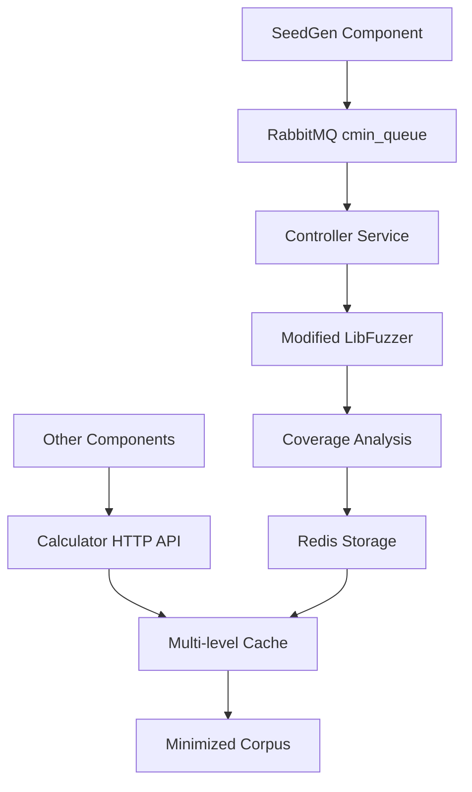

# CMinPlusPlus Component Analysis

The **cminplusplus** component implements a **corpus minimization service** for fuzzing in the CRS. Its primary purpose is to minimize fuzzing corpora by identifying the minimal set of input files that achieve the same code coverage as a larger corpus.

## Purpose and Functionality

- **Minimize fuzzing corpora** by identifying the minimal set of input files that achieve the same code coverage as a larger corpus
- **Extract coverage features** from fuzzing inputs to enable efficient corpus reduction
- **Provide fast access** to minimized corpora through a distributed caching system
- **Support the fuzzing pipeline** by reducing storage overhead and improving fuzzing efficiency

## Architecture Overview

The component follows a **distributed microservices architecture** with two main services working together:

### 1. Controller Service

**Location**: [`components/cminplusplus/controller`](../components/cminplusplus/controller)

Message queue consumer that processes corpus minimization requests:

**Core Files**:
- **[`app.py`](../components/cminplusplus/controller/app.py#L14)**: Main entry point, sets up message queue consumption and Redis connections
- **[`tasks.py`](../components/cminplusplus/controller/tasks.py#L70)**: Core task processing logic with `on_message_wrapper()` function
- **[`executor.py`](../components/cminplusplus/controller/executor.py#L4)**: Async subprocess execution utilities
- **[`mq.py`](../components/cminplusplus/controller/mq.py#L5)**: RabbitMQ message queue wrapper using aio_pika

**Key Implementation**:
- Consumes from `cmin_queue` RabbitMQ queue
- Processes messages containing `{task_id, harness, seeds}`
- Uses modified LibFuzzer with [`-generate_hash=1` flag](../components/cminplusplus/controller/tasks.py#L155) for coverage analysis
- Extracts seed files from tar.gz archives and runs coverage analysis
- Stores results in Redis with keys like `clustercmin:file:{task_id}:{harness}:{feature}`

### 2. Calculator Service

**Location**: [`components/cminplusplus/calculator`](../components/cminplusplus/calculator)

HTTP API service that provides fast access to minimized corpora:

**Core Files**:
- **[`app.py`](../components/cminplusplus/calculator/app.py#L12)**: aiohttp web server with `/cmin/{task}/{harness}` endpoint
- **[`cmin.py`](../components/cminplusplus/calculator/cmin.py#L13)**: Core business logic with multi-level caching
- **[`rio.py`](../components/cminplusplus/calculator/rio.py#L3)**: Redis abstraction layer with sentinel support

**Key Features**:
- **Multi-level caching strategy**:
  - L1: In-memory local cache with configurable timeout
  - L2: Redis distributed cache
- **Async processing** with future-based deduplication to prevent concurrent processing of same requests
- **Tar.gz generation** of minimized corpora on-demand
- **File caching** in `/seedcache` directory for performance

## LibFuzzer Integration

### Modified LibFuzzer

**Location**: [`components/cminplusplus/libfuzzer`](../components/cminplusplus/libfuzzer)

Custom LLVM LibFuzzer modifications for coverage-based corpus minimization:

**Key Modifications**:
- **[`FuzzerDriver.cpp#L885-932`](../components/cminplusplus/libfuzzer/FuzzerDriver.cpp#L885)**: Added `generate_hash` mode for coverage analysis
- **[`FuzzerFlags.def#L214`](../components/cminplusplus/libfuzzer/FuzzerFlags.def#L214)**: New `generate_hash` flag
- **Custom output format**: `clustercmin:{feature}:{filename}` for parsing by controller

### Coverage Analysis Process

```python
# Workflow:
# 1. Loads corpus from input directory
# 2. Runs each input through F->RunAndHash() to extract coverage features
# 3. Maps unique features to the first file that triggers them
# 4. Outputs minimal file set that covers all unique features
```

## Integration with CRS Pipeline

### Message Flow Integration



**Upstream**: [SeedGen component](../components/seedgen/task_handler.py#L345) sends tasks to `cmin_queue`:

```python
def send_to_cmin_queue(connection, task, harness_name, seed_path):
    message = json.dumps({
        "task_id": task.task_id,
        "harness": harness_name,
        "seeds": seed_path
    })
```

**Downstream**: Other components query calculator service via HTTP:
- Endpoint: `GET /cmin/{task}/{harness}`
- Returns: Path to minimized corpus tar.gz file

## Redis Key Schema

```bash
clustercmin:features:{task_id}:{harness}        # Set of coverage features
clustercmin:file:{task_id}:{harness}:{feature}  # Feature -> filename mapping
clustercmin:file:{task_id}:{harness}            # Cache key for tar.gz path
clustercmin:future:{task_id}:{harness}          # Async processing deduplication
```

## Configuration and Environment

### Environment Variables

```bash
CMIN_QUEUE                # RabbitMQ queue name
REDIS_SENTINEL_HOSTS      # Redis cluster configuration
SHARED_STORAGE_PREFIX     # Shared file system mount
SEED_STORAGE_PREFIX       # Seed archive location
CACHE_TIMEOUT            # Cache expiration time
```

### Deployment Configuration

**Kubernetes Deployment**: [`deployment/crs-k8s/b3yond-crs/charts/libcmin`](../deployment/crs-k8s/b3yond-crs/charts/libcmin)

- **Controller**: Consumes from RabbitMQ queue `cmin_queue`
- **Calculator**: Exposes HTTP service as `b3yond-libcmin`

## Performance Optimizations

### Multi-level Caching Strategy

1. **L1 Cache**: In-memory local cache with configurable timeout
2. **L2 Cache**: Redis distributed cache for cluster-wide sharing
3. **File Cache**: Local `/seedcache` directory for frequently accessed files

### Async Processing Features

- **Future-based deduplication**: Prevents redundant processing of same requests
- **Pipeline operations**: Redis operations batched to reduce network overhead
- **Compression level 0**: Tar.gz prioritizes speed over size
- **Concurrent execution**: asyncio for parallel processing

## Error Handling and Resilience

```python
# Key resilience features:
# - Requeuing strategy: Failed tasks are requeued with delay
# - Timeout handling: 600-second timeout for fuzzer execution
# - Signal recovery: Uses sigsetjmp() for crash recovery during fuzzing
# - Cache expiration: Configurable cache timeout via CACHE_TIMEOUT
```

## Technologies and Dependencies

### Core Technologies

- **Python 3** with asyncio for async processing
- **aiohttp** for HTTP server (calculator)
- **aio_pika** for RabbitMQ integration (controller)
- **redis.asyncio** for Redis integration
- **Modified LLVM LibFuzzer** for coverage analysis

### Infrastructure

- **RabbitMQ** for message queuing
- **Redis Sentinel** for distributed caching
- **Docker containers** for deployment
- **Kubernetes** for orchestration

## Key Technical Features

### Coverage-Based Minimization

The component uses LibFuzzer's coverage instrumentation to:
1. **Extract unique coverage features** from each input file
2. **Map features to files** that first trigger them
3. **Generate minimal set** that covers all unique features
4. **Cache results** for fast subsequent access

### Distributed Architecture Benefits

- **Scalability**: Controller and calculator can scale independently
- **Performance**: Multi-level caching reduces computation overhead
- **Reliability**: Redis sentinel provides high availability
- **Efficiency**: Async processing maximizes resource utilization

This cminplusplus component represents a sophisticated approach to corpus minimization that balances processing efficiency, storage optimization, and fast query response times through its distributed architecture and multi-level caching strategy.