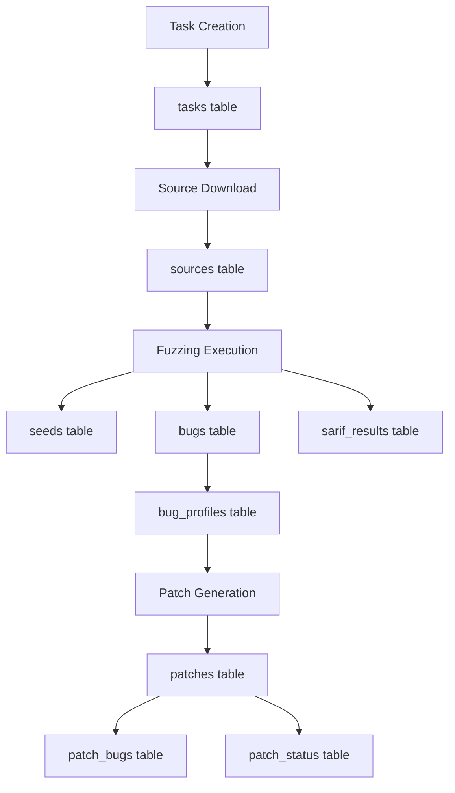

# DB Component Analysis

The **db component** provides the **centralized database schema** and initialization for the entire CRS system. It defines the complete data model for tracking cybersecurity tasks, fuzzing results, bugs, patches, and system state.

## Purpose and Functionality

- **Unified Schema**: Provides consistent data model for all CRS components
- **Task Lifecycle Tracking**: Manages complete task lifecycle from submission to completion
- **Fuzzing Artifact Management**: Stores seeds, bugs, coverage data, and results
- **Patch Management**: Supports patch generation, validation, and submission workflows
- **SARIF Integration**: Enables static analysis results storage and querying

## Architecture Overview

### Database Technology

- **PostgreSQL 13+**: Primary database engine with Alpine Linux base
- **Schema-first Design**: Complete schema definition in SQL with constraints
- **Enum Types**: Custom PostgreSQL enums for type safety
- **Relationship Integrity**: Comprehensive foreign key constraints

### Core Schema Architecture

#### Task Management Tables

```sql
-- Primary task tracking
tasks (
    id VARCHAR PRIMARY KEY,
    user_id INTEGER NOT NULL,
    project_name VARCHAR NOT NULL,
    task_type tasktypeenum NOT NULL,  -- 'full', 'delta'
    status taskstatusenum NOT NULL,   -- 'pending', 'processing', 'succeeded', etc.
    deadline BIGINT NOT NULL,
    metadata JSON
)

-- HTTP request/response audit trail
messages (
    id SERIAL PRIMARY KEY,
    task_id VARCHAR REFERENCES tasks(id),
    http_request TEXT,
    http_response TEXT,
    created_at TIMESTAMP WITH TIME ZONE DEFAULT NOW()
)

-- Source artifact tracking
sources (
    task_id VARCHAR REFERENCES tasks(id),
    sha256 VARCHAR(64) NOT NULL,
    source_type sourcetypeenum NOT NULL,  -- 'repo', 'diff', 'fuzz_tooling'
    url VARCHAR NOT NULL,
    path VARCHAR
)
```

#### Fuzzing Data Model

```sql
-- Seed corpus with metrics
seeds (
    id SERIAL PRIMARY KEY,
    task_id VARCHAR REFERENCES tasks(id),
    path TEXT,
    harness_name TEXT,
    fuzzer fuzzertypeenum,           -- 'seedgen', 'prime', 'directed', etc.
    coverage DOUBLE PRECISION,
    metric JSONB,
    instance TEXT DEFAULT 'default'
)

-- Discovered vulnerabilities
bugs (
    id SERIAL PRIMARY KEY,
    task_id VARCHAR REFERENCES tasks(id),
    summary TEXT,
    poc TEXT,                        -- Proof of concept
    harness_name TEXT,
    fuzzer fuzzertypeenum,
    sarif_report JSONB,
    created_at TIMESTAMP WITH TIME ZONE DEFAULT NOW()
)

-- Bug categorization and deduplication
bug_profiles (
    id SERIAL PRIMARY KEY,
    cluster_id INTEGER,
    bug_id INTEGER REFERENCES bugs(id),
    summary TEXT,
    cwe VARCHAR,
    trigger_point TEXT,
    sanitizer sanitizertypeenum      -- 'AddressSanitizer', 'MemorySanitizer', etc.
)
```

#### Patch Management System

```sql
-- Generated patches
patches (
    id SERIAL PRIMARY KEY,
    task_id VARCHAR REFERENCES tasks(id),
    diff TEXT NOT NULL,
    model VARCHAR,                   -- AI model used for generation
    created_at TIMESTAMP WITH TIME ZONE DEFAULT NOW()
)

-- Patch-to-bug relationships
patch_bugs (
    patch_id INTEGER REFERENCES patches(id),
    bug_id INTEGER REFERENCES bugs(id),
    PRIMARY KEY (patch_id, bug_id)
)

-- Patch validation status
patch_status (
    id SERIAL PRIMARY KEY,
    patch_id INTEGER REFERENCES patches(id),
    status submissionstatusenum,     -- 'accepted', 'passed', 'failed', etc.
    feedback TEXT,
    submission_time TIMESTAMP WITH TIME ZONE
)
```

#### Specialized Component Support

```sql
-- Static analysis integration
sarif_results (
    id SERIAL PRIMARY KEY,
    task_id VARCHAR REFERENCES tasks(id),
    sarif_report JSONB,
    validation_status VARCHAR,
    created_at TIMESTAMP WITH TIME ZONE DEFAULT NOW()
)

-- Code slicing for directed fuzzing
sarif_slice (
    slice_id SERIAL PRIMARY KEY,
    task_id VARCHAR REFERENCES tasks(id),
    project_name VARCHAR,
    focus VARCHAR,
    slice_target JSONB,              -- Target functions/locations
    result_path VARCHAR
)

-- Directed fuzzing coordination
directed_slice (
    directed_id SERIAL PRIMARY KEY,
    task_id VARCHAR REFERENCES tasks(id),
    project_name VARCHAR,
    focus VARCHAR,
    slice_target JSONB,
    result_path VARCHAR
)
```

## Enum Type Definitions

### Core Enums ([`schema.sql`](../components/db/schema.sql))

```sql
-- Task types
CREATE TYPE tasktypeenum AS ENUM ('full', 'delta');

-- Task status lifecycle
CREATE TYPE taskstatusenum AS ENUM (
    'canceled', 'errored', 'pending', 'processing',
    'succeeded', 'failed', 'waiting'
);

-- Fuzzer identification
CREATE TYPE fuzzertypeenum AS ENUM (
    'seedgen', 'prime', 'general', 'directed',
    'corpus', 'seedmini', 'seedcodex', 'seedmcp'
);

-- Source artifact types
CREATE TYPE sourcetypeenum AS ENUM ('repo', 'diff', 'fuzz_tooling');

-- Sanitizer types for bug classification
CREATE TYPE sanitizertypeenum AS ENUM (
    'AddressSanitizer', 'MemorySanitizer', 'UndefinedBehaviorSanitizer',
    'ThreadSanitizer', 'LeakSanitizer'
);

-- Submission status for patches
CREATE TYPE submissionstatusenum AS ENUM (
    'accepted', 'passed', 'failed', 'deadline_exceeded',
    'errored', 'inconclusive'
);
```

## Container Setup and Deployment

### Dockerfile Configuration ([`Dockerfile`](../components/db/Dockerfile))

```dockerfile
FROM postgres:13-alpine

# Copy schema definition
COPY schema.sql /schema.sql

# Initialize database with schema
CMD ["sh", "-c", "psql \"$DATABASE_URL\" -f /schema.sql"]
```

### Environment Variables

```bash
DATABASE_URL              # PostgreSQL connection string
POSTGRES_USER            # Database username
POSTGRES_PASSWORD        # Database password
POSTGRES_DB              # Database name
```

## Integration Patterns

### SQLAlchemy Models

Components use SQLAlchemy ORM for database interactions:

```python
# Example from directed component
class DirectedSlice(Base):
    __tablename__ = 'directed_slice'

    directed_id = Column(Integer, primary_key=True)
    task_id = Column(String, ForeignKey('tasks.id'))
    project_name = Column(String)
    focus = Column(String)
    slice_target = Column(JSON)
    result_path = Column(String)
```

### Database Connection Pattern

```python
# Common database connection pattern
class DBConnection:
    def __init__(self, database_url: str):
        self.engine = create_engine(database_url)
        self.session_factory = sessionmaker(bind=self.engine)

    def execute_stmt_with_session(self, stmt):
        with self.session_factory() as session:
            return session.execute(stmt).fetchall()

    def write_to_db(self, obj):
        with self.session_factory() as session:
            session.add(obj)
            session.commit()
```

## Data Flow and Relationships

### Task Lifecycle Tracking



### Cross-Component Data Sharing

1. **Scheduler → Tasks**: Creates task records and downloads sources
2. **Fuzzing Components → Seeds/Bugs**: Store fuzzing results and discoveries
3. **SARIF → Static Analysis**: Store and validate static analysis results
4. **Patch Agents → Patches**: Generate and track patch submissions
5. **Triage → Bug Profiles**: Deduplicate and classify discovered bugs

## Key Design Patterns

### Data Integrity

- **Foreign Key Constraints**: Ensure referential integrity across tables
- **Enum Types**: Prevent invalid status and type values
- **NOT NULL Constraints**: Ensure required fields are populated
- **JSON Validation**: Flexible metadata storage with structure

### Audit Trail

- **Message Logging**: Complete HTTP request/response audit trail
- **Timestamp Tracking**: Automatic creation time tracking
- **Status History**: Track task and patch status changes
- **Source Tracking**: SHA256 validation and source provenance

### Scalability Considerations

- **Indexed Columns**: Primary and foreign keys automatically indexed
- **JSON Columns**: Efficient storage for variable metadata
- **Partition Ready**: Schema designed for future partitioning
- **Connection Pooling**: SQLAlchemy engine supports connection pooling

## Schema Evolution and Maintenance

### Migration Strategy

- **Schema Versioning**: Track schema changes through version control
- **Backwards Compatibility**: Careful enum and column additions
- **Data Migration**: SQL scripts for schema updates
- **Environment Parity**: Same schema across development and production

This database component serves as the foundation for the entire CRS system, providing a robust, scalable, and well-structured data layer that supports all cybersecurity analysis workflows while maintaining data integrity and audit capabilities.