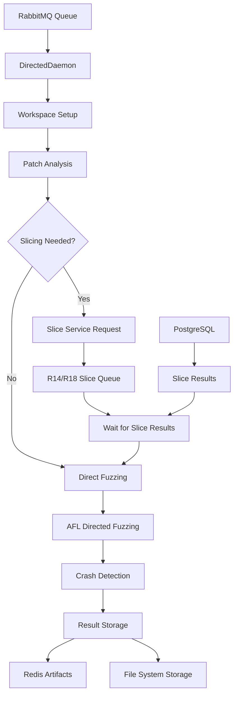

# Directed Component Analysis

The **directed component** is a **directed fuzzing service** designed for the AIxCC (AI Cyber Challenge). It orchestrates intelligent fuzzing campaigns by analyzing code changes and directing fuzzing efforts toward specific modified functions.

## Purpose and Functionality

- **Delta Fuzzing**: Identifies modified functions from patches/diffs for targeted testing
- **Slicing Coordination**: Works with slicing services to generate targeted test cases
- **Directed Fuzzing**: Executes AFL-based tools with specific function targets
- **Workspace Isolation**: Manages Docker-based execution for safe fuzzing
- **Message Queue Integration**: Distributed task processing through RabbitMQ

## Architecture Overview

### Core Design Pattern

The component implements a **multi-stage pipeline architecture**:

1. **Message parsing and validation** - Validates DirectedMsg format
2. **Workspace preparation** - Sets up isolated environment for fuzzing
3. **Delta analysis** - Extracts modified functions from patches
4. **Slicing coordination** - Requests code slices from external services
5. **Fuzzer execution** - Runs directed AFL with targeted harnesses
6. **Result storage** - Stores artifacts in Redis and file system

### Key Components

#### 1. Main Entry Point ([`app.py`](../components/directed/src/app.py))

```python
def main():
    # Initializes configuration, message queues, and daemon services
    # Supports mock mode and debug configurations
    # Manages Docker client and workspace cleanup
```

#### 2. Core Daemon ([`daemon/daemon.py`](../components/directed/src/daemon/daemon.py))

**DirectedDaemon class** - Main orchestrator handling incoming fuzzing tasks:

```python
class DirectedDaemon:
    def process_message(self, directed_msg: DirectedMsg):
        # 1. Workspace setup and repository extraction
        # 2. Patch application and delta analysis
        # 3. Slicing request coordination
        # 4. Directed fuzzing execution
        # 5. Artifact storage and cleanup
```

#### 3. Module Organization

- **[`modules/workspace.py`](../components/directed/src/modules/workspace.py)** - Workspace and repository management
- **[`modules/fuzzer_runner.py`](../components/directed/src/modules/fuzzer_runner.py)** - AFL fuzzer orchestration and Docker management
- **[`modules/patch_runner.py`](../components/directed/src/modules/patch_runner.py)** - Patch application and diff analysis
- **[`modules/seed_syncer.py`](../components/directed/src/modules/seed_syncer.py)** - Seed corpus synchronization
- **[`modules/crash_handler.py`](../components/directed/src/modules/crash_handler.py)** - Crash detection and processing
- **[`modules/telemetry.py`](../components/directed/src/modules/telemetry.py)** - Distributed tracing and monitoring

## Message Format and Integration

### Message Structure ([`directed_msg.py`](../components/directed/src/daemon/directed_msg.py))

```python
@dataclass
class DirectedMsg:
    task_id: str
    task_type: str  # 'delta' or 'full'
    project_name: str
    focus: str
    repo: List[str]
    fuzzing_tooling: str
    diff: Optional[str] = None
    sarif_slice_path: Optional[str] = None
```

### External Service Integration



**Service Dependencies:**
- **RabbitMQ** - Task message queuing via `RABBITMQ_URL` and `CRS_DIRECTED_QUEUE`
- **Slicing Services** - Communicates with R14/R18 slice queues via `SLICE_TASK_QUEUE`
- **Redis Sentinel** - Stores task metadata and fuzzing artifacts
- **PostgreSQL** - Tracks slice results via `DirectedSlice` model

## Docker Integration

### Container Management

```python
# Docker execution pattern
container = docker_client.containers.run(
    image=f"aixcc-afc/oss-fuzz/{project_name}",
    volumes={workspace_dir: {'bind': '/workspace', 'mode': 'rw'}},
    privileged=True,  # Required for fuzzing tools
    detach=True
)
```

**Key Features:**
- **Project-specific images**: Uses `aixcc-afc/oss-fuzz/{project}` images
- **Workspace mounting**: Isolated directory mounting for each task
- **Privileged execution**: Required for AFL and fuzzing instrumentation

## Configuration and Environment

### Required Environment Variables

```bash
RABBITMQ_URL          # Message queue connection
DATABASE_URL          # PostgreSQL connection
SLICE_TASK_QUEUE      # R14 slicing service queue
SLICE_TASK_QUEUE_R18  # R18 slicing service queue
REDIS_SENTINEL_HOSTS  # Redis cluster configuration
REDIS_MASTER          # Redis master name
REDIS_PASSWORD        # Redis authentication
CRS_DIRECTED_QUEUE    # Incoming task queue name
STORAGE_DIR           # Output artifact storage
```

### Key Configuration ([`config/config.py`](../components/directed/src/config/config.py))

```python
class Config:
    max_slicing_time = 900  # seconds - Timeout for slice operations
    tmp_dir = '/tmp/directed-fuzzing-agent'  # Workspace base directory
    mock_slice_service = False  # Enable mock mode for testing
```

## Database Integration

### Models ([`db/models/`](../components/directed/src/db/models/))

- **[`directed_slice.py`](../components/directed/src/db/models/directed_slice.py)** - SQLAlchemy model for slice result tracking
- **[`fuzz_related.py`](../components/directed/src/db/models/fuzz_related.py)** - Seed and fuzzing artifact models
- **[`base.py`](../components/directed/src/db/models/base.py)** - SQLAlchemy base configuration

### Database Operations

```python
# Slice result tracking
stmt = select(DirectedSlice).where(DirectedSlice.directed_id == slice_id)
slice_results = db_connection.execute_stmt_with_session(stmt)

# Seed storage
seed_obj = Seed(task_id=task_id, path=seed_path, harness_name=harness)
db_connection.write_to_db(seed_obj)
```

## Operational Workflow

### Delta Fuzzing Process

1. **Task Receipt**: Receives DirectedMsg from RabbitMQ queue
2. **Workspace Setup**: Creates isolated directory and extracts repositories
3. **Patch Application**: Applies diff patches to identify modified functions
4. **Slice Coordination**: Requests code slices from R14/R18 services if needed
5. **Fuzzing Execution**: Runs AFL with directed targets on modified functions
6. **Crash Analysis**: Processes discovered crashes and generates POCs
7. **Artifact Storage**: Stores results in Redis and shared file system

### Error Handling and Resilience

```python
# Comprehensive error handling pattern
try:
    execute_directed_fuzzing(task)
except SlicingTimeoutError:
    logger.warning(f"Slicing timeout for task {task.task_id}")
    fallback_to_general_fuzzing(task)
except DockerExecutionError as e:
    logger.error(f"Docker execution failed: {e}")
    cleanup_workspace(task)
    raise
finally:
    store_telemetry_data(task)
```

## Key Technical Features

### Workspace Isolation

- **Temporary directories**: Each task gets isolated `/tmp/directed-fuzzing-agent/{task_id}`
- **Docker containers**: Separate container per fuzzing execution
- **Resource cleanup**: Automatic cleanup of temporary files and containers

### Fault Tolerance

- **Retry mechanisms**: Failed operations are retried with exponential backoff
- **Timeout handling**: Configurable timeouts for slicing and fuzzing operations
- **Graceful degradation**: Falls back to general fuzzing if directed slicing fails

### Observability

- **Distributed tracing**: OpenTelemetry integration for request tracking
- **Structured logging**: JSON-formatted logs with task context
- **Metrics collection**: Performance and success rate monitoring
- **Error reporting**: Comprehensive error tracking and alerting

This directed component represents a sophisticated approach to intelligent fuzzing that combines static analysis insights with dynamic testing to maximize vulnerability discovery efficiency in the AIxCC competition environment.