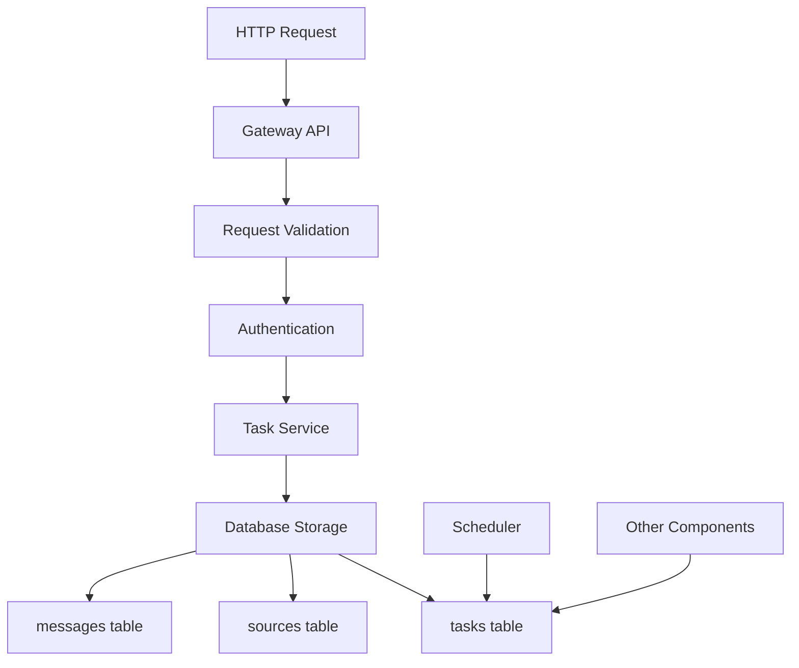

# Gateway Component Analysis

The **Gateway** component implements the CRS API specification for the AIxCC competition. It serves as the primary interface for receiving tasks and managing the CRS system's external communication.

## Purpose and Functionality

- **API Gateway Pattern**: Single entry point for all external CRS communications
- **OpenAPI Compliance**: Implements competition-specified API exactly
- **Authentication & Authorization**: Handles Basic Auth for API access
- **Request Processing**: Validates, processes, and routes incoming requests

## Architecture Overview

### Core Technologies

- **Go with Gin Framework**: High-performance HTTP server
- **OpenAPI Code Generation**: Automatic handler generation from swagger spec
- **GORM**: ORM for database operations
- **Uber FX**: Dependency injection framework
- **Zap**: Structured logging

### Key Components

#### 1. Main Entry Point ([`cmd/crs-gateway/main.go`](../components/gateway/cmd/crs-gateway/main.go))

Application bootstrap with dependency injection:

```go
func main() {
    fx.New(
        fx.Provide(
            config.LoadConfig,
            db.NewDBConnection,
            handlers.NewTaskHandler,
            server.NewServer,
        ),
        fx.Invoke(server.StartServer),
    ).Run()
}
```

#### 2. Server Setup ([`internal/server/server.go`](../components/gateway/internal/server/server.go))

HTTP server configuration and handler registration:

```go
func NewServer(config *config.Config, taskHandler *handlers.TaskHandler) *gin.Engine {
    router := gin.New()
    router.Use(gin.Logger(), gin.Recovery())

    // API routes
    v1 := router.Group("/v1")
    {
        v1.POST("/task", taskHandler.CreateTask)
        v1.DELETE("/task", taskHandler.CancelAllTasks)
        v1.DELETE("/task/:taskId", taskHandler.CancelTask)
        v1.POST("/sarif", taskHandler.SubmitSarif)
    }

    router.GET("/status", handlers.HealthCheck)
    return router
}
```

#### 3. Task Handling ([`internal/handlers/task_handler.go`](../components/gateway/internal/handlers/task_handler.go))

Task creation and management endpoints:

```go
type TaskHandler struct {
    taskService services.TaskService
    logger      *zap.Logger
}

func (h *TaskHandler) CreateTask(c *gin.Context) {
    var request models.TypesTask
    if err := c.ShouldBindJSON(&request); err != nil {
        c.JSON(400, gin.H{"error": "Invalid request format"})
        return
    }

    if err := h.taskService.CreateTask(&request, messageID, userID); err != nil {
        c.JSON(500, gin.H{"error": "Failed to create task"})
        return
    }

    c.JSON(201, gin.H{"status": "created"})
}
```

#### 4. Task Service ([`internal/services/task_service.go`](../components/gateway/internal/services/task_service.go))

Business logic for task operations:

```go
type TaskServiceImpl struct {
    db     *gorm.DB
    logger *zap.Logger
}

func (s *TaskServiceImpl) CreateTask(task *models.TypesTask, messageID string, userID int) error {
    for _, t := range task.Tasks {
        if err := s.createSingleTask(t, messageID, userID); err != nil {
            return fmt.Errorf("failed to create task: %w", err)
        }
    }
    return nil
}
```

## API Implementation

### OpenAPI Specification ([`swagger/crs-swagger-v1.0.yaml`](../components/gateway/swagger/crs-swagger-v1.0.yaml))

The gateway implements the official CRS API specification:

```yaml
openapi: 3.0.0
info:
  title: CRS API
  version: 1.0.0
  description: Cybersecurity Reasoning System API for AIxCC

paths:
  /v1/task:
    post:
      summary: Create new task
      requestBody:
        required: true
        content:
          application/json:
            schema:
              $ref: '#/components/schemas/TaskRequest'
      responses:
        '201':
          description: Task created successfully
        '400':
          description: Invalid request
```

### Key API Endpoints

#### 1. POST /v1/task - Task Creation

```go
func (h *TaskHandler) CreateTask(c *gin.Context) {
    // 1. Parse and validate request
    var request models.TypesTask
    if err := c.ShouldBindJSON(&request); err != nil {
        h.handleValidationError(c, err)
        return
    }

    // 2. Extract authentication info
    userID := h.extractUserID(c)
    messageID := h.generateMessageID()

    // 3. Create task and sources
    if err := h.taskService.CreateTask(&request, messageID, userID); err != nil {
        h.handleServiceError(c, err)
        return
    }

    // 4. Return success response
    c.JSON(201, gin.H{"status": "created", "message_id": messageID})
}
```

#### 2. DELETE /v1/task - Cancel All Tasks

```go
func (h *TaskHandler) CancelAllTasks(c *gin.Context) {
    userID := h.extractUserID(c)
    if err := h.taskService.CancelAllTasks(userID); err != nil {
        c.JSON(500, gin.H{"error": "Failed to cancel tasks"})
        return
    }
    c.JSON(200, gin.H{"status": "cancelled"})
}
```

#### 3. DELETE /v1/task/{taskId} - Cancel Specific Task

```go
func (h *TaskHandler) CancelTask(c *gin.Context) {
    taskID := c.Param("taskId")
    userID := h.extractUserID(c)

    if err := h.taskService.CancelTask(taskID, userID); err != nil {
        c.JSON(500, gin.H{"error": "Failed to cancel task"})
        return
    }
    c.JSON(200, gin.H{"status": "cancelled"})
}
```

#### 4. POST /v1/sarif - SARIF Report Submission

```go
func (h *TaskHandler) SubmitSarif(c *gin.Context) {
    var sarifRequest models.SarifRequest
    if err := c.ShouldBindJSON(&sarifRequest); err != nil {
        c.JSON(400, gin.H{"error": "Invalid SARIF format"})
        return
    }

    if err := h.taskService.StoreSarif(&sarifRequest); err != nil {
        c.JSON(500, gin.H{"error": "Failed to store SARIF"})
        return
    }

    c.JSON(201, gin.H{"status": "accepted"})
}
```

#### 5. GET /status - Health Check

```go
func HealthCheck(c *gin.Context) {
    c.JSON(200, gin.H{
        "status": "healthy",
        "timestamp": time.Now().UTC().Format(time.RFC3339),
        "version": "1.0.0"
    })
}
```

## Data Models

### Task Request Model

```go
type TypesTask struct {
    Tasks []SingleTask `json:"tasks" validate:"required,min=1"`
}

type SingleTask struct {
    TaskID      string   `json:"task_id" validate:"required"`
    TaskType    string   `json:"task_type" validate:"required,oneof=full delta"`
    ProjectName string   `json:"project_name" validate:"required"`
    Focus       string   `json:"focus" validate:"required"`
    Sources     []Source `json:"sources" validate:"required,min=1"`
}

type Source struct {
    Type string `json:"type" validate:"required,oneof=repo diff fuzz_tooling"`
    URL  string `json:"url" validate:"required,url"`
}
```

### Database Integration

#### Task Storage

```go
func (s *TaskServiceImpl) createSingleTask(task SingleTask, messageID string, userID int) error {
    // 1. Create main task record
    dbTask := &models.Task{
        ID:          task.TaskID,
        UserID:      userID,
        MessageID:   messageID,
        Focus:       task.Focus,
        ProjectName: task.ProjectName,
        TaskType:    task.TaskType,
        Status:      "pending",
        Deadline:    time.Now().Add(24 * time.Hour).Unix(),
    }

    if err := s.db.Create(dbTask).Error; err != nil {
        return fmt.Errorf("failed to create task: %w", err)
    }

    // 2. Create source records
    for _, source := range task.Sources {
        dbSource := &models.Source{
            TaskID:     task.TaskID,
            SourceType: source.Type,
            URL:        source.URL,
            SHA256:     calculateSHA256(source.URL),
        }
        if err := s.db.Create(dbSource).Error; err != nil {
            return fmt.Errorf("failed to create source: %w", err)
        }
    }

    return nil
}
```

## Configuration System

### Configuration Structure

```go
type Config struct {
    Server   ServerConfig   `yaml:"server"`
    Database DatabaseConfig `yaml:"database"`
    Auth     AuthConfig     `yaml:"auth"`
    Logging  LoggingConfig  `yaml:"logging"`
}

type ServerConfig struct {
    Port         int    `yaml:"port" env:"PORT" envDefault:"8080"`
    Host         string `yaml:"host" env:"HOST" envDefault:"0.0.0.0"`
    ReadTimeout  int    `yaml:"read_timeout" env:"READ_TIMEOUT" envDefault:"30"`
    WriteTimeout int    `yaml:"write_timeout" env:"WRITE_TIMEOUT" envDefault:"30"`
}
```

### Environment Variables

```bash
PORT                    # Server port (default: 8080)
HOST                    # Server host (default: 0.0.0.0)
DATABASE_URL            # PostgreSQL connection string
AUTH_ENABLED           # Enable authentication (default: true)
LOG_LEVEL              # Logging level (debug, info, warn, error)
CORS_ENABLED           # Enable CORS headers
RATE_LIMIT_ENABLED     # Enable rate limiting
```

## Authentication and Security

### Basic Authentication

```go
func (h *TaskHandler) authenticate(c *gin.Context) (int, error) {
    authHeader := c.GetHeader("Authorization")
    if authHeader == "" {
        return 0, errors.New("missing authorization header")
    }

    // Parse Basic Auth
    username, password, ok := parseBasicAuth(authHeader)
    if !ok {
        return 0, errors.New("invalid authorization format")
    }

    // Validate credentials
    userID, err := h.validateCredentials(username, password)
    if err != nil {
        return 0, errors.New("invalid credentials")
    }

    return userID, nil
}
```

### Request Validation

```go
func (h *TaskHandler) validateTaskRequest(request *models.TypesTask) error {
    if len(request.Tasks) == 0 {
        return errors.New("at least one task is required")
    }

    for _, task := range request.Tasks {
        if task.TaskType != "full" && task.TaskType != "delta" {
            return errors.New("task_type must be 'full' or 'delta'")
        }

        if len(task.Sources) == 0 {
            return errors.New("at least one source is required")
        }

        for _, source := range task.Sources {
            if !isValidSourceType(source.Type) {
                return errors.New("invalid source type")
            }
            if !isValidURL(source.URL) {
                return errors.New("invalid source URL")
            }
        }
    }

    return nil
}
```

## Integration with CRS Ecosystem

### Database Integration



### Downstream Integration

- **Scheduler**: Reads tasks from database for processing
- **Build System**: Uses source information for compilation
- **Analysis Tools**: Process tasks based on type and configuration
- **Monitoring**: Tracks API usage and system health

## Error Handling and Logging

### Structured Error Responses

```go
type ErrorResponse struct {
    Error     string            `json:"error"`
    Code      string            `json:"code"`
    Details   map[string]string `json:"details,omitempty"`
    Timestamp string            `json:"timestamp"`
}

func (h *TaskHandler) handleError(c *gin.Context, err error, code int) {
    response := ErrorResponse{
        Error:     err.Error(),
        Code:      fmt.Sprintf("CRS_%d", code),
        Timestamp: time.Now().UTC().Format(time.RFC3339),
    }

    h.logger.Error("API error", zap.Error(err), zap.Int("status", code))
    c.JSON(code, response)
}
```

### Comprehensive Logging

```go
func (h *TaskHandler) logRequest(c *gin.Context) {
    h.logger.Info("API request",
        zap.String("method", c.Request.Method),
        zap.String("path", c.Request.URL.Path),
        zap.String("client_ip", c.ClientIP()),
        zap.String("user_agent", c.GetHeader("User-Agent")),
        zap.Duration("duration", time.Since(start)),
    )
}
```

This Gateway component provides a robust, secure, and compliant API interface that serves as the primary entry point for the CRS system while maintaining full compatibility with the AIxCC competition requirements.