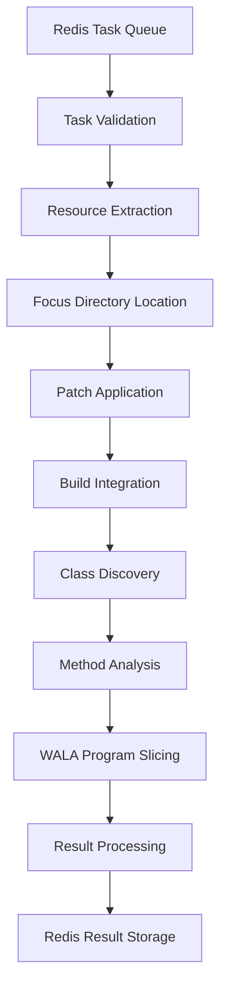

# JavaSlicer Component Analysis

The **JavaSlicer** component is a Java-based static analysis service that performs program slicing on Java codebases using IBM WALA. It analyzes Java bytecode to identify relevant code portions for fuzzing and vulnerability analysis.

## Purpose and Functionality

- **Code Slicing**: Analyzes Java bytecode to identify relevant code portions for fuzzing
- **Diff Analysis**: Parses patch files to determine changed methods requiring analysis
- **Instrumentation Support**: Generates class filters and instrumentation includes for coverage tools
- **Task Processing**: Operates as a Redis-based worker service

## Architecture Overview

### Core Technologies

- **Language**: Java 17
- **Build System**: Maven
- **Static Analysis**: IBM WALA framework (version 1.6.9)
- **Code Parsing**: JavaParser for source code analysis
- **Task Queue**: Redis with Jedis client
- **Observability**: OpenTelemetry integration

### Key Components

#### 1. Main Service ([`SliceTaskProcessor.java`](../components/javaslicer/src/main/java/org/b3yond/SliceTaskProcessor.java))

Main service orchestrator:

```java
public class SliceTaskProcessor {
    // Redis-based task polling with configurable intervals
    // Parallel task processing with thread pools (default: 4 concurrent tasks)
    // Comprehensive error handling and logging

    public void processTask(Task task) {
        // 1. Validate public build success
        // 2. Extract resources and apply patches
        // 3. Locate compiled class files
        // 4. Perform WALA-based slicing
        // 5. Generate instrumentation filters
    }
}
```

#### 2. Core Slicing Engine ([`SliceCmdGenerator.java`](../components/javaslicer/src/main/java/org/b3yond/SliceCmdGenerator.java))

Core slicing logic:

- **Entry Point Detection**: Finds fuzzer entry methods (`fuzzerTestOneInput`)
- **Target Method Extraction**: Uses `DiffParser` to identify modified methods from patch files
- **WALA Integration**: Executes program slicing via `AIXCCJavaSlice.run()`
- **Output Generation**: Creates multiple result files:
  - `.results.txt`: Raw slicing results
  - `.instrumentation_includes.txt`: Filtered class patterns with `.**` suffix
  - `.filtered_classes.txt`: Classes after exclusion filtering

#### 3. Task Model ([`model/Task.java`](../components/javaslicer/src/main/java/org/b3yond/model/Task.java))

```java
public class Task {
    private String task_id;
    private String task_type;        // "full" or "delta"
    private String project_name;
    private String focus;            // Target directory
    private String[] repo;           // Repository file paths
    private String diff;             // Patch file path
    private String fuzzing_tooling;  // Tooling resources
}
```

#### 4. Redis Service ([`service/RedisService.java`](../components/javaslicer/src/main/java/org/b3yond/service/RedisService.java))

Redis integration for task coordination:

- **Sentinel Support**: Primary Redis Sentinel integration with fallback
- **Task Management**: Fetches tasks from `primefuzz:task:task_status` set
- **Result Storage**: Saves results to `javaslice:task:<task_id>:result`
- **Status Tracking**: Maintains processed tasks in `javaslice:task:task_done`

## Slicing Workflow

### Task Processing Pipeline



### Detailed Workflow Steps

1. **Validation**: Checks public build success via Redis
2. **Resource Extraction**: Unpacks repositories, diffs, and tooling files
3. **Focus Directory Location**: Identifies target directory from extracted repositories
4. **Patch Application**: Applies diff patches using system `patch` command
5. **Build Integration**: Copies compiled `.class` files from `/crs/public_build/<task_id>/build/out/<project_name>/`
6. **Class Discovery**: Finds `.class` files directly or extracts from JAR files
7. **Method Analysis**: Uses `DiffParser` to extract changed method signatures
8. **Program Slicing**: Executes WALA-based slicing with timeout protection (2 hours default)
9. **Result Processing**: Generates instrumentation filters and class lists

## Diff Parser Implementation

### Diff Analysis ([`utils/DiffParser.java`](../components/javaslicer/src/main/java/org/b3yond/utils/DiffParser.java))

```java
public class DiffParser {
    // Parses unified diff format to identify modified Java files
    // Uses JavaParser AST to map line numbers to method declarations
    // Outputs fully-qualified method names for slicing targets

    public List<String> extractChangedMethods(String diffFile) {
        // 1. Parse diff to get changed line ranges
        // 2. Parse Java source files with JavaParser
        // 3. Map line numbers to method declarations
        // 4. Return fully-qualified method names
    }
}
```

## Configuration and Environment

### Environment Variables

```bash
REDIS_HOST=localhost              # Redis server
REDIS_PORT=6379                   # Redis port
WORK_DIR=/tmp/javaslice          # Working directory
POLL_INTERVAL_SECONDS=60         # Task polling frequency
CRS_MOUNT_PATH=/crs              # Shared filesystem mount
MAX_CONCURRENT_TASKS=4           # Parallel processing limit
```

### Maven Configuration

Key dependencies in [`pom.xml`](../components/javaslicer/pom.xml):

```xml
<dependencies>
    <dependency>
        <groupId>com.ibm.wala</groupId>
        <artifactId>com.ibm.wala.core</artifactId>
        <version>1.6.9</version>
    </dependency>
    <dependency>
        <groupId>com.github.javaparser</groupId>
        <artifactId>javaparser-core</artifactId>
        <version>3.26.2</version>
    </dependency>
    <dependency>
        <groupId>redis.clients</groupId>
        <artifactId>jedis</artifactId>
        <version>5.2.0</version>
    </dependency>
</dependencies>
```

## Integration with CRS Ecosystem

### Input Dependencies

- **Successful Public Build**: Requires build completion verified via Redis
- **Task Definitions**: Consumes task definitions from scheduler component
- **Shared File System**: Uses `/crs/` mount point for resource access

### Output Artifacts

- **Slicing Results**: Saved to `/crs/javaslice/<task_id>/`
- **Three Output Files per Class**:
  - `.results.txt`: Raw slicing results
  - `.instrumentation_includes.txt`: Filtered class patterns
  - `.filtered_classes.txt`: Classes after exclusion filtering
- **Result Paths**: Stored in Redis for consumption by other components

### Redis Key Schema

```bash
primefuzz:task:task_status           # Input task queue
javaslice:task:<task_id>:result      # Slicing results
javaslice:task:task_done             # Processed task tracking
```

## IBM WALA Integration

### Static Analysis Configuration

The component uses IBM WALA for sophisticated program slicing:

```java
// WALA slicing configuration
SliceConfig config = new SliceConfig()
    .setEntryPoints(fuzzerMethods)
    .setTargetMethods(changedMethods)
    .setSlicingCriteria(SlicingCriteria.BACKWARD)
    .setTimeout(Duration.ofHours(2));

SliceResult result = AIXCCJavaSlice.run(config);
```

### Key WALA Features Used

- **Call Graph Construction**: Builds complete call graph for analysis
- **Data Flow Analysis**: Tracks data dependencies through program
- **Backward Slicing**: Identifies code that affects target methods
- **Class Hierarchy Analysis**: Handles inheritance and polymorphism

## Performance and Scalability

### Parallel Processing

- **Thread Pool**: Configurable concurrent task processing (default: 4)
- **Task Isolation**: Each task runs in separate workspace
- **Timeout Protection**: 2-hour timeout prevents infinite analysis
- **Resource Management**: Automatic cleanup of temporary files

### Memory Optimization

- **Streaming Processing**: Large files processed in chunks
- **Garbage Collection**: Explicit GC calls after heavy operations
- **Class Loading**: Dynamic class loading for analysis targets
- **Cache Management**: Efficient caching of WALA analysis results

## Error Handling and Resilience

```java
// Comprehensive error handling pattern
try {
    performSlicing(task);
} catch (WALAException e) {
    logger.error("WALA analysis failed: {}", e.getMessage());
    recordFailure(task, e);
} catch (TimeoutException e) {
    logger.warn("Slicing timeout for task: {}", task.getTaskId());
    recordTimeout(task);
} finally {
    cleanupResources(task);
}
```

### Resilience Features

- **Graceful Degradation**: Continues processing other tasks on individual failures
- **Retry Logic**: Failed tasks can be requeued for retry
- **Status Tracking**: Comprehensive tracking of task states
- **Resource Cleanup**: Automatic cleanup of temporary files and resources

This JavaSlicer component represents a sophisticated static analysis tool that combines WALA's powerful program analysis capabilities with practical engineering for production deployment in the distributed CRS architecture.