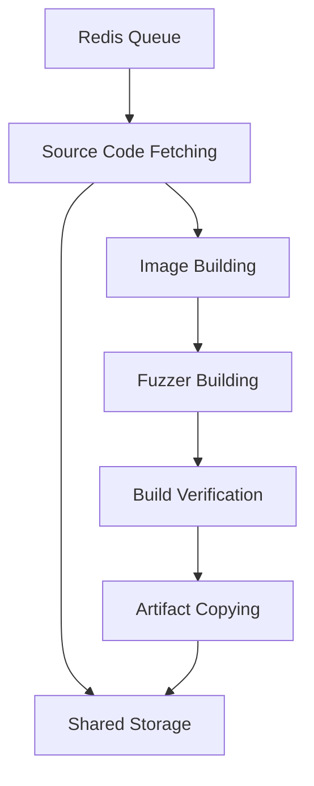

# Prime-Build Component Analysis

The **Prime-Build** component is a job queue system for building OSS-Fuzz projects using Redis Queue (RQ). It automates the process of setting up build environments, compiling fuzzers, and managing the entire build pipeline for fuzzing targets.

## Purpose and Functionality

- **Distributed Build System**: Uses Redis-based job queuing to handle multiple build tasks concurrently
- **OSS-Fuzz Integration**: Leverages the OSS-Fuzz infrastructure for building fuzzers
- **Docker-in-Docker (DinD)**: Employs containerized build environments for isolation and consistency
- **Pipeline Architecture**: Implements a multi-step build process with dependency management

## Architecture Overview

### Core Technologies

- **Python 3.11+** with async/await patterns
- **Redis Queue (RQ)** for job management and task dependencies
- **Docker** for containerized builds
- **OSS-Fuzz** infrastructure for fuzzer compilation
- **Typer** for CLI interface

### Key Components

#### 1. Main Entry Point ([`run_build_job.py`](../components/prime-build/run_build_job.py))

Standalone script to run and monitor build jobs:

```python
def main():
    # Connects to Redis and processes build jobs
    # Monitors job status and handles failures
    # Provides logging and telemetry integration
```

#### 2. Core Application ([`primebuilder/main.py`](../components/prime-build/primebuilder/main.py))

Main application with CLI interface using Typer:

```python
@app.command()
def build(task_id: str, src_path: str, oss_fuzz_path: str):
    # Creates and enqueues build pipeline jobs
    # Manages job dependencies and execution order
    # Handles error recovery and cleanup
```

#### 3. Worker Implementation ([`primebuilder/worker.py`](../components/prime-build/primebuilder/worker.py))

Contains all build step implementations:

```python
class BuildWorker:
    def fetch_source_code(self, task_id, src_path, oss_fuzz_path):
        # Downloads/copies source code and OSS-Fuzz tooling

    def build_image(self, task_id, project_name):
        # Builds Docker images using OSS-Fuzz helper

    def build_fuzzers(self, task_id, project_name, src_path):
        # Compiles fuzzer binaries

    def check_build(self, task_id, project_name):
        # Validates fuzzer builds

    def copy_artifact(self, task_id, project_name):
        # Copies artifacts to shared storage
```

## Build Pipeline Architecture

### 5-Step Sequential Pipeline



#### Step 1: Source Code Fetching

```python
def fetch_source_code(self, task_id, src_path, oss_fuzz_path):
    # Downloads/copies source code and OSS-Fuzz tooling
    # Supports both directory copying and archive extraction
    # Creates isolated workspace per task ID
    workspace = f"/tmp/{task_id}"
    shutil.copytree(src_path, workspace)
```

#### Step 2: Image Building

```python
def build_image(self, task_id, project_name):
    # Builds Docker images for the target project
    # Uses OSS-Fuzz helper scripts
    cmd = f"{helper_path} build_image --pull {project_name}"
    subprocess.run(cmd, shell=True, check=True)
```

#### Step 3: Fuzzer Building

```python
def build_fuzzers(self, task_id, project_name, src_path):
    # Compiles actual fuzzer binaries
    # Uses OSS-Fuzz infrastructure for compilation
    cmd = f"{helper_path} build_fuzzers --clean {project_name} {src_path}"
    subprocess.run(cmd, shell=True, check=True)
```

#### Step 4: Build Verification (Optional)

```python
def check_build(self, task_id, project_name):
    # Validates fuzzer builds using Docker containers
    # Runs test_all.py in the base runner image
    # Optional step controlled by configuration
```

#### Step 5: Artifact Copying (Optional)

```python
def copy_artifact(self, task_id, project_name):
    # Copies built artifacts to shared storage
    # Optional step controlled by ENABLE_COPY_ARTIFACT
    # Enables artifact sharing across components
```

## Configuration System

### Configuration Structure ([`primebuilder/config.py`](../components/prime-build/primebuilder/config.py))

```python
class BuildConfig:
    REDIS_HOST = os.getenv("REDIS_HOST", "localhost")
    REDIS_PORT = int(os.getenv("REDIS_PORT", "6379"))
    REDIS_DB = int(os.getenv("REDIS_DB", "0"))

    REDIS_URL = f"redis://{REDIS_HOST}:{REDIS_PORT}/{REDIS_DB}"
    BUILD_QUEUE = "public_build_queue"

    OSS_FUZZ_PATH = Path("/data/fuzz-tools")
    BASE_RUNNER_IMAGE = "ghcr.io/aixcc-finals/base-runner:v1.1.0"

    ENABLE_COPY_ARTIFACT = bool(os.getenv("ENABLE_COPY_ARTIFACT", False))
```

### Environment Variables

```bash
REDIS_HOST              # Redis server hostname
REDIS_PORT              # Redis server port
REDIS_DB                # Redis database number
BUILD_QUEUE             # Job queue name
OSS_FUZZ_PATH          # Path to OSS-Fuzz tooling
ENABLE_COPY_ARTIFACT   # Enable artifact copying step
BASE_RUNNER_IMAGE      # Docker image for build verification
```

## Integration Patterns

### Redis Queue Integration

```python
# Job creation with dependencies
job = queue.enqueue(
    worker.fetch_source_code,
    task_id, src_path, oss_fuzz_path,
    job_id=f"{task_id}_fetch",
    timeout="30m"
)

next_job = queue.enqueue(
    worker.build_image,
    task_id, project_name,
    depends_on=job,  # Sequential execution
    job_id=f"{task_id}_image",
    timeout="45m"
)
```

### Docker Integration

```python
# Docker-in-Docker execution pattern
docker_client = docker.from_env()

# Build image using OSS-Fuzz infrastructure
container = docker_client.containers.run(
    image="gcr.io/oss-fuzz-base/base-builder",
    command=f"helper.py build_image {project_name}",
    volumes={
        oss_fuzz_path: {'bind': '/src', 'mode': 'rw'},
        '/var/run/docker.sock': {'bind': '/var/run/docker.sock', 'mode': 'rw'}
    },
    privileged=True
)
```

### Shared File System Integration

- **Input**: Source code from `/crs/{task_id}/` mount
- **Output**: Built artifacts to `/crs/public_build/{task_id}/`
- **Tooling**: OSS-Fuzz infrastructure from shared mount

## Operational Workflow

### Build Job Lifecycle

1. **Job Submission**: Tasks submitted to `public_build_queue`
2. **Worker Assignment**: RQ workers pick up jobs from queue
3. **Pipeline Execution**: Sequential execution of 5 build steps
4. **Progress Tracking**: Job status tracked in Redis
5. **Artifact Storage**: Results stored in shared file system
6. **Completion Notification**: Status updates for downstream components

### Error Handling and Resilience

```python
# Comprehensive error handling
try:
    execute_build_step(task_id, params)
except subprocess.CalledProcessError as e:
    logger.error(f"Build command failed: {e}")
    job.meta['error'] = str(e)
    job.save_meta()
    raise
except docker.errors.DockerException as e:
    logger.error(f"Docker operation failed: {e}")
    cleanup_docker_resources(task_id)
    raise
finally:
    cleanup_workspace(task_id)
```

## Performance and Scalability

### Parallel Processing

- **Multiple Workers**: Supports multiple RQ workers for concurrent builds
- **Job Dependencies**: Ensures correct execution order within pipeline
- **Resource Isolation**: Each build uses separate Docker containers
- **Queue Management**: Redis provides reliable job queuing and distribution

### Resource Management

```python
# Resource cleanup after build completion
def cleanup_resources(task_id):
    # Remove temporary workspace
    workspace_path = f"/tmp/{task_id}"
    if os.path.exists(workspace_path):
        shutil.rmtree(workspace_path)

    # Clean up Docker containers and images
    cleanup_docker_resources(task_id)

    # Clear Redis job metadata
    clear_job_metadata(task_id)
```

## Integration with CRS Components

### Upstream Dependencies

- **Scheduler**: Submits build jobs to the queue
- **Source Management**: Provides source code and tooling archives
- **Task Management**: Coordinates task lifecycle and status

### Downstream Consumers

- **Fuzzing Components**: Use built artifacts for fuzzing campaigns
- **Analysis Tools**: Analyze compiled binaries and build outputs
- **Quality Assurance**: Validate build success before fuzzing

### Data Flow


## Key Technical Features

### Docker-in-Docker Architecture

- **Isolation**: Each build runs in separate container environment
- **Consistency**: Same build environment across all builds
- **Security**: Containerized execution prevents host contamination
- **Scalability**: Easy to scale by adding more worker containers

### Job Queue Management

- **Reliability**: Redis provides persistent job queues
- **Dependencies**: Sequential job execution with dependency management
- **Monitoring**: Real-time job status and progress tracking
- **Recovery**: Failed jobs can be retried or investigated

This Prime-Build component provides a robust, scalable build system that integrates seamlessly with the OSS-Fuzz ecosystem while providing the distributed coordination needed for the CRS architecture.