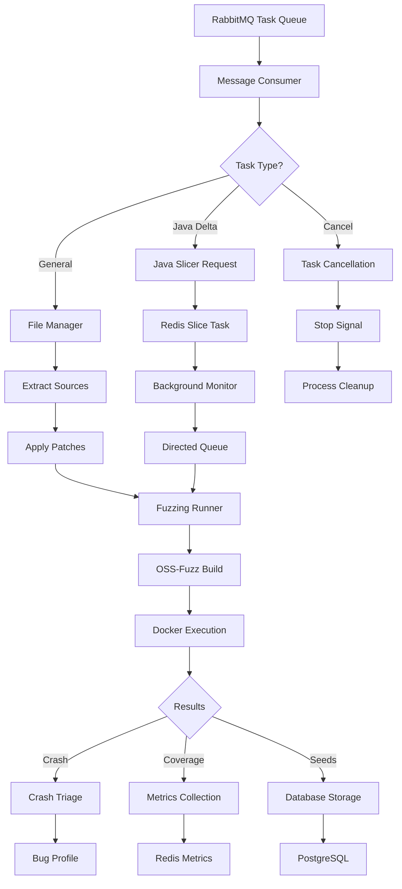

# PrimeFuzz Component Analysis

PrimeFuzz is a distributed fuzzing service that processes tasks from RabbitMQ and executes OSS-Fuzz workflows. It serves as the primary fuzzing engine in the CRS, handling both general fuzzing and Java-specific directed fuzzing with slicing capabilities.

## Architecture Overview

PrimeFuzz implements a message-driven architecture with multiple service components:

### Core Services

- **CRS Prime Fuzz**: Main fuzzing service for general-purpose fuzzing
- **CRS Prime Fuzz Java Directed**: Specialized service for Java directed fuzzing
- **CRS Java Slicer**: Code slicing service for Java projects
- **CRS Prime Sentinel**: Monitoring and health check service
- **Dev Redis Master**: Data exchange and task coordination
- **Dev RabbitMQ**: Task queue management
- **PostgreSQL**: Optional database for task persistence

### Key Components

#### 1. Workflow Engine ([workflow.py](../components/primefuzz/workflow.py))

The main orchestrator implementing the `FuzzingWorkflow` class:

```python
class FuzzingWorkflow:
    def __init__(self, config: Config):
        self.message_consumer = MessageConsumer(...)
        self.fuzzing_runner = FuzzingRunner(...)
        self.redis_middleware = RedisMiddleware()
        self.file_manager = FileManager()
```

**Key responsibilities:**
- Message processing from RabbitMQ queues
- Task validation and deduplication
- File extraction and patch application
- Coordination with Java slicer for directed fuzzing
- Background monitoring of slice results

#### 2. Fuzzing Runner ([modules/fuzzing_runner.py](../components/primefuzz/modules/fuzzing_runner.py))

Core fuzzing execution engine:

```python
class FuzzingRunner:
    def __init__(self, oss_fuzz_path: str, max_workers: int = 2, ...):
        self.oss_fuzz_path = Path(oss_fuzz_path)
        self.running_processes = {}
        self.db_manager = DBManager()
        self.metrics_collector = MetricsCollector()
```

**Key features:**
- OSS-Fuzz integration and project building
- Multi-sanitizer support (AddressSanitizer, MemorySanitizer, etc.)
- Docker-based isolation with Docker-in-Docker (DinD)
- Crash triage and bug profile generation
- Real-time metrics collection

#### 3. Message Consumer ([modules/message_consumer.py](../components/primefuzz/modules/message_consumer.py))

RabbitMQ integration for task processing:

```python
class MessageConsumer:
    async def start(self, callback_func: Callable[[Dict], None]):
        # Robust connection with auto-reconnect
        self._connection = await aio_pika.connect_robust(...)
        # Priority queue support for task scheduling
        queue = await channel.declare_queue(
            self.queue_name, arguments={"x-max-priority": 10}
        )
```

#### 4. Redis Middleware ([modules/redis_middleware.py](../components/primefuzz/modules/redis_middleware.py))

Distributed state management and coordination:

```python
class RedisMiddleware:
    def __init__(self):
        # Sentinel support for high availability
        self.tasks_key_prefix = "primefuzz:task:"
        self.slice_task_key_prefix = "javaslice:task:"
```

**Functions:**
- Task status tracking and cancellation
- Java slice task coordination
- Docker host management
- Metrics aggregation
- Backup artifact coordination

#### 5. File Manager ([modules/file_manager.py](../components/primefuzz/modules/file_manager.py))

Source code and artifact management:

- Repository extraction from tar/zip archives
- Patch application with `PatchManager`
- Shared workspace coordination (`/crs` mount)
- Seed corpus generation

## Operational Workflow



## Configuration System

Configuration through environment variables ([modules/config.py](../components/primefuzz/modules/config.py)):

### Core Settings

```python
@dataclass
class Config:
    rabbitmq_host: str
    queue_name: str
    oss_fuzz_path: Path
    max_fuzzer_instances: int = 1
    directed_mode: bool = False
    redis_host: str = "localhost"
```

### Key Environment Variables

- **RABBITMQ_HOST/PORT**: Message queue connection
- **OSS_FUZZ_PATH**: Path to fuzzing tooling
- **MAX_FUZZER_INSTANCES**: Concurrent fuzzer limit
- **DIRECTED_MODE**: Enable Java directed fuzzing
- **REDIS_SENTINEL_HOSTS**: High availability Redis
- **DATABASE_URL**: PostgreSQL connection string

## Java Integration Features

### Code Slicing Workflow

For Java projects with delta tasks:

1. **Slice Task Creation**: Record task in Redis for Java slicer
2. **Background Monitoring**: Monitor slice results asynchronously
3. **Directed Publishing**: Forward results to directed fuzzing queue
4. **Targeted Fuzzing**: Execute fuzzing on sliced code paths

### Jazzer Integration

Java fuzzing through Jazzer with security issue detection:

```
== Java Exception:com.code_intelligence.jazzer.api.FuzzerSecurityIssue.*
* FuzzerSecurityIssueCritical: File path traversal
* FuzzerSecurityIssueCritical: OS Command Injection
* FuzzerSecurityIssueHigh: SQL Injection
```

## Scalability and Resource Management

### Resource Allocation

| Service | CPU Requirements | Memory Requirements | Notes |
|---------|-----------------|-------------------|-------|
| crs-java-slicer | 4 cores | 8 GB | Fixed allocation |
| crs-prime-fuzz-javaslice | 2 × H cores | Variable | H = harness count |
| crs-prime-fuzz | 2 × H × 3 × S cores | Variable | S = sanitizer count |
| crs-prime-sentinel | 1 core | 2 GB | Monitoring only |

### Docker-in-Docker Architecture

- **Privileged containers** for Docker execution
- **Multi-host support** with Docker daemon selection
- **Resource isolation** between fuzzing instances
- **Automatic cleanup** of containers and images

## Integration Points

### Database Schema

Task tracking ([db/db_manager.py](../components/primefuzz/db/db_manager.py)):

```sql
Table "public.tasks"
- id (varchar): Task identifier
- project_name (varchar): Target project
- task_type (tasktypeenum): general/delta/cancel
- status (taskstatusenum): Task state
- metadata (json): Additional task data

Table "public.seeds"
- task_id (varchar): Associated task
- harness_name (text): Fuzzer target
- coverage (double): Coverage metrics
- metric (jsonb): Detailed metrics
```

### Crash Triage Integration

Integrated crash analysis ([modules/triage.py](../components/primefuzz/modules/triage.py)):

- **Sanitizer parsing**: AddressSanitizer, UBSan, etc.
- **Bug profiling**: CWE classification and deduplication
- **Severity assessment**: Based on sanitizer type
- **Reproduction data**: POC file generation

### Telemetry and Monitoring

OpenTelemetry integration ([utils/telemetry.py](../components/primefuzz/utils/telemetry.py)):

- **Distributed tracing**: Cross-service request tracking
- **Metrics collection**: Performance and resource usage
- **Action logging**: Fuzzing lifecycle events
- **Error reporting**: Failure analysis and debugging

## Deployment Options

### Docker Compose

Local development and testing:

```yaml
services:
  crs-prime-fuzz:
    build: .
    privileged: true
    volumes:
      - /crs:/crs
    depends_on:
      - dev-rabbitmq
      - dev-redis-master
```

### Kubernetes

Production deployment ([prime-k8s-deployment.yaml](../components/primefuzz/prime-k8s-deployment.yaml)):

- **Horizontal Pod Autoscaling**: Based on queue depth
- **Resource limits**: CPU/memory constraints
- **Persistent volumes**: Shared workspace mounting
- **Service discovery**: Inter-component communication

## Key Technical Features

### Fault Tolerance

- **Robust connections**: Auto-reconnect for RabbitMQ/Redis
- **Task retry logic**: Configurable retry limits
- **Graceful degradation**: Fallback mechanisms
- **Resource cleanup**: Automatic container/process cleanup

### Performance Optimizations

- **Parallel processing**: Multiple fuzzer instances
- **Smart scheduling**: Priority queue management
- **Resource pooling**: Docker host selection
- **Incremental builds**: Build artifact caching

### Security Considerations

- **Container isolation**: Privileged container restrictions
- **Resource limits**: CPU/memory bounds
- **Network segmentation**: Internal service communication
- **Credential management**: Environment-based secrets