# SARIF Component: Static Analysis Validation System

## Overview

The SARIF component is a sophisticated validation system for [SARIF](https://sarifweb.azurewebsites.net/) (Static Analysis Results Interchange Format) reports. It determines whether security vulnerability findings reported by static analysis tools are true positives or false positives by analyzing the SARIF reports against actual source code and crash data.

## Architecture

### Two-Tier System

#### 1. SARIF Agent (Main Service)
- **Location**: [src/app.py](../components/sarif/src/app.py)
- **Purpose**: Message queue-based daemon that processes SARIF validation requests
- **Key Components**:
  - **Daemon**: [src/daemon.py](../components/sarif/src/daemon.py#L17-L131) - Manages workspace creation and task coordination
  - **Task Worker**: [src/tasks.py](../components/sarif/src/tasks.py#L23-L173) - Orchestrates validation workflow
  - **Multiple Checker Types**: Different validation strategies for various scenarios

#### 2. SARIF Evaluator (AI-Powered Analysis)
- **Location**: [crs-prime-sarif-evaluator/](../components/sarif/crs-prime-sarif-evaluator/)
- **Purpose**: LLM-based detailed analysis of SARIF reports against source code
- **Main Entry**: [evaluator/main.py](../components/sarif/crs-prime-sarif-evaluator/evaluator/main.py#L25-L139)

## Validation Workflow

### Message Processing Pipeline
1. **Message Reception**: RabbitMQ message contains:
   - `task_id`: Challenge/task identifier
   - `sarif_id`: Unique SARIF report identifier
   - `project_name`: Target project name
   - `focus`: Primary repository to analyze
   - `repo`: List of repository archives
   - `sarif_report`: SARIF JSON content
   - `fuzzing_tooling`: Fuzzing infrastructure archive
   - `diff`: Delta changes (for delta mode)

2. **Workspace Setup**: [daemon.py#L66-L131](../components/sarif/src/daemon.py#L66-L131)
   - Creates isolated workspace directory
   - Extracts repository archives and fuzzing tooling
   - Applies diff patches for delta mode validation
   - Saves SARIF report as JSON file

3. **Task Worker Execution**: [tasks.py#L38-L77](../components/sarif/src/tasks.py#L38-L77)
   - Parses SARIF report and validates file references
   - Routes to appropriate validation strategy
   - Writes results to database

### Validation Strategies

#### Java Project Validation
- **Logic**: [tasks.py#L88-L144](../components/sarif/src/tasks.py#L88-L144)
- **Method**: Direct AI evaluation using LLM analysis
- **Models**: OpenAI or Anthropic (configurable)
- **Retries**: Up to 20 attempts for reliable results
- **Result Processing**: Extracts `assessment` field from JSON response

#### C/C++ Project Validation (Seeds Checker)
- **Implementation**: [checkers/seeds.py](../components/sarif/src/checkers/seeds.py)
- **Multi-Stage Process**:

  1. **Preliminary AI Check**: [seeds.py#L124-L170](../components/sarif/src/checkers/seeds.py#L124-L170)
     - Quick false positive detection
     - Uses `--preliminary` flag to reduce false negatives
     - Early termination if clearly incorrect

  2. **Crash-Based Validation**: [seeds.py#L173-L377](../components/sarif/src/checkers/seeds.py#L173-L377)
     - Monitors database for new crash reports (`BugProfiles`)
     - Correlates crashes with SARIF findings
     - Uses AI to analyze crash reports against SARIF claims
     - Polls every 2 minutes for new crashes

### AI-Powered Analysis

#### System Architecture
- **Framework**: MCP (Model Context Protocol) Agent
- **Tools Available**:
  - **Filesystem**: Code access and navigation
  - **Tree-sitter**: Code parsing and symbol extraction
- **Multi-turn Conversation**: Initial analysis + structured summary

#### Analysis Process
- **System Prompt**: [prompts.py#L1-L21](../components/sarif/crs-prime-sarif-evaluator/evaluator/prompts.py#L1-L21)
  - Security vulnerability verification specialist role
  - Code tracing and data flow analysis instructions
  - Language-specific vulnerability detection (C/Java)
  - 12,000 word limit for focused analysis

- **Summary Prompt**: [prompts.py#L23-L26](../components/sarif/crs-prime-sarif-evaluator/evaluator/prompts.py#L23-L26)
  - Structured JSON output: `{"assessment": "correct | incorrect", "description": "..."}`

## Database Integration

### Result Storage
- **Model**: `SarifResults` - Stores validation outcomes
- **Fields**: `sarif_id`, `result` (boolean), `task_id`, `description`

### Crash Data Sources
- **BugProfiles**: Crash summaries and reports from fuzzing
- **Task Status**: Monitors processing state for early termination

## Configuration

### Environment Variables
```bash
RABBITMQ_URL          # Message queue connection
CRS_QUEUE            # Primary task queue name
DATABASE_URL         # PostgreSQL connection
AGENT_ROOT           # Root directory for components
USE_OPENAI           # AI model selection flag
OPENAI_API_KEY       # OpenAI credentials
ANTHROPIC_API_KEY    # Anthropic credentials
```

### Deployment Options
- **Mock Mode**: `--mock` flag enables testing without external dependencies
- **Debug Mode**: `--debug` flag provides verbose logging
- **Docker Support**: Containerized deployment with [Dockerfile](../components/sarif/Dockerfile)

## Integration Points

### CRS System Integration
- **Message Queue**: Receives tasks from broader CRS orchestration
- **Database**: Shares crash data with fuzzing components
- **Fuzzing Tooling**: Utilizes OSS-Fuzz infrastructure for validation

### AI Model Support
- **OpenAI**: GPT models for code analysis
- **Anthropic**: Claude models for vulnerability assessment
- **Configurable**: Runtime model selection based on environment

## Key Design Decisions

### Hybrid Validation Approach
- **AI + Empirical**: Combines LLM reasoning with crash evidence
- **Language-Specific**: Different strategies for Java vs C/C++
- **Preliminary Filtering**: Reduces computational cost for obvious false positives

### Reliability Mechanisms
- **Retry Logic**: Multiple attempts for AI analysis
- **Fallback Strategies**: Graceful degradation when tools fail
- **Result Validation**: Parses and validates AI-generated assessments

### Performance Optimizations
- **Isolated Workspaces**: Prevents interference between tasks
- **Polling Strategy**: Efficient crash monitoring without blocking
- **Early Termination**: Stops processing when task status changes

## SARIF Validation Workflow

```mermaid
graph TB
    %% Input
    INPUT["INPUT<br/>━━━━━━━━━━━━━━━━━━━━━━━━━━━━<br/>• RabbitMQ Message<br/>• task_id: Challenge ID<br/>• sarif_id: Report ID<br/>• project_name: Target project<br/>• focus: Primary repo<br/>• repo: Archive list<br/>• sarif_report: JSON content<br/>• fuzzing_tooling: OSS-Fuzz<br/>• diff: Delta changes (optional)"]

    %% Stage 1: Message Reception
    subgraph S1["STAGE 1: MESSAGE RECEPTION & PARSING"]
        direction TB
        DAEMON["SarifDaemon<br/>(daemon.py:17-131)"]
        PARSE_MSG["Parse JSON Message<br/>Extract task metadata"]
        CREATE_WORKSPACE["Create Workspace<br/>UUID-based directory<br/>(daemon.py:66-72)"]

        DAEMON --> PARSE_MSG
        PARSE_MSG --> CREATE_WORKSPACE
    end

    OUT1["OUTPUT → STAGE 2<br/>━━━━━━━━━━━━━━━━━━━━━━━━━━━━<br/>• Workspace directory created<br/>• Task metadata extracted<br/>• Worker ID generated"]

    %% Stage 2: Workspace Setup
    subgraph S2["STAGE 2: WORKSPACE SETUP & EXTRACTION"]
        direction TB

        subgraph "File Operations"
            COPY_REPOS["Copy Repository Archives<br/>(daemon.py:75-85)"]
            EXTRACT_REPOS["Extract tar.gz Archives<br/>All repos to workspace"]
            COPY_FUZZ["Copy Fuzzing Tooling<br/>(daemon.py:95-100)"]
            EXTRACT_FUZZ["Extract fuzz-tooling/"]
        end

        subgraph "SARIF Processing"
            SAVE_SARIF["Save SARIF Report<br/>workspace/sarif.json<br/>(daemon.py:102-107)"]
            VALIDATE_FOCUS["Validate Focused Repo<br/>Ensure target exists<br/>(daemon.py:88-92)"]
        end

        subgraph "Delta Mode (Optional)"
            CHECK_DELTA["Check task_type == 'delta'<br/>(daemon.py:110-111)"]
            EXTRACT_DIFF["Extract diff archive<br/>Apply patch to focused repo<br/>(daemon.py:113-123)"]
        end

        COPY_REPOS --> EXTRACT_REPOS
        EXTRACT_REPOS --> COPY_FUZZ
        COPY_FUZZ --> EXTRACT_FUZZ
        EXTRACT_FUZZ --> SAVE_SARIF
        SAVE_SARIF --> VALIDATE_FOCUS
        VALIDATE_FOCUS --> CHECK_DELTA
        CHECK_DELTA -->|delta mode| EXTRACT_DIFF
        CHECK_DELTA -->|normal mode| TASK_WORKER
    end

    OUT2["OUTPUT → STAGE 3<br/>━━━━━━━━━━━━━━━━━━━━━━━━━━━━<br/>• Complete workspace setup<br/>• All archives extracted<br/>• SARIF report saved<br/>• Diff applied (if delta mode)"]

    %% Stage 3: Task Worker Creation
    subgraph S3["STAGE 3: TASK WORKER INITIALIZATION"]
        direction TB
        TASK_WORKER["SarifTaskWorker<br/>(tasks.py:23-173)"]
        PARSE_SARIF["parse_sarif_report()<br/>Extract findings and stats<br/>(tasks.py:45-52)"]
        CHECK_FILES["Check File References<br/>Validate SARIF targets exist<br/>(tasks.py:83-85)"]

        TASK_WORKER --> PARSE_SARIF
        PARSE_SARIF --> CHECK_FILES
    end

    OUT3["OUTPUT → STAGE 4<br/>━━━━━━━━━━━━━━━━━━━━━━━━━━━━<br/>• SARIF results parsed<br/>• File validation complete<br/>• Statistics collected"]

    %% Stage 4: Validation Strategy Selection
    subgraph S4["STAGE 4: VALIDATION STRATEGY SELECTION"]
        direction TB

        FILE_ERROR{"File References Invalid?<br/>(tasks.py:83-85)"}
        LANG_CHECK{"Java/JVM Project?<br/>(tasks.py:88)"}

        FILE_ERROR -->|yes| RETURN_FALSE["Return False<br/>'File name error'"]
        FILE_ERROR -->|no| LANG_CHECK
        LANG_CHECK -->|yes| JAVA_PATH["Java Validation Path"]
        LANG_CHECK -->|no| CPP_PATH["C/C++ Validation Path"]
    end

    OUT4A["OUTPUT → JAVA PATH<br/>━━━━━━━━━━━━━━━━━━━━━━━━━━━━<br/>• Direct AI analysis<br/>• OpenAI or Anthropic model"]

    OUT4B["OUTPUT → C/C++ PATH<br/>━━━━━━━━━━━━━━━━━━━━━━━━━━━━<br/>• Seeds checker workflow<br/>• Crash-based validation"]

    %% Stage 5A: Java Validation
    subgraph S5A["STAGE 5A: JAVA PROJECT VALIDATION"]
        direction TB

        JAVA_AI["AI Analysis (Java)<br/>(tasks.py:93-143)"]
        JAVA_RETRY["Retry Logic<br/>Up to 20 attempts"]
        JAVA_EXTRACT["Extract Assessment<br/>Parse JSON response"]
        JAVA_RESULT["Return Result<br/>True/False + description"]

        JAVA_AI --> JAVA_RETRY
        JAVA_RETRY --> JAVA_EXTRACT
        JAVA_EXTRACT --> JAVA_RESULT
    end

    %% Stage 5B: C/C++ Validation
    subgraph S5B["STAGE 5B: C/C++ PROJECT VALIDATION (SEEDS CHECKER)"]
        direction TB

        SEEDS_INIT["SeedsChecker Initialization<br/>(seeds.py:24-37)"]

        subgraph "Preliminary Check"
            PRELIM_AI["Preliminary AI Analysis<br/>(seeds.py:124-170)"]
            PRELIM_FLAG["--preliminary flag<br/>Reduce false negatives"]
            PRELIM_RESULT{"Assessment Result?"}
        end

        subgraph "Crash Monitoring Loop"
            DB_CONNECT["Database Connection<br/>(seeds.py:173-175)"]
            TASK_STATUS["Check Task Status<br/>Exit if not processing<br/>(seeds.py:203-216)"]
            FETCH_CRASHES["Fetch Bug Profiles<br/>Get crash reports<br/>(seeds.py:218-228)"]
            CRASH_LOOP["Process Each Crash<br/>(seeds.py:231-364)"]
        end

        subgraph "Crash Analysis"
            SAVE_CRASH["Save Crash Report<br/>To workspace file<br/>(seeds.py:267-277)"]
            CRASH_AI["AI Analysis with Crash<br/>(seeds.py:279-320)"]
            CRASH_ASSESS{"Assessment == 'correct'?"}
        end

        SEEDS_INIT --> PRELIM_AI
        PRELIM_AI --> PRELIM_FLAG
        PRELIM_FLAG --> PRELIM_RESULT
        PRELIM_RESULT -->|incorrect| RETURN_FALSE_PRELIM["Return False<br/>Early termination"]
        PRELIM_RESULT -->|correct| RETURN_TRUE_PRELIM["Return True<br/>Early termination"]
        PRELIM_RESULT -->|uncertain| DB_CONNECT

        DB_CONNECT --> TASK_STATUS
        TASK_STATUS --> FETCH_CRASHES
        FETCH_CRASHES --> CRASH_LOOP
        CRASH_LOOP --> SAVE_CRASH
        SAVE_CRASH --> CRASH_AI
        CRASH_AI --> CRASH_ASSESS
        CRASH_ASSESS -->|yes| RETURN_TRUE_CRASH["Return True<br/>Validation complete"]
        CRASH_ASSESS -->|no| CONTINUE_LOOP["Continue monitoring<br/>2-minute intervals"]
        CONTINUE_LOOP --> TASK_STATUS
    end

    %% Stage 6: Result Storage
    subgraph S6["STAGE 6: RESULT STORAGE & COMPLETION"]
        direction TB

        DB_WRITE["Database Write<br/>SarifResults table<br/>(tasks.py:57-76)"]

        subgraph "Result Fields"
            RESULT_FIELDS["• sarif_id: Report identifier<br/>• result: Boolean outcome<br/>• task_id: Challenge ID<br/>• description: Analysis summary"]
        end

        CLEANUP["Workspace Cleanup<br/>Optional cleanup"]
        TASK_COMPLETE["Task Complete<br/>Worker thread ends"]

        DB_WRITE --> RESULT_FIELDS
        RESULT_FIELDS --> CLEANUP
        CLEANUP --> TASK_COMPLETE
    end

    FINAL_OUT["FINAL OUTPUT<br/>━━━━━━━━━━━━━━━━━━━━━━━━━━━━<br/>• Database record with validation result<br/>• True/False assessment<br/>• Detailed description<br/>• Task marked complete"]

    %% Main flow connections
    INPUT --> S1
    S1 --> OUT1
    OUT1 --> S2
    S2 --> OUT2
    OUT2 --> S3
    S3 --> OUT3
    OUT3 --> S4
    S4 --> OUT4A
    S4 --> OUT4B
    OUT4A --> S5A
    OUT4B --> S5B
    S5A --> S6
    S5B --> S6
    S6 --> FINAL_OUT

    %% Additional connections for early termination
    RETURN_FALSE --> S6
    RETURN_FALSE_PRELIM --> S6
    RETURN_TRUE_PRELIM --> S6
    RETURN_TRUE_CRASH --> S6

    %% Styling
    classDef inputOutput fill:#e1f5fe,stroke:#01579b,stroke-width:3px,color:#000
    classDef stage fill:#fff8e1,stroke:#f57f17,stroke-width:2px
    classDef java fill:#e8f5e9,stroke:#388e3c,stroke-width:2px
    classDef cpp fill:#f3e5f5,stroke:#7b1fa2,stroke-width:2px
    classDef ai fill:#fff3e0,stroke:#ef6c00,stroke-width:2px
    classDef db fill:#fce4ec,stroke:#c2185b,stroke-width:2px
    classDef decision fill:#ffebee,stroke:#c62828,stroke-width:2px
    classDef result fill:#e0f2f1,stroke:#00695c,stroke-width:2px

    class INPUT,OUT1,OUT2,OUT3,OUT4A,OUT4B,FINAL_OUT inputOutput
    class S1,S2,S3,S4,S6 stage
    class S5A,JAVA_AI,JAVA_RETRY,PRELIM_AI,CRASH_AI java
    class S5B,SEEDS_INIT,CRASH_LOOP cpp
    class JAVA_AI,PRELIM_AI,CRASH_AI ai
    class DB_CONNECT,DB_WRITE,FETCH_CRASHES db
    class FILE_ERROR,LANG_CHECK,PRELIM_RESULT,CRASH_ASSESS decision
    class RETURN_FALSE,RETURN_TRUE_PRELIM,RETURN_FALSE_PRELIM,RETURN_TRUE_CRASH,JAVA_RESULT result
```

