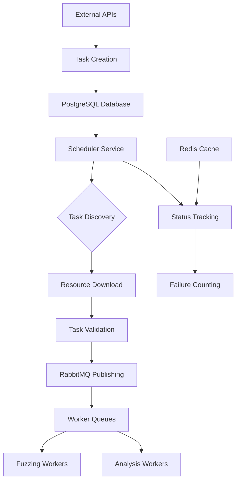

# Scheduler Component Analysis

The **Scheduler** component is a Go-based task orchestration service that acts as the central coordinator for the CRS. It manages the lifecycle of cybersecurity analysis tasks from discovery to worker distribution.

## Purpose and Functionality

- **Task Discovery**: Fetches pending tasks from a PostgreSQL database every minute
- **Task Publishing**: Publishes validated tasks to RabbitMQ queues for worker consumption
- **Resource Management**: Downloads and validates task resources (repositories, diffs, tooling)
- **Status Tracking**: Maintains task status through Redis and database updates

## Architecture Overview

### Core Technologies

- **Language**: Go 1.23.5
- **Framework**: Uber Fx (dependency injection)
- **Database**: PostgreSQL with GORM ORM
- **Message Queue**: RabbitMQ
- **Cache/State**: Redis with Sentinel support
- **Observability**: OpenTelemetry for tracing and logging

### Key Components

#### 1. Main Entry Point ([`cmd/scheduler/main.go`](../components/scheduler/cmd/scheduler/main.go))

Uses Fx dependency injection framework:

```go
func main() {
    fx.New(
        fx.Provide(
            config.LoadConfig,
            db.NewDBConnection,
            redis.NewRedisClient,
            rabbitmq.NewRabbitMQConnection,
            telemetry.NewTracer,
        ),
        fx.Invoke(scheduler.StartScheduler),
    ).Run()
}
```

#### 2. Core Scheduler ([`internal/scheduler/scheduler.go`](../components/scheduler/internal/scheduler/scheduler.go))

- Runs on 1-minute intervals with mutex protection against concurrent execution
- Manages multiple `ScheduleRoutine` implementations
- Graceful shutdown handling

#### 3. Task Service ([`service/task_service.go`](../components/scheduler/service/task_service.go))

**Key responsibilities**:

- **Resource Download**: Downloads and SHA256-validates task resources to `/crs/<task_id>/`
- **Task Validation**: Ensures required sources exist based on task type (`full` vs `delta`)
- **Queue Management**: Builds task queue elements for worker consumption
- **Failure Tracking**: Uses Redis to track task failure counts

## Data Models

### Task Model ([`models/tasks.go`](../components/scheduler/models/tasks.go))

```go
type Task struct {
    ID          string `gorm:"primaryKey;not null"`
    Focus       string `gorm:"not null"`        // Target component
    ProjectName string `gorm:"not null"`        // Project identifier
    TaskType    string `gorm:"type:tasktypeenum;not null"` // "full" or "delta"
    Status      string `gorm:"type:taskstatusenum;not null"`
}

type Source struct {
    TaskID     string `gorm:"not null"`
    SHA256     string `gorm:"not null;size:64"`
    SourceType string `gorm:"type:sourcetypeenum;not null"` // "repo", "diff", "fuzz_tooling"
    URL        string `gorm:"not null"`
    Path       string `gorm:"default:null"` // Local file path after download
}
```

## Configuration System

### Configuration Structure ([`config/config.go`](../components/scheduler/config/config.go))

```go
type AppConfig struct {
    DatabaseURL                string
    RabbitMQURL                string
    RedisSentinelHosts         string
    RedisMasterName            string
    CompetitionAPI CompetitionAPIConfig
    CrsAPI         CrsAPIConfig
}
```

### Environment Variables

```bash
DATABASE_URL              # PostgreSQL connection string
RABBITMQ_URL             # RabbitMQ connection string
REDIS_SENTINEL_HOSTS     # Redis Sentinel hosts
REDIS_MASTER_NAME        # Redis master name
OTEL_EXPORTER_OTLP_ENDPOINT  # OpenTelemetry endpoint
```

## Operational Workflow



## Integration Patterns

### Database Integration

- Repository pattern with GORM for database operations
- Task and Source entities with foreign key relationships
- Enum types for task status and source types

### Message Queue Integration

- Publishes validated tasks to RabbitMQ queues
- Different queues for different task types and priorities
- Failure handling with retry mechanisms

### Resource Management

```go
// Resource download and validation workflow
func (ts *TaskService) ProcessTask(task *Task) error {
    // 1. Create task workspace
    workspaceDir := filepath.Join("/crs", task.ID)

    // 2. Download all sources
    for _, source := range task.Sources {
        if err := ts.downloadAndValidate(source, workspaceDir); err != nil {
            return err
        }
    }

    // 3. Validate task requirements
    if err := ts.validateTaskSources(task); err != nil {
        return err
    }

    // 4. Publish to queue
    return ts.publishToQueue(task)
}
```

## Key Technical Features

### Fault Tolerance

- **Mutex protection**: Prevents concurrent execution of scheduler routines
- **Retry mechanisms**: Failed tasks are retried with exponential backoff
- **Graceful shutdown**: Proper cleanup of resources on termination
- **Health checks**: Monitoring of database and Redis connectivity

### Performance Optimizations

- **Batch processing**: Groups multiple tasks for efficient processing
- **Resource caching**: Local caching of downloaded resources
- **Connection pooling**: Efficient database and Redis connections
- **Concurrent downloads**: Parallel downloading of task resources

### Observability

- **OpenTelemetry integration**: Distributed tracing and metrics
- **Structured logging**: JSON-formatted logs with context
- **Health endpoints**: HTTP endpoints for monitoring
- **Error tracking**: Comprehensive error reporting and alerting

## Security Considerations

- **Input validation**: Strict validation of task parameters
- **Resource isolation**: Tasks isolated in separate directories
- **Access controls**: Database and Redis access controls
- **Audit logging**: Complete audit trail of task operations