# SeedGen Codex Mode (All Languages, Not Used in Competition)

Codex Mode is an alternative seed generation strategy in the CRS that leverages an external code analysis assistant tool called `codex` to provide deep codebase understanding and generate high-quality seeds without compilation or dynamic analysis.

## Overview

Codex Mode combines **static harness analysis** with **autonomous codebase exploration** to generate seeds through an interactive AI-powered code analysis tool. Unlike MCP mode which uses specialized servers, Codex mode uses a command-line tool that can autonomously navigate and analyze the codebase using various code analysis capabilities including tree-sitter AST parsing.

**Key Characteristics:**
- **Not used in the competition** (requires `ENABLE_CODEX=1` environment variable)
- Mutually exclusive with MCP mode (only one can be enabled at a time)
- Skips Claude models (returns early for Claude models)
- Supports all programming languages (C/C++, Java/JVM, etc.)
- No compilation or instrumentation required
- Uses external `codex` CLI tool for autonomous code analysis

## Architecture and Workflow

```mermaid
graph TB
    %% Input
    INPUT["INPUT<br/>━━━━━━━━━━━━━━━━━━━━━━━━━━━━<br/>• Task Message<br/>• project_name: 'libxml2'<br/>• src_path: source code<br/>• fuzz_tooling: OSS-Fuzz<br/>• gen_model: GPT-4.1/O4-mini<br/>• harnesses: [binary1, binary2, ...]"]

    %% Stage 1: Model Filtering
    subgraph S1["STAGE 1: MODEL FILTERING"]
        direction TB
        CHECK_MODEL["Check Model Type<br/>(aixcc.py:765-767)"]
        
        SKIP_CLAUDE["Skip if 'claude' in model<br/>Claude lacks Response API<br/>Return immediately"]
        
        CHECK_MODEL --> SKIP_CLAUDE
    end

    OUT1["OUTPUT → STAGE 2<br/>━━━━━━━━━━━━━━━━━━━━━━━━━━━━<br/>• Non-Claude models proceed<br/>• Project directory created<br/>• Java/JVM language detected"]

    %% Stage 2: Harness Discovery
    subgraph S2["STAGE 2: HARNESS DISCOVERY"]
        direction TB
        FIND_HARNESS["find_files_with_fuzzer_function()<br/>(aixcc.py:776-777)"]
        
        subgraph "Language Detection"
            JAVA_CHECK["Check if language in ['jvm', 'java']<br/>Sets is_java flag"]
            C_CHECK["C/C++ projects<br/>Find LLVMFuzzerTestOneInput"]
            JVM_CHECK["Java/JVM projects<br/>Find fuzzerTestOneInput"]
        end
        
        HARNESS_MAP["Create harness map<br/>binary_name → source_code"]
        
        FIND_HARNESS --> JAVA_CHECK
        JAVA_CHECK --> C_CHECK
        JAVA_CHECK --> JVM_CHECK
        C_CHECK --> HARNESS_MAP
        JVM_CHECK --> HARNESS_MAP
    end

    OUT2["OUTPUT → STAGE 3<br/>━━━━━━━━━━━━━━━━━━━━━━━━━━━━<br/>• Harness binaries list<br/>• Harness source code map<br/>• Language-specific settings"]

    %% Stage 3: Parallel Harness Processing
    subgraph S3["STAGE 3: PARALLEL HARNESS PROCESSING"]
        direction TB
        PARALLEL["ThreadPoolExecutor<br/>(aixcc.py:848-850)"]
        
        H1["Harness 1<br/>SeedCodexAgent"]
        H2["Harness 2<br/>SeedCodexAgent"]
        HN["Harness N<br/>SeedCodexAgent"]
        
        PARALLEL --> H1
        PARALLEL --> H2
        PARALLEL --> HN
    end

    OUT3["OUTPUT → STAGE 4<br/>━━━━━━━━━━━━━━━━━━━━━━━━━━━━<br/>• Individual harness processing tasks<br/>• Agent configuration per harness"]

    %% Stage 4: SeedCodexAgent Pipeline - Autonomous Analysis
    subgraph S4["STAGE 4: SEEDCODEXAGENT PIPELINE - AUTONOMOUS CODEBASE ANALYSIS (Per Harness)"]
        direction TB
        
        STEP1["Step 1: Prompt Construction<br/>(seedcodex.py:46-60)"]
        STEP2["Step 2: Codexbot Initialization<br/>(seedcodex.py:62-63)"]
        STEP3["Step 3: Codex CLI Invocation<br/>(codexbot.py:271-300)"]
        STEP4["Step 4: Autonomous Code Analysis<br/>(External Process)"]
        STEP5["Step 5: Script Generation & Validation<br/>(codexbot.py:227-246)"]
        STEP6["Step 6: Result Processing<br/>(codexbot.py:301-335)"]
        
        subgraph "Step 1 Details"
            subgraph "Prompt Components"
                P1["Harness source code"]
                P2["Codebase location"]
                P3["Analysis instructions:<br/>• Understand harness/codebase interaction<br/>• Identify test case structure<br/>• Analyze headers, fields, formats<br/>• File type requirements"]
                P4["Generation requirements:<br/>• Create Python generator script<br/>• Maximize code coverage<br/>• Security-focused test cases<br/>• Edge cases and vulnerabilities"]
                P5["Autonomy rules:<br/>• Work independently<br/>• Register tree-sitter first<br/>• Token limit awareness"]
            end
        end
        
        subgraph "Step 2 Details"
            BOT_CONFIG["Configuration:<br/>• seedd: None (no dynamic analysis)<br/>• harness_binary: name<br/>• target_project_dir: source path<br/>• model: GPT-4.1/O4-mini"]
        end
        
        subgraph "Step 3 Details"
            subgraph "Ultra-Thinking Mode"
                ULTRA["ULTRA_THINKING_PROMPT<br/>(codexbot.py:28-34)"]
                RIGOR["• Greater rigor & detail<br/>• Multi-angle verification<br/>• Challenge assumptions<br/>• Triple-verify everything<br/>• Cross-check with tools<br/>• Systematic weakness search"]
            end
            
            subgraph "Codex CLI Execution"
                CODEX_CMD["subprocess.run('codex')<br/>(codexbot.py:108-119)"]
                
                CMD_ARGS["Arguments:<br/>• -q: Quiet mode<br/>• --approval-mode full-auto<br/>• --model: LLM model<br/>• Prompt with task"]
                
                ENV_VARS["Environment:<br/>• OPENAI_API_KEY<br/>• OPENAI_BASE_URL<br/>• Working dir: project root"]
            end
        end
        
        subgraph "Step 4 Details"
            subgraph "Available Capabilities"
                CAP1["Tree-sitter AST parsing<br/>Register & query code structure"]
                CAP2["File system navigation<br/>Read source files with token limits"]
                CAP3["Code relationship analysis<br/>Understand dependencies"]
                CAP4["Pattern recognition<br/>Identify file formats & protocols"]
            end
            
            subgraph "Analysis Activities"
                ACT1["Study harness implementation"]
                ACT2["Trace function calls in codebase"]
                ACT3["Identify input constraints"]
                ACT4["Discover file format specs"]
                ACT5["Find edge cases & boundaries"]
            end
        end
        
        subgraph "Step 5 Details"
            subgraph "Graph Nodes"
                NODE_GEN["GenerationNode<br/>Initial script creation"]
                NODE_VAL["ScriptValidationNode<br/>Extract & validate Python"]
                NODE_ERR["ErrorHandlingNode<br/>Fix generation errors"]
            end
            
            subgraph "Validation Process"
                EXTRACT["Extract Python script<br/>From triple backticks"]
                VALIDATE["Validate syntax<br/>Try script execution"]
                GEN_SEEDS["Generate 400 seeds<br/>(num_seeds=400)"]
                RETRY["Retry on error<br/>Max 5 attempts"]
            end
        end
        
        SCRIPT_FINAL["📄 Final Generator Script<br/>400 seeds generated<br/>No coverage measurement"]
        
        subgraph "Step 6 Details"
            NO_COVERAGE["No Coverage Analysis<br/>seedd=None, skip evaluation<br/>Empty SeedFeedback"]
            
            TRACKER["Track Generation<br/>Log prompt, script, metadata"]
        end
        
        %% Main flow connections (step to step)
        STEP1 -.-> STEP2
        STEP2 -.-> STEP3
        STEP3 -.-> STEP4
        STEP4 -.-> STEP5
        STEP5 -.-> SCRIPT_FINAL
        SCRIPT_FINAL -.-> STEP6
        
        %% Styling for clarity
        style SCRIPT_FINAL fill:#e8f5e9,stroke:#4caf50,stroke-width:2px
        style ULTRA fill:#fff3e0,stroke:#ff9800,stroke-width:2px
        style NO_COVERAGE fill:#ffebee,stroke:#f44336,stroke-width:2px
        style STEP1 fill:#e3f2fd,stroke:#1976d2,stroke-width:2px
        style STEP2 fill:#e3f2fd,stroke:#1976d2,stroke-width:2px
        style STEP3 fill:#e3f2fd,stroke:#1976d2,stroke-width:2px
        style STEP4 fill:#e3f2fd,stroke:#1976d2,stroke-width:2px
        style STEP5 fill:#e3f2fd,stroke:#1976d2,stroke-width:2px
        style STEP6 fill:#e3f2fd,stroke:#1976d2,stroke-width:2px
    end

    OUT4["OUTPUT → STAGE 5<br/>━━━━━━━━━━━━━━━━━━━━━━━━━━━━<br/>• Generated seeds (400 per harness)<br/>• Generator Python scripts<br/>• No coverage metrics"]

    %% Stage 5: Output Processing
    subgraph S5["STAGE 5: OUTPUT & STORAGE"]
        direction TB
        
        subgraph "Deduplication Check"
            REDIS_CHECK["Redis Check<br/>(aixcc.py:796-805)"]
            CHECK_KEY["Key: seedcodex:{task_id}:{model}:{harness}<br/>Skip if already processed"]
        end
        
        SAVE["save_result_to_db()<br/>(aixcc.py:822-835)"]
        
        subgraph "Storage Configuration"
            STORAGE["Storage Details:<br/>• Path: /storage/seedgen/{task_id}/<br/>• Type: 'seedcodex'<br/>• Seeds: fuzzer_dir/seeds/"]
            
            CMIN_FLAG["Corpus Minimization:<br/>• C/C++: send_to_cmin=true<br/>• Java: send_to_cmin=false<br/>(aixcc.py:834)"]
        end
        
        subgraph "Artifacts"
            TAR["Compress seeds<br/>tar.gz format"]
            DB["Database record<br/>No coverage metrics"]
            REDIS_SET["Redis: Mark complete<br/>Set 'done' flag"]
        end
        
        REDIS_CHECK --> SAVE
        SAVE --> STORAGE
        STORAGE --> CMIN_FLAG
        SAVE --> TAR
        SAVE --> DB
        SAVE --> REDIS_SET
        
        CMIN_QUEUE["Conditional: cmin_queue<br/>Only for C/C++ projects"]
        
        CMIN_FLAG --> CMIN_QUEUE
    end

    FINAL_OUT["FINAL OUTPUT<br/>━━━━━━━━━━━━━━━━━━━━━━━━━━━━<br/>• Seeds archive: seedgen_{model}_{task_id}_{harness}.tar.gz<br/>• Database record (no coverage data)<br/>• C/C++ seeds queued for corpus minimization<br/>• Java seeds skip minimization"]

    %% Main flow connections (stage to stage)
    INPUT --> S1
    S1 --> OUT1
    OUT1 --> S2
    S2 --> OUT2
    OUT2 --> S3
    S3 --> OUT3
    OUT3 --> S4
    S4 --> OUT4
    OUT4 --> S5
    S5 --> FINAL_OUT

    %% Styling
    classDef inputOutput fill:#e1f5fe,stroke:#01579b,stroke-width:3px,color:#000
    classDef stage fill:#fff8e1,stroke:#f57f17,stroke-width:2px
    classDef filtering fill:#ffebee,stroke:#c62828,stroke-width:2px
    classDef discovery fill:#f3e5f5,stroke:#7b1fa2,stroke-width:2px
    classDef agent fill:#e8f5e9,stroke:#388e3c,stroke-width:2px
    classDef analysis fill:#fff3e0,stroke:#ef6c00,stroke-width:2px
    classDef output fill:#fce4ec,stroke:#c2185b,stroke-width:2px
    classDef external fill:#eceff1,stroke:#455a64,stroke-width:2px,stroke-dasharray: 5 5
    
    class INPUT,OUT1,OUT2,OUT3,OUT4,FINAL_OUT inputOutput
    class S1,S2,S3,S4,S5 stage
    class CHECK_MODEL,SKIP_CLAUDE filtering
    class FIND_HARNESS,JAVA_CHECK,C_CHECK,JVM_CHECK discovery
    class H1,H2,HN,BUILD_PROMPT,INIT_BOT,CODEX_RUN,GEN_GRAPH agent
    class ANALYSIS,CODEX_CMD analysis
    class SAVE,TAR,DB,STORAGE,CMIN_QUEUE,REDIS_CHECK,REDIS_SET output
    class CODEX_CMD,ANALYSIS external
```



## Detailed Component Analysis

### 1. Model Filtering ([`run_codex_mode`](../components/seedgen/infra/aixcc.py#L754))

Codex Mode has specific model requirements due to its reliance on the external `codex` CLI tool:

**Model Exclusion Logic** ([aixcc.py#L765-767](../components/seedgen/infra/aixcc.py#L765)):
```python
if "claude" in gen_model:
    return  # Skip Claude models - no Response API support
```

**Supported Models:**
- GPT-4.1
- O4-mini  
- Other OpenAI-compatible models with Response API

**Why Claude is Excluded:**
The `codex` CLI tool requires specific API capabilities that Claude models don't provide through the LiteLLM proxy setup.

### 2. The Codex CLI Tool

An external command-line tool that provides autonomous code analysis capabilities:

**Core Features:**
- **Autonomous Operation**: Works independently without human intervention (`--approval-mode full-auto`)
- **Code Understanding**: Can navigate and analyze large codebases
- **Tree-sitter Integration**: AST-based code parsing and querying
- **Token Awareness**: Manages token limits when reading large files
- **Multi-tool Capabilities**: Combines various analysis methods

**Command Structure** ([codexbot.py#L108-115](../components/seedgen/seedgen2/graphs/codexbot.py#L108)):
```bash
codex -q --approval-mode full-auto --model {model} "{prompt}"
```

**Environment Configuration:**
- Uses LiteLLM proxy for model access
- Runs in project directory for file access
- Returns JSON-formatted responses

### 3. SeedCodexAgent ([`seedcodex.py`](../components/seedgen/seedgen2/seedcodex.py))

The orchestrator that manages the codex-based seed generation process:

**Initialization** ([seedcodex.py#L19-38](../components/seedgen/seedgen2/seedcodex.py#L19)):
- Sets up result and shared directories
- Configures seed generator store
- Initializes tracking for audit logs
- No SeedD daemon needed (unlike Full Mode)

**Prompt Engineering** ([seedcodex.py#L46-60](../components/seedgen/seedgen2/seedcodex.py#L46)):
The agent constructs a comprehensive prompt that includes:

1. **Context Setting**: Project name, harness binary name, and full harness source code
2. **Analysis Instructions**:
   - Understand harness/codebase interaction patterns
   - Identify test case structure requirements
   - Analyze headers, metadata, and data fields
   - Recognize file type specifications
   - Find specific encoding requirements
3. **Generation Requirements**:
   - Create Python script for test case generation
   - Maximize code coverage
   - Focus on security testing
   - Include edge cases and vulnerability scenarios
4. **Operational Rules**:
   - Work autonomously without asking for clarification
   - Register tree-sitter before use
   - Respect token limits when reading files

### 4. Codexbot Workflow ([`codexbot.py`](../components/seedgen/seedgen2/graphs/codexbot.py))

A LangGraph-based workflow that manages script generation and validation:

#### Ultra-Thinking Mode ([codexbot.py#L28-34](../components/seedgen/seedgen2/graphs/codexbot.py#L28))

An advanced reasoning mode that enhances analysis quality:
- **Multi-perspective Analysis**: Explores even improbable angles
- **Self-challenge**: Actively disproves own assumptions
- **Triple Verification**: Every conclusion is verified multiple times
- **Cross-validation**: Uses multiple tools and methods
- **Weakness Search**: Deliberately looks for logical gaps
- **Final Reflection**: Complete reasoning chain review

#### Graph Structure ([codexbot.py#L227-246](../components/seedgen/seedgen2/graphs/codexbot.py#L227))

```python
StateGraph nodes:
1. GenerationNode → Initial script generation via codex CLI
2. ScriptValidationNode → Extract and validate Python code
3. ErrorHandlingNode → Fix errors with retry logic

Edge flow:
START → generate → validate_script → 
  ├─ [no error] → END
  └─ [error] → handle_error → validate_script (retry)
```

#### Script Extraction and Validation ([codexbot.py#L140-199](../components/seedgen/seedgen2/graphs/codexbot.py#L140))

**Extraction Process:**
- Uses regex to find Python code within triple backticks
- Returns error if no properly formatted code found

**Validation Steps:**
1. Extract script from response
2. Create new generator with extracted script
3. Execute generator to produce 400 seeds
4. Check for runtime errors
5. Retry up to 5 times on failure

### 5. Comparison with Other Modes

#### Codex Mode vs MCP Mode

| Aspect | Codex Mode | MCP Mode |
|--------|------------|----------|
| **Architecture** | External CLI tool (`codex`) | Built-in MCP servers |
| **Code Analysis** | Autonomous exploration | Server-based queries |
| **Execution** | Subprocess with full-auto mode | Direct API calls |
| **Model Support** | No Claude models | All models supported |
| **Tree-sitter** | Via codex tool | Via MCP server |
| **File Access** | Direct via codex | Via filesystem MCP |
| **Seed Count** | 400 seeds | 100 seeds |
| **Bug Detection** | No direct triage | Can submit to triage |
| **Deployment** | Not enabled | Currently enabled |

#### Codex Mode vs Full Mode

| Aspect | Codex Mode | Full Mode |
|--------|------------|-----------|
| **Language Support** | All languages | C/C++ only |
| **Compilation** | Not required | Required with instrumentation |
| **Dynamic Analysis** | None | SeedD daemon with coverage |
| **Coverage Feedback** | No measurement | Real-time coverage tracking |
| **Script Evolution** | Single generation | 3-iteration refinement |
| **Infrastructure** | Simple (codex CLI) | Complex (LLVM, SeedD, getcov) |
| **Resource Usage** | Lightweight | Resource-intensive |

#### Codex Mode vs Mini Mode

| Aspect | Codex Mode | Mini Mode |
|--------|------------|-----------|
| **Code Analysis** | Deep autonomous exploration | Harness-only analysis |
| **External Tools** | Codex CLI with capabilities | None |
| **Prompt Complexity** | Ultra-thinking mode | Simple generation |
| **Seed Generation** | 400 seeds | 100 seeds |
| **Script Quality** | Codebase-aware | Basic harness-based |

### 6. Key Design Decisions

1. **Mutual Exclusivity with MCP**: Only one advanced analysis mode can be active ([task_handler.py#L173-207](../components/seedgen/task_handler.py#L173))
   - Prevents resource conflicts
   - Simplifies debugging
   - Clear mode selection

2. **No Coverage Measurement**: Unlike Full Mode, Codex Mode doesn't measure coverage ([codexbot.py#L313-317](../components/seedgen/seedgen2/graphs/codexbot.py#L313))
   - No SeedD daemon integration
   - Focus on generation quality over metrics
   - Faster execution without overhead

3. **High Seed Count**: Generates 400 seeds vs 100 in other modes ([codexbot.py#L182](../components/seedgen/seedgen2/graphs/codexbot.py#L182))
   - Compensates for lack of coverage-guided refinement
   - Increases chance of finding vulnerabilities
   - Statistical approach to coverage

4. **Corpus Minimization Strategy**: 
   - C/C++ projects: Seeds sent to `cmin_queue`
   - Java projects: Skip minimization ([aixcc.py#L834](../components/seedgen/infra/aixcc.py#L834))

### 7. Advantages of Codex Mode

1. **Deep Codebase Understanding**: Autonomous exploration provides comprehensive analysis
2. **Language Agnostic**: Works with any programming language
3. **No Compilation Overhead**: Faster startup than Full Mode
4. **Advanced Reasoning**: Ultra-thinking mode for complex analysis
5. **Self-sufficient**: Doesn't require additional infrastructure
6. **High Seed Volume**: 400 seeds provide diverse test cases

### 8. Limitations

1. **No Coverage Metrics**: Cannot measure actual code coverage achieved
2. **Model Restrictions**: Doesn't support Claude models
3. **External Dependency**: Requires `codex` CLI tool installation
4. **No Feedback Loop**: Single-pass generation without refinement
5. **Not Competition-Ready**: Disabled in deployment, possibly experimental
6. **No Bug Triage Integration**: Unlike MCP mode, doesn't submit potential bugs

## Implementation References

- Main orchestrator: [`run_codex_mode()`](../components/seedgen/infra/aixcc.py#L754-876)
- Agent implementation: [`SeedCodexAgent`](../components/seedgen/seedgen2/seedcodex.py#L16-66)
- Codexbot workflow: [`/components/seedgen/seedgen2/graphs/codexbot.py`](../components/seedgen/seedgen2/graphs/codexbot.py)
- Task handler integration: [`task_handler.py#L191-205`](../components/seedgen/task_handler.py#L191)
- Database schema: [`schema.sql#L19`](../components/db/schema.sql#L19) (includes 'seedcodex' in fuzzertypeenum)

## Usage and Deployment

To enable Codex Mode:
1. Set environment variable: `ENABLE_CODEX=1`
2. Ensure `ENABLE_MCP` is not set (mutually exclusive)
3. Install and configure the `codex` CLI tool
4. Configure LiteLLM proxy with compatible models

**Note**: This mode was not used in the actual competition, suggesting it may have been an experimental feature or alternative approach that was superseded by MCP mode.