# SeedGen Mini Mode (All Languages)

Mini Mode is a lightweight seed generation strategy in the CRS that generates high-quality fuzzing seeds using only harness source code analysis, without requiring compilation or dynamic analysis. It supports all programming languages including C/C++ and Java/JVM projects.

## Overview

Mini Mode provides a **fast, language-agnostic approach** to seed generation by analyzing harness source code and generating Python scripts that produce test inputs. Unlike Full Mode, it operates purely through static analysis and LLM reasoning, making it suitable for projects where compilation infrastructure is unavailable or when rapid seed generation is prioritized.

## Architecture and Workflow

```mermaid
graph TB
    %% Input
    INPUT["INPUT<br/>━━━━━━━━━━━━━━━━━━━━━━━━━━━━<br/>• Task Message<br/>• project_name: 'libxml2' or 'pdfbox'<br/>• src_path: source code<br/>• fuzz_tooling: OSS-Fuzz<br/>• gen_model: GPT-4.1/Claude/O4<br/>• harnesses: [source1.c, source2.java, ...]"]

    %% Stage 1: Harness Discovery
    subgraph S1["STAGE 1: HARNESS DISCOVERY"]
        direction TB
        FIND["find_files_with_fuzzer_function()<br/>(aixcc.py:358-359)"]
        
        subgraph "Language Detection"
            DETECT_LANG["Check project_config<br/>language field"]
            JAVA_CHECK["is_java = language in<br/>['jvm', 'java']"]
        end
        
        subgraph "Harness Search"
            C_SEARCH["C/C++: Find<br/>LLVMFuzzerTestOneInput"]
            JAVA_SEARCH["Java: Find<br/>fuzzerTestOneInput"]
        end
        
        FIND --> DETECT_LANG
        DETECT_LANG --> JAVA_CHECK
        JAVA_CHECK --> |"C/C++"| C_SEARCH
        JAVA_CHECK --> |"Java/JVM"| JAVA_SEARCH
    end

    OUT1["OUTPUT → STAGE 2<br/>━━━━━━━━━━━━━━━━━━━━━━━━━━━━<br/>• harness_binaries: list of harness names<br/>• fuzzers: dict mapping names to source code<br/>• is_java: boolean flag"]

    %% Stage 2: Parallel Harness Processing
    subgraph S2["STAGE 2: PARALLEL HARNESS PROCESSING"]
        direction TB
        PARALLEL["ThreadPoolExecutor<br/>(aixcc.py:428-431)"]
        
        subgraph "Redis Deduplication"
            REDIS_CHECK["Check Redis key<br/>seedmini:{task_id}:{model}:{harness}"]
            SKIP["Skip if 'done'"]
            PROCESS["Process harness"]
        end
        
        H1["Harness 1<br/>SeedMiniAgent"]
        H2["Harness 2<br/>SeedMiniAgent"]
        HN["Harness N<br/>SeedMiniAgent"]
        
        PARALLEL --> REDIS_CHECK
        REDIS_CHECK --> |"exists"| SKIP
        REDIS_CHECK --> |"not exists"| PROCESS
        PROCESS --> H1
        PROCESS --> H2
        PROCESS --> HN
    end

    OUT2["OUTPUT → STAGE 3<br/>━━━━━━━━━━━━━━━━━━━━━━━━━━━━<br/>• Individual harness processing tasks<br/>• Harness source code per agent"]

    %% Stage 3: SeedMiniAgent Pipeline - Simplified Generation
    subgraph S3["STAGE 3: SEEDMINIAGENT PIPELINE - SIMPLIFIED GENERATION (Per Harness)"]
        direction TB
        
        subgraph "Step 1: Initial Script Generation"
            GEN_FIRST["generate_first_script()<br/>(seedmini.py:52)"]
            
            subgraph "No SeedD/Coverage"
                SOWBOT1["Sowbot: Analyze harness<br/>Generate Python script"]
                VALIDATE1["Validate syntax only<br/>No execution/coverage"]
                STORE1["Store as generator script<br/>No seed evaluation"]
            end
            
            GEN_FIRST --> SOWBOT1
            SOWBOT1 --> VALIDATE1
            VALIDATE1 --> STORE1
        end
        
        SCRIPT1["📄 Initial Script<br/>(Basic generator)<br/>100 seeds generated"]
        STORE1 --> SCRIPT1
        
        subgraph "Step 2: Structure Documentation"
            UPDATE_DOC["update_doc_mini()<br/>(seedmini.py:54)"]
            ANALYZE_HARNESS["Analyze harness code<br/>Extract requirements"]
            CREATE_DOC["Create structure doc<br/>via Plainbot"]
            
            UPDATE_DOC --> ANALYZE_HARNESS
            ANALYZE_HARNESS --> CREATE_DOC
        end
        
        DOC["📝 Structure Documentation<br/>(Input requirements)"]
        CREATE_DOC --> DOC
        
        subgraph "Step 3: Filetype Detection"
            GET_TYPE["get_filetype()<br/>(seedmini.py:55-60)"]
            DETECT["Identify format from:<br/>• Harness code<br/>• Project name<br/>• File patterns"]
            CLEAN["Remove quotes/ticks<br/>from result"]
            
            GET_TYPE --> DETECT
            DETECT --> CLEAN
        end
        
        FILETYPE["🏷️ Filetype Result<br/>(XML/JSON/binary/unknown)"]
        CLEAN --> FILETYPE
        
        subgraph "Step 4: Final Script Generation"
            BRANCH["Filetype == unknown?"]
            
            subgraph "Unknown Path"
                ALIGN_ONLY["align_script()<br/>(seedmini.py:65)"]
                USE_STRUCTURE["Use structure doc<br/>to align script"]
            end
            
            subgraph "Known Filetype Path"
                GEN_REF["generate_reference_script()<br/>(seedmini.py:68)"]
                REF_SCRIPT["Create format-specific<br/>reference script"]
                GEN_FILETYPE["generate_based_on_filetype()<br/>(seedmini.py:69-78)"]
                COMBINE["Combine:<br/>• Initial script<br/>• Structure doc<br/>• Reference script<br/>• Filetype knowledge"]
            end
            
            BRANCH --> |"Yes"| ALIGN_ONLY
            ALIGN_ONLY --> USE_STRUCTURE
            
            BRANCH --> |"No"| GEN_REF
            GEN_REF --> REF_SCRIPT
            REF_SCRIPT --> GEN_FILETYPE
            GEN_FILETYPE --> COMBINE
        end
        
        FINAL_SCRIPT["📄 Final Script<br/>(Complete generator)<br/>100 seeds total"]
        USE_STRUCTURE --> FINAL_SCRIPT
        COMBINE --> FINAL_SCRIPT
        
        %% Flow connections
        SCRIPT1 --> UPDATE_DOC
        SCRIPT1 --> GET_TYPE
        DOC --> BRANCH
        FILETYPE --> BRANCH
        SCRIPT1 --> BRANCH
        
        %% Styling for clarity
        style SCRIPT1 fill:#e8f5e9,stroke:#4caf50,stroke-width:2px
        style DOC fill:#fff3e0,stroke:#ff9800,stroke-width:2px
        style FILETYPE fill:#e3f2fd,stroke:#2196f3,stroke-width:2px
        style FINAL_SCRIPT fill:#f3e5f5,stroke:#9c27b0,stroke-width:2px
    end

    OUT3["OUTPUT → STAGE 4<br/>━━━━━━━━━━━━━━━━━━━━━━━━━━━━<br/>• Final generator script<br/>• 100 generated seeds per harness<br/>• No coverage metrics (not collected)"]

    %% Stage 4: Seed Execution in Docker
    subgraph S4["STAGE 4: SEED GENERATION IN DOCKER"]
        direction TB
        RUN_GEN["SeedGeneratorStore.run_generator()<br/>(generators.py:55-135)"]
        
        subgraph "Docker Container Execution"
            DOCKER["python:3.9-slim container"]
            MOUNT["Mount volumes:<br/>• generator.py (read-only)<br/>• wrapper.sh (executes 100x)<br/>• seeds/ output directory"]
            WRAPPER["Wrapper script:<br/>Loop 100 times<br/>Timeout: 5s per seed<br/>python generator.py seed_X"]
        end
        
        subgraph "Seed Generation"
            EXEC["Execute generator<br/>100 times"]
            CREATE["Create seed files:<br/>seed_0 to seed_99"]
            RENAME["Rename with UUID<br/>Prevent collisions"]
        end
        
        RUN_GEN --> DOCKER
        DOCKER --> MOUNT
        MOUNT --> WRAPPER
        WRAPPER --> EXEC
        EXEC --> CREATE
        CREATE --> RENAME
    end

    OUT4["OUTPUT → STAGE 5<br/>━━━━━━━━━━━━━━━━━━━━━━━━━━━━<br/>• 100 seed files per harness<br/>• Seeds stored in /seeds directory<br/>• Unique UUID-based naming"]

    %% Stage 5: Output Processing
    subgraph S5["STAGE 5: OUTPUT & STORAGE"]
        direction TB
        SAVE["save_result_func()<br/>(aixcc.py:407-416)"]
        
        subgraph "Storage Operations"
            TAR["Compress seeds<br/>tar.gz format"]
            DB["Database record<br/>No coverage metrics"]
            STORAGE["Storage path<br/>/storage/seedgen/{task_id}/"]
        end
        
        subgraph "Language-Specific Routing"
            LANG_CHECK["Check is_java flag"]
            CMIN_C["C/C++: Send to<br/>cmin_queue"]
            SKIP_JAVA["Java: Skip cmin<br/>(send_to_cmin=False)"]
        end
        
        SAVE --> TAR
        SAVE --> DB
        SAVE --> STORAGE
        STORAGE --> LANG_CHECK
        LANG_CHECK --> |"C/C++"| CMIN_C
        LANG_CHECK --> |"Java"| SKIP_JAVA
        
        REDIS_MARK["Redis: seedmini:{task_id}:{model}:{harness}<br/>Mark as 'done'"]
        
        STORAGE --> REDIS_MARK
    end

    FINAL_OUT["FINAL OUTPUT<br/>━━━━━━━━━━━━━━━━━━━━━━━━━━━━<br/>• Seeds archive: seedgen_{model}_{task_id}_{harness}.tar.gz<br/>• Database record (no coverage metrics)<br/>• C/C++: Seeds queued for corpus minimization<br/>• Java: Seeds directly available for fuzzing"]

    %% Main flow connections (stage to stage)
    INPUT --> S1
    S1 --> OUT1
    OUT1 --> S2
    S2 --> OUT2
    OUT2 --> S3
    S3 --> OUT3
    OUT3 --> S4
    S4 --> OUT4
    OUT4 --> S5
    S5 --> FINAL_OUT

    %% Styling
    classDef inputOutput fill:#e1f5fe,stroke:#01579b,stroke-width:3px,color:#000
    classDef stage fill:#fff8e1,stroke:#f57f17,stroke-width:2px
    classDef discovery fill:#fff3e0,stroke:#f57c00,stroke-width:2px
    classDef agent fill:#e8f5e9,stroke:#388e3c,stroke-width:2px
    classDef docker fill:#f3e5f5,stroke:#7b1fa2,stroke-width:2px
    classDef output fill:#fce4ec,stroke:#c2185b,stroke-width:2px
    
    class INPUT,OUT1,OUT2,OUT3,OUT4,FINAL_OUT inputOutput
    class S1,S2,S3,S4,S5 stage
    class FIND,DETECT_LANG,C_SEARCH,JAVA_SEARCH discovery
    class H1,H2,HN,GEN_FIRST,UPDATE_DOC,GET_TYPE,ALIGN_ONLY,GEN_FILETYPE agent
    class RUN_GEN,DOCKER,EXEC docker
    class SAVE,TAR,DB,STORAGE,CMIN_C,SKIP_JAVA,REDIS_MARK output
```



## Detailed Component Analysis

### 1. Harness Discovery ([`find_files_with_fuzzer_function`](../components/seedgen/infra/aixcc.py#L358))

Mini Mode begins by identifying all harness files in the project that contain fuzzer entry points.

**Language Detection:**
- Checks `project_config["language"]` field
- Sets `is_java = True` for "jvm" or "java" languages
- This flag determines downstream processing behavior

**Harness Search Patterns:**
- **C/C++**: Searches for `LLVMFuzzerTestOneInput` function
- **Java/JVM**: Searches for `fuzzerTestOneInput` method
- Returns dictionary mapping harness names to their source code

### 2. SeedMiniAgent Pipeline ([`seedmini.py`](../components/seedgen/seedgen2/seedmini.py))

The core orchestrator that manages a **simplified seed generation process** without compilation or coverage feedback.

**🔑 KEY INSIGHT: Static Analysis Only**

Unlike Full Mode's iterative refinement with coverage feedback, Mini Mode:
- Generates scripts based purely on harness source code analysis
- Does NOT execute seeds to measure coverage
- Does NOT iterate based on coverage gaps
- Produces ONE final script that generates ALL seeds

```text
Mini Mode Pipeline:
┌─────────────┐     ┌──────────────┐     ┌─────────────┐
│   Initial   │────▶│   Structure  │────▶│   Final     │
│   Script    │     │Documentation │     │   Script    │
│ (Template)  │     │  (Analysis)  │     │ (Complete)  │
└─────────────┘     └──────────────┘     └─────────────┘
       ▲                    ▲                    ▲
       │                    │                    │
   Harness              Harness              Filetype
   Analysis             Requirements         Knowledge
```

**Pipeline Stages:**

#### Step 1: Initial Script Generation ([`generate_first_script`](../components/seedgen/seedgen2/agents/glance.py#L39) at [seedmini.py#L52](../components/seedgen/seedgen2/seedmini.py#L52))
- Uses **Sowbot** graph with `seedd=None` parameter
- When `seedd` is None, Sowbot operates in "mini mode":
  - Generates Python script based on harness analysis
  - Validates script syntax only (no execution)
  - Returns empty `SeedFeedback` (no coverage data)
- Prompt: [`PROMPT_GENERATE_FIRST_SCRIPT`](../components/seedgen/seedgen2/agents/glance.py#L12)
- Creates initial generator script template

#### Step 2: Structure Documentation ([`update_doc_mini`](../components/seedgen/seedgen2/agents/alignment.py#L106) at [seedmini.py#L54](../components/seedgen/seedgen2/seedmini.py#L54))
- Uses **Plainbot** for simple text generation
- Analyzes harness source code to extract:
  - Input data structures
  - Field requirements
  - Size constraints
  - Format expectations
- Prompt: [`PROMPT_GENERATE_STRUCTURE_DOCUMENTATION`](../components/seedgen/seedgen2/agents/alignment.py#L26)
- Returns text documentation (not executable code)

#### Step 3: Filetype Detection ([`get_filetype`](../components/seedgen/seedgen2/agents/filetype.py#L11) at [seedmini.py#L55](../components/seedgen/seedgen2/seedmini.py#L55))
- Identifies target file format from:
  - Harness source code patterns
  - Project name hints
  - Function signatures
- Prompt: [`PROMPT_determine_file_type`](../components/seedgen/seedgen2/agents/filetype.py#L11)
- Removes quotes/ticks from result for clean string
- Returns: "XML", "JSON", "binary", or "unknown"

#### Step 4: Final Script Generation (Conditional Path)

**Path A: Unknown Filetype** ([seedmini.py#L63-65](../components/seedgen/seedgen2/seedmini.py#L63))
- Uses [`align_script`](../components/seedgen/seedgen2/agents/alignment.py#L60) 
- Aligns initial script with structure documentation
- Prompt: [`PROMPT_ALIGNMENT`](../components/seedgen/seedgen2/agents/alignment.py#L11)
- Generates final script based on documented requirements

**Path B: Known Filetype** ([seedmini.py#L67-78](../components/seedgen/seedgen2/seedmini.py#L67))
- First generates reference script via [`generate_reference_script`](../components/seedgen/seedgen2/agents/filetype.py#L38)
  - Prompt: [`PROMPT_reference`](../components/seedgen/seedgen2/agents/filetype.py#L24)
- Then uses [`generate_based_on_filetype`](../components/seedgen/seedgen2/agents/filetype.py#L50)
  - Combines initial script, structure doc, and reference
  - Prompt: [`PROMPT_generate`](../components/seedgen/seedgen2/agents/filetype.py#L28)
  - Produces format-aware generator script

### 3. Sowbot in Mini Mode ([`sowbot.py#L263-272`](../components/seedgen/seedgen2/graphs/sowbot.py#L263))

When `seedd` parameter is None, Sowbot operates differently:

```python
if self.seedd:
    seed_feedback = run_seeds(self.seedd, self.harness_binary, seeds)
else:
    # Empty SeedD means Seedgen is running in mini mode
    # So we don't run and evaluate seeds at all
    seed_feedback = SeedFeedback(
        coverage_info=None,
        partially_covered_functions=None,
        report=None,
    )
```

**Mini Mode Behavior:**
- Still validates Python script syntax
- Executes generator in Docker to produce seeds
- Does NOT measure coverage
- Does NOT provide feedback for refinement
- Returns empty feedback structure

### 4. Seed Generation in Docker ([`SeedGeneratorStore`](../components/seedgen/seedgen2/utils/generators.py#L29))

Mini Mode uses the same Docker-based execution as other modes, but without coverage collection:

**Execution Process:**
1. **Script Storage**: Saves generator script as `generator_{id}.py`
2. **Wrapper Creation**: Creates shell script to run generator 100 times
3. **Docker Execution**: 
   ```bash
   docker run --rm \
     -v generator.py:/app/generator.py:ro \
     -v wrapper.sh:/app/wrapper.sh:ro \
     -v seeds/:/app/output \
     python:3.9-slim \
     /app/wrapper.sh
   ```
4. **Seed Creation**: Each execution creates one seed file
5. **UUID Renaming**: Prevents naming collisions across parallel runs

**Safety Features:**
- 5-second timeout per seed generation
- Error handling for OOM and timeout conditions
- Validation that all 100 seeds were created
- Read-only mount for generator script

### 5. Parallel Processing Architecture

Mini Mode implements two levels of parallelism:

1. **Model-Level**: Multiple LLMs (GPT-4.1, Claude, O4-mini) process same task
2. **Harness-Level**: Each harness processed independently via ThreadPoolExecutor

**Redis-Based Deduplication:**
- Key format: `seedmini:{task_id}:{model}:{harness}`
- Prevents duplicate processing if job is retried
- Marks completion with "done" value

### 6. Language-Specific Handling

**C/C++ Projects:**
- Seeds sent to `cmin_queue` for corpus minimization
- Standard fuzzing pipeline integration

**Java/JVM Projects:**
- Skip corpus minimization (`send_to_cmin=False`)
- Seeds directly available for fuzzing
- No binary instrumentation required

## Key Advantages of Mini Mode

1. **Universal Language Support**: Works with any language (C/C++, Java, Python, etc.)
2. **No Compilation Required**: Operates purely on source code analysis
3. **Fast Generation**: No instrumentation or coverage collection overhead
4. **Simplified Pipeline**: Single-pass generation without iterative refinement
5. **Docker Isolation**: Safe execution environment for generated scripts
6. **Parallel Scalability**: Efficient processing of multiple harnesses

## Comparison with Full Mode

For a comprehensive comparison of all seedgen modes, see the [Mode Comparison Summary](./seedgen.md#mode-comparison-summary) in the main seedgen documentation.

## Limitations

- **No Coverage Guidance**: Cannot optimize for code coverage
- **No Runtime Feedback**: Cannot detect execution issues
- **Static Analysis Only**: May miss dynamic behavior patterns
- **Single-Shot Generation**: No iterative improvement based on results
- **LLM Dependent**: Quality entirely relies on LLM understanding

## Implementation References

- Main orchestrator: [`run_mini_mode()`](../components/seedgen/infra/aixcc.py#L340-459)
- Agent implementation: [`SeedMiniAgent`](../components/seedgen/seedgen2/seedmini.py#L20-79)
- Generator execution: [`SeedGeneratorStore`](../components/seedgen/seedgen2/utils/generators.py#L29-135)
- Sowbot mini mode: [`sowbot.py#L263-272`](../components/seedgen/seedgen2/graphs/sowbot.py#L263)
- Structure documentation: [`update_doc_mini()`](../components/seedgen/seedgen2/agents/alignment.py#L106-124)