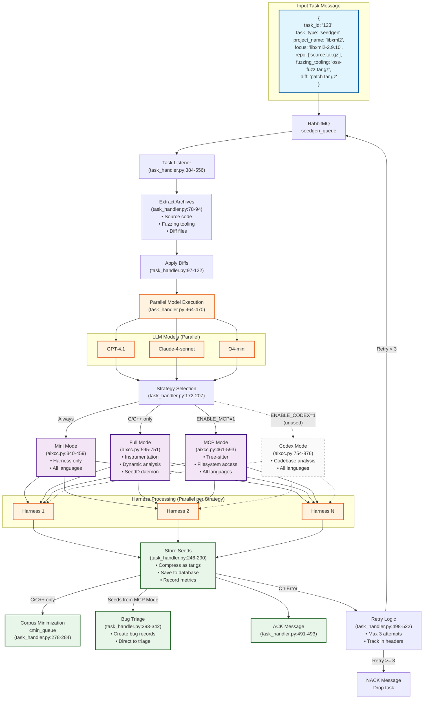

# SeedGen Component Analysis

The seedgen component is an LLM-powered seed generation system that creates initial fuzzing inputs to maximize code coverage. It implements a parallel processing architecture with **four distinct strategies** (three active, one unused):

**Main Workflow Entry Point**: [`components/seedgen/task_handler.py`](../components/seedgen/task_handler.py)
- Listens to RabbitMQ queue (`seedgen_queue`) for incoming tasks
- Processes tasks in parallel using multiple generative models (GPT-4.1, Claude-4-sonnet, O4-mini)
- Orchestrates seed generation strategies based on environment variables

## Key Design Choice: One-Time Generation Strategy

**🔑 N.B. Seedgen operates as a ONE-TIME generation at task arrival, NOT continuous generation based on coverage feedback.**

All four modes (Full, Mini, MCP, Codex) follow this same pattern ([task_handler.py#L143-207](../components/seedgen/task_handler.py#L143)):
- Seeds are generated **once** when a new task arrives from the queue
- No feedback loop from fuzzing back to seedgen
- Fuzzing takes these initial seeds and mutates them independently
- Multiple LLM models run in parallel for the same task, but each runs only once

```text
Task Arrival → Seedgen (once) → Initial Seeds → Fuzzing (continuous mutation) → Bug Discovery
     ↓              ↓                  ↓                    ↓
  Queue msg    3 models × N        cmin_queue         Fuzzers mutate
              seeds per harness                      independently
```

## Overall Workflow



The seedgen component follows a multi-layered parallel processing workflow with three levels of parallelism:

- **Task Reception and Distribution**: [`task_handler.py#L384-557`](../components/seedgen/task_handler.py#L384)
- **Archive Extraction**: [`task_handler.py#L78-94`](../components/seedgen/task_handler.py#L78)
- **Diff Application**: [`task_handler.py#L97-122`](../components/seedgen/task_handler.py#L97)
- **Parallel Model Processing**: [`task_handler.py#L464-490`](../components/seedgen/task_handler.py#L464)
- **Strategy Selection and Execution**: [`task_handler.py#L143-207`](../components/seedgen/task_handler.py#L143)
- **Result Storage and Distribution**: [`task_handler.py#L246-290`](../components/seedgen/task_handler.py#L246)
- **Error Handling and Retry Logic**: [`task_handler.py#L494-527`](../components/seedgen/task_handler.py#L494)

### Key Infrastructure Components

The infrastructure components provide the underlying technical capabilities that enable specific parts of the workflow:

**1. SeedD Service** ([`components/seedgen/seedd/`](../components/seedgen/seedd/)):
- **Purpose**: Go-based gRPC daemon that powers the Full Mode strategy's dynamic analysis capabilities
- **Integration**: Started via Docker container at [`aixcc.py#L654-697`](../components/seedgen/infra/aixcc.py#L654)
- **Workflow Connection**: Enables the "Dynamic analysis" feature shown in the Full Mode box of the workflow
- **Usage**: Each harness (H1, H2, HN) in Full Mode communicates with this daemon via gRPC for coverage collection and function enumeration
- **Scope**: Only used by Full Mode; not needed for Mini, MCP, or Codex modes

**2. Compilation Tools** (deployed at [`aixcc.py#L151-159`](../components/seedgen/infra/aixcc.py#L151)):
- **Purpose**: Custom instrumentation toolchain that enables Full Mode's code analysis
- **Components**:
  - `clang-argus/clang-argus++`: Instrumented compiler wrappers replacing standard compilers
  - `bandld`: Custom linker for binary instrumentation
  - `libcallgraph_rt.a`: Runtime library for call graph generation
  - `SeedMindCFPass.so`: LLVM pass for control flow instrumentation
- **Integration**: Deployed via [`compile_project()`](../components/seedgen/infra/aixcc.py#L151) before Full Mode execution
- **Workflow Connection**: Provides the "Instrumentation" capability mentioned in the Full Mode box
- **Prerequisite**: Must instrument the code before SeedD can perform dynamic analysis

**3. LiteLLM Proxy Integration**:
- **Purpose**: Unified API interface that powers the parallel LLM model execution
- **Configuration**: Set up via [`deployment.yaml:43-46`](../deployment.yaml:43) with multiple models
- **Integration**: Used by [`task_handler.py:464-470`](../components/seedgen/task_handler.py:464) with ThreadPoolExecutor
- **Workflow Connection**: Enables the "LLM Models (Parallel)" subgraph containing GPT-4.1, Claude-4-sonnet, and O4-mini
- **Model Selection**: Controlled via `GEN_MODEL_LIST` environment variable and `SeedGen2GenerativeModel.set_custom_model()`

## Four Key Seed Generation Strategies

| Mode | Agent Class | Language Support | Compilation Required | Key Features | Coverage Feedback | Script Evolution | Infrastructure | Corpus Minimization | Deployment Status |
|------|------------|-----------------|---------------------|--------------|-------------------|------------------|----------------|-------------------|------------------|
| **[Full](./seedgen-fullmode.md)** | [`SeedGenAgent`](../components/seedgen/seedgen2/seedgen.py#L35) | C/C++ only | Yes (instrumented) | • Binary instrumentation with LLVM<br>• SeedD daemon for dynamic analysis<br>• Function call graph collection | Yes (via SeedD) | 3 iterations with refinement | Complex (SeedD, getcov, LLVM) | Always for C/C++ | Active |
| **[Mini](./seedgen-minimode.md)** | [`SeedMiniAgent`](../components/seedgen/seedgen2/seedmini.py#L20) | All languages | No | • Lightweight harness-only analysis<br>• Docker-based seed execution<br>• Fastest execution time | No | Single generation | Simple (Docker only) | C/C++ only, skip for Java | Active (default) |
| **[MCP](./seedgen-mcpmode.md)** | [`SeedMcpAgent`](../components/seedgen/seedgen2/seedmcp.py#L148) | All languages | No | • Tree-sitter AST analysis<br>• MCP filesystem access<br>• Direct bug triage submission | No (static only) | Single-pass with MCP context | MCP servers (Node.js/Python) | None (direct to triage) | **Enabled** ([`ENABLE_MCP=1`](../deployment.yaml#L64)) |
| **[Codex](./seedgen-codexmode.md)** | [`SeedCodexAgent`](../components/seedgen/seedgen2/seedcodex.py#L16) | All languages | No | • Codexbot graph analysis<br>• Harness + codebase context<br>• Skips Claude models | No | Single generation | Codexbot graph | C/C++ only, skip for Java | **Unused** (needs `ENABLE_CODEX=1`) |

### Implementation Entry Points
- **Full Mode**: [`run_full_mode`](../components/seedgen/infra/aixcc.py#L595) (lines 595-751)
- **Mini Mode**: [`run_mini_mode`](../components/seedgen/infra/aixcc.py#L340) (lines 340-459)  
- **MCP Mode**: [`run_mcp_mode`](../components/seedgen/infra/aixcc.py#L461) (lines 461-593)
- **Codex Mode**: [`run_codex_mode`](../components/seedgen/infra/aixcc.py#L754) (lines 754-876)

### Mode Selection Logic
- Strategy selection: [`task_handler.py#L173-207`](../components/seedgen/task_handler.py#L173)
- MCP and Codex are mutually exclusive
- Java projects: Skip Full Mode ([`aixcc.py#L606-610`](../components/seedgen/infra/aixcc.py#L606))
- Corpus minimization: Java projects skip in Mini/Codex modes ([`aixcc.py#L415`](../components/seedgen/infra/aixcc.py#L415), [`aixcc.py#L834`](../components/seedgen/infra/aixcc.py#L834))

## How Generated Seeds Are Used (Not Fully Solved)

### Seed Storage and Distribution

**Seeds are NOT executed by the generation script directly**. The seedgen component generates 300-400 seeds per harness which are stored as compressed tar.gz archives ([`task_handler.py#L256-263`](../components/seedgen/task_handler.py#L256)), not executed directly.

### Distribution Paths by Mode

#### C/C++ Projects (Full, Mini, Codex modes)
1. Seeds compressed and stored in database ([`task_handler.py#L266-275`](../components/seedgen/task_handler.py#L266))
2. Seeds sent to `cmin_queue` for corpus minimization ([`task_handler.py#L278-284`](../components/seedgen/task_handler.py#L278))
3. cminplusplus controller processes from `cmin_queue` ([`cminplusplus/controller/app.py#L44-79`](../components/cminplusplus/controller/app.py#L44))
4. Minimized corpus stored in Redis: `cmin:{task_id}:{harness}` ([`cminplusplus/controller/tasks.py#L34-68`](../components/cminplusplus/controller/tasks.py#L34))

#### MCP Mode (All Languages)
- Seeds **directly saved as bug records** for triage, bypassing fuzzing ([`task_handler.py#L293-342`](../components/seedgen/task_handler.py#L293))
- Each seed becomes potential bug entry with all sanitizer/harness combinations

#### Java Projects
- Skip corpus minimization, seeds go directly to database ([`aixcc.py#L415`](../components/seedgen/infra/aixcc.py#L415), [`aixcc.py#L834`](../components/seedgen/infra/aixcc.py#L834))

### POC Validation
**No POC validation process exists**. Seeds are assumed to be initial inputs for mutation, not bugs. Only MCP mode seeds are treated as potential bugs and sent directly to triage.

### Fuzzer Seed Retrieval

Bandfuzz retrieves seeds through a **prioritized corpus grabber system** ([`bandfuzz/internal/corpus/grab.go#L33-38`](../components/bandfuzz/internal/corpus/grab.go#L33)):

1. **LibCminCorpusGrabber** - Minimized corpus from cminplusplus (highest priority)
2. **DBSeedGrabber** - Database retrieval ([`bandfuzz/internal/corpus/database.go#L41-61`](../components/bandfuzz/internal/corpus/database.go#L41)):
   - Fetches from: `seedgen`, `seedmini`, `corpus`, `seedmcp`, `seedcodex`
   - Plus last 10 `general` fuzzer seeds per harness
3. **CminSeedGrabber** - Redis key `cmin:{taskId}:{harness}` ([`bandfuzz/internal/corpus/cmin.go#L39-42`](../components/bandfuzz/internal/corpus/cmin.go#L39))
4. **MockSeedGrabber** - Random seeds for testing

### Seeds as Fuzzer Input Directory

When fuzzing starts ([`bandfuzz/internal/fuzz/aflpp/aflpp.go#L97`](../components/bandfuzz/internal/fuzz/aflpp/aflpp.go#L97)):
1. `CollectCorpusToDir` unpacks all seed tar.gz files into flat directory
2. Directory becomes **initial corpus directory** for fuzzer (e.g., AFL++)
3. Fuzzers then:
   - Load all seeds from directory
   - Use as starting points for mutation
   - Generate new inputs through fuzzing strategies

### Continuous Seed Collection During Fuzzing

During fuzzing, new interesting seeds are:
1. Collected by bandfuzz's SeedManager ([`bandfuzz/internal/seeds/seeds.go#L104-137`](../components/bandfuzz/internal/seeds/seeds.go#L104))
2. Batched and compressed into tar.gz bundles
3. Sent back to `cmin_queue` for minimization ([`bandfuzz/internal/seeds/seeds.go#L199-211`](../components/bandfuzz/internal/seeds/seeds.go#L199))
4. Stored in database as `general` fuzzer type seeds

### Key Insights
- Seeds stored as **tar.gz archives**, not executed by generation script
- **No POC validation** - seeds assumed as inputs for mutation, not bugs
- Seeds used as **initial corpus directory** for fuzzers
- Fuzzers **pick them up from directory** after unpacking, not through direct mutator injection
- System uses **corpus minimization** (cminplusplus) to reduce redundant seeds before fuzzing
