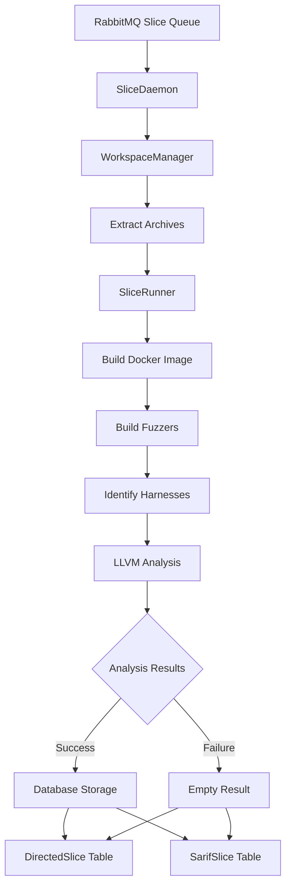

# Slice Component Analysis

The **slice component** is a critical part of the CRS that performs **static program slicing** on C/C++ codebases to identify code regions relevant to specific functions or security vulnerabilities. It serves as a code analysis tool using LLVM-based static analysis.

## Purpose and Functionality

- **Extracts relevant code paths** for targeted functions using LLVM-based static analysis
- **Supports both directed slicing and SARIF-compatible slicing** for different analysis workflows
- **Processes fuzzer harnesses** to understand which code is reachable from fuzzing entry points
- **Integrates with the larger CRS pipeline** through message queues and database storage

## Architecture Overview

### Core Design Pattern

The component follows a **microservice architecture** with:

- **Message Queue-Driven Processing**: Uses RabbitMQ for asynchronous task handling
- **Dockerized Execution Environment**: Leverages OSS-Fuzz infrastructure for consistent build environments
- **Database Integration**: Stores results in PostgreSQL for downstream consumption
- **Workspace Isolation**: Each analysis task runs in isolated temporary workspaces

### Integration Points

**Input**: Receives [`SliceMsg`](../components/slice/src/daemon/slice_msg.py#L5) messages containing:
- Project repositories (as tar archives)
- Fuzzing tooling (OSS-Fuzz infrastructure)
- Target functions to slice
- Optional diff patches for vulnerability analysis

**Output**: Writes slice results to database tables (`DirectedSlice` or `SarifSlice`)

## Key Components

### 1. Core Entry Points

- **[`src/app.py`](../components/slice/src/app.py)**: Main application entry point that initializes the daemon
- **[`entrypoint.sh`](../components/slice/entrypoint.sh)**: Docker container startup script that loads base-builder image
- **[`slice.py`](../components/slice/slice.py)**: LLVM analysis script executed inside project containers

### 2. SliceDaemon ([`src/daemon/daemon.py`](../components/slice/src/daemon/daemon.py))

Main message processing daemon:

```python
class SliceDaemon:
    def _on_message(self, ch, method, properties, body):
        # Processes incoming slice requests with retry logic

    def _process_slice(self, slice_msg):
        # Orchestrates the complete slicing workflow

    def _prepare_empty_result(self, slice_msg):
        # Creates fallback results for failed analyses
```

### 3. SliceRunner ([`src/daemon/modules/slicerunner.py`](../components/slice/src/daemon/modules/slicerunner.py))

Manages Docker-based slice execution for each fuzzer harness:

```python
# Key workflow steps:
# 1. Build/verify Docker images (standard or legacy OSS-Fuzz images)
self._build_docker_image()

# 2. Build fuzzers using OSS-Fuzz helper
self._build_fuzzers()

# 3. Identify harnesses containing LLVMFuzzerTestOneInput
harness_dirs = self.prepare_harnesses()

# 4. Run slice analysis per harness
for harness_name, harness_dir in harness_dirs.items():
    # Execute slice.py in project container with mounted bitcode
    result = docker_run([...slice_command...])

# 5. Merge results from all harnesses
self.merge_slice_results()
```

### 4. WorkspaceManager ([`src/daemon/modules/workspace.py`](../components/slice/src/daemon/modules/workspace.py))

Manages isolated workspaces for each slice task:

- **Security**: Enforces workspace creation only under `/tmp` to prevent data loss
- **Repository Handling**: Extracts tar archives for repositories, fuzzing tooling, and diffs
- **Infrastructure Location**: Locates `helper.py` in OSS-Fuzz infrastructure
- **Patch Application**: Applies diff patches when provided

## LLVM Analysis Implementation

### Core Analysis Script ([`slice.py`](../components/slice/slice.py))

```python
# Key steps in slice analysis:

# 1. Collect complete function set from bitcode
find_command = (
    f"find {BITCODE_PATH} -name '*.bc' "
    f"-exec llvm-nm --defined-only --no-demangle {{}} \\; | "
    f"grep -E ' [tT] ' | awk '{{print $3}}' > {function_set_file}"
)

# 2. Run static analyzer with slicing enabled
analyzer_cmd = [
    f"{STATIC_TOOLS_PATH}",  # Custom LLVM analyzer
    f"--srcroot={PROJECT_PATH}",
    "--callgraph=true",
    "--slicing=true",
    f"--output={harness_output_dir}",
    f"--multi={INPUT_FILE}"  # File containing target functions
]
analyzer_cmd.extend(found_files)  # All .bc files
```

## Technologies and Dependencies

### Core Technologies

- **LLVM 14**: For bitcode analysis and program slicing
- **Docker**: Container-based execution environment
- **Python 3**: Main implementation language
- **RabbitMQ**: Message queue for task distribution
- **PostgreSQL**: Result storage database

### Key Dependencies ([`Dockerfile`](../components/slice/Dockerfile))

```dockerfile
# LLVM toolchain
RUN apt-get install -y llvm-14 llvm-14-dev llvm-14-tools clang-14

# Python dependencies
RUN pip3 install pika sqlalchemy psycopg2 docker grpcio grpcio-tools openlit...

# OSS-Fuzz base image
COPY base-builder.tar.gz base-builder.tar.gz
```

## Configuration and Usage

### Environment Variables

```bash
RABBITMQ_URL          # Message queue connection
DATABASE_URL          # PostgreSQL database connection
SLICE_TASK_QUEUE      # Queue name for slice tasks
STORAGE_DIR           # Output directory for results
```

### Message Format Example

```python
SliceMsg(
    task_id='1',
    is_sarif=True,                    # Output format type
    slice_id='1',
    project_name='libpng',
    focus='example-libpng',           # Target repository name
    repo=['/path/to/repo.tar.gz'],    # Source repositories
    fuzzing_tooling='/path/to/fuzz-tooling.tar.gz',  # OSS-Fuzz infra
    diff='/path/to/diff.tar.gz',      # Optional vulnerability patch
    slice_target=[                    # Functions to slice
        ['contrib/tools/pngfix.c', 'OSS_FUZZ_process_zTXt_iCCP'],
        ['pngrutil.c', 'OSS_FUZZ_png_check_chunk_length']
    ]
)
```

## Integration with CRS Pipeline

### Workflow Diagram



### Upstream Dependencies

- **Repositories**: Source code packages from various sources
- **Fuzzing Infrastructure**: OSS-Fuzz tooling for consistent builds
- **Vulnerability Data**: Diff patches representing security fixes

### Downstream Consumers

- **Database Storage**: Results stored in `DirectedSlice`/`SarifSlice` tables
- **Other CRS Components**: Analysis results feed into vulnerability assessment and patch generation workflows

## Docker Compose Integration

```yaml
crs-slice-test:
  image: crs-slice:v0.2.1
  privileged: true           # Required for Docker-in-Docker
  depends_on:
    - crs-rabbitmq          # Message queue dependency
    - crs-postgres          # Database dependency
```

## Key Features and Limitations

### Strengths

- **Scalable Architecture**: Message queue enables horizontal scaling
- **Robust Error Handling**: Retry logic with fallback to empty results
- **Security Isolation**: Workspace sandboxing and container execution
- **Comprehensive Telemetry**: Detailed logging and span tracking for observability

### Current Limitations

- **No Delta Mode Support**: Cannot process incremental changes (noted in TODO)
- **Limited Line Number Support**: Cannot slice at line-level granularity
- **OSS-Fuzz Dependency**: Tightly coupled to OSS-Fuzz infrastructure

## Technical Implementation Details

The slice component represents a sophisticated static analysis tool that bridges traditional program slicing techniques with modern containerized CI/CD workflows, specifically tailored for cybersecurity vulnerability analysis in the DARPA AIxCC challenge context.

Key technical aspects:
- **LLVM bitcode analysis** for precise program slicing
- **Docker-in-Docker execution** for secure isolation
- **Multi-harness processing** for comprehensive coverage
- **Database integration** for persistent result storage