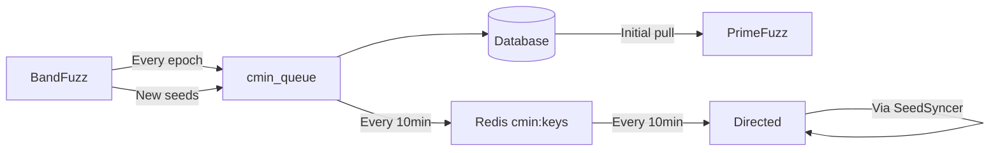

# Fuzzing Components

## Overview

The CRS employs three distinct fuzzing components that work together to find vulnerabilities:

1. **BandFuzz**: Collaborative fuzzing framework with scheduler-based resource management (C/C++ only)
2. **PrimeFuzz**: Message-driven continuous fuzzing service (all languages)
3. **Directed Fuzzing**: Delta-focused fuzzing targeting modified functions with language-specific implementations

## Component Comparison Table

| Aspect | BandFuzz | PrimeFuzz | Directed Fuzzing |
|--------|----------|-----------|------------------|
| **Mode Support** | Full and Delta | Full and Delta | Delta only |
| **Java Support** | ❌ Explicitly skips ([builder.go#L318](https://github.com/Team-Atlanta/42-afc-crs/blob/main/components/bandfuzz/internal/builder/builder.go#L318)) | ✅ Full support via Jazzer | ✅ Via `javadirected` component |
| **Fuzzer Engines** | AFL++ only (LibFuzzer stub not implemented) | LibFuzzer, Jazzer | AFL++ (C/C++), Jazzer (Java) |
| **Execution Mode** | Epoch-based (configurable: 10min default, 15min prod, 30s dev) | Continuous long-running | Continuous until cancelled |
| **Termination** | After each epoch, new fuzzlet selected | Runs indefinitely | Runs until task cancelled |
| **Seed Sync** | After epoch → Cmin queue → DB | Initial pull + runtime seedgen polling | Every 10 minutes from Redis |
| **Corpus Management** | Batched (1024 seeds or 1min) → cmin_queue | OSS-Fuzz internal + seedgen integration | Active sync via SeedSyncer |
| **Resource Allocation** | Factor-based scoring (Task, Sanitizer weights) | OSS-Fuzz resource management | Master/slaves for C/C++, replicas for Java |
| **Sanitizers (C/C++)** | Multi-sanitizer from project.yaml (default: ASAN) | ASAN only (reads project.yaml but doesn't use it) | ASAN only (hardcoded) |
| **Primary Use Case** | Broad exploration with resource limits | Deep continuous fuzzing | Targeted delta fuzzing |

## Detailed Comparison

### Language Support

**BandFuzz**:
- **C/C++ ONLY** - Skips Java projects entirely ([builder.go#L316-321](https://github.com/Team-Atlanta/42-afc-crs/blob/main/components/bandfuzz/internal/builder/builder.go#L316))
- Detects language from project.yaml but only processes non-JVM projects
- Uses OSS-Fuzz build system but limited to AFL++ compatible targets

**PrimeFuzz**:
- **Full multi-language support** via OSS-Fuzz infrastructure
- Special handling for Java with Jazzer ([triage.py#L101](https://github.com/Team-Atlanta/42-afc-crs/blob/main/components/primefuzz/modules/triage.py#L101))
- Supports: C/C++, Java, Python, Rust, Go, JavaScript, and more
- Language-specific sanitizers and crash detection

**Directed Fuzzing**:
- **Dual-language support**: C/C++ via AFL++ allowlists, Java via Jazzer selective instrumentation
- **Implementation**: Two separate services (`directed` for C/C++, `javadirected` for Java)
- **Common approach**: Both use program slicing to identify and target modified functions

### Sanitizers (C/C++)

**BandFuzz**:
- **Configuration**: Reads from `project.yaml` `sanitizers` field ([yamlParser.go#L43-48](https://github.com/Team-Atlanta/42-afc-crs/blob/main/components/bandfuzz/internal/builder/yamlParser.go#L43))
- **Default**: `["address"]` if not specified or on error ([afl.go#L15](https://github.com/Team-Atlanta/42-afc-crs/blob/main/components/bandfuzz/internal/builder/afl.go#L15))
- **Multi-Sanitizer Build Process**:
  1. Loops through each sanitizer ([afl.go#L26](https://github.com/Team-Atlanta/42-afc-crs/blob/main/components/bandfuzz/internal/builder/afl.go#L26))
  2. Creates separate binaries for each sanitizer ([afl.go#L38-45](https://github.com/Team-Atlanta/42-afc-crs/blob/main/components/bandfuzz/internal/builder/afl.go#L38))
  3. For each harness×sanitizer combination ([afl.go#L87-103](https://github.com/Team-Atlanta/42-afc-crs/blob/main/components/bandfuzz/internal/builder/afl.go#L87)):
     - Uploads artifact ([afl.go#L88](https://github.com/Team-Atlanta/42-afc-crs/blob/main/components/bandfuzz/internal/builder/afl.go#L88))
     - Creates fuzzlet entry ([afl.go#L96](https://github.com/Team-Atlanta/42-afc-crs/blob/main/components/bandfuzz/internal/builder/afl.go#L96))
  4. `addFuzzlet` adds to Redis set `b3fuzz:fuzzlets` ([upload.go#L55-72](https://github.com/Team-Atlanta/42-afc-crs/blob/main/components/bandfuzz/internal/builder/upload.go#L55))
- **Scheduling Weights**: ASAN=5, UBSAN=1, MSAN=1 ([simpleFactors.go#L37-52](https://github.com/Team-Atlanta/42-afc-crs/blob/main/components/bandfuzz/internal/scheduler/simpleFactors.go#L37))
- **Result**: Creates N×M fuzzlets (N harnesses × M sanitizers) all stored in Redis
- **Support**: address, undefined, memory (from OSS-Fuzz project.yaml)

**PrimeFuzz**:
- **Configuration**: Reads from `project.yaml` but doesn't use it ([fuzzing_runner.py#L1342-1345](https://github.com/Team-Atlanta/42-afc-crs/blob/main/components/primefuzz/modules/fuzzing_runner.py#L1342))
- **Implementation**: Always uses default ASAN only
- **Build Strategy**: Single build without `--sanitizer` flag ([fuzzing_runner.py#L1383-1389](https://github.com/Team-Atlanta/42-afc-crs/blob/main/components/primefuzz/modules/fuzzing_runner.py#L1383))
- **Support**: ASAN only in practice (despite reading multi-sanitizer config)

**Directed Fuzzing**:
- **Configuration**: Hardcoded to `"address"` sanitizer only ([daemon.py#L342](https://github.com/Team-Atlanta/42-afc-crs/blob/main/components/directed/src/daemon/daemon.py#L342))
- **Build Strategy**: AFL builds with ASAN only ([fuzzer_runner.py#L151](https://github.com/Team-Atlanta/42-afc-crs/blob/main/components/directed/src/daemon/modules/fuzzer_runner.py#L151))
- **Runtime**: Sets `SANITIZER=address` environment variable ([fuzzer_runner.py#L192](https://github.com/Team-Atlanta/42-afc-crs/blob/main/components/directed/src/daemon/modules/fuzzer_runner.py#L192))
- **Support**: ASAN only (no multi-sanitizer support)

#### BandFuzz Multi-Sanitizer Implementation Flow

Example: Project with 2 harnesses and 3 sanitizers = 6 fuzzlets created:
```go
// afl.go - buildAflArtifacts()
supportedSanitizers := ["address", "undefined", "memory"]  // From project.yaml
for _, sanitizer := range supportedSanitizers {            // L26: Loop each sanitizer
    // Build binaries with this sanitizer
    artifacts := b.compile_with_retry(ctx, isolatedDetails, buildConfig)

    for idx, harness := range harnesses {               // L87: Loop each harness
        // Upload artifact for this harness×sanitizer combo
        uploadPath := b.uploadArtifact(ctx, harness, taskId, sanitizer, "afl", artifacts[idx])

        // Create fuzzlet in Redis - L96 calls addFuzzlet()
        b.addFuzzlet(ctx, taskId, harness, sanitizer, "afl", uploadPath)
    }
}

// upload.go - addFuzzlet() creates fuzzlet entry
fuzzlet := types.Fuzzlet{
    TaskId:       taskId,
    Harness:      harness,      // e.g., "fuzz_parser"
    Sanitizer:    sanitizer,     // e.g., "address", "undefined", or "memory"
    FuzzEngine:   engine,
    ArtifactPath: artifactPath,
}
b.redisClient.SAdd(ctx, "b3fuzz:fuzzlets", fuzzletJSON)  // L70: Add to Redis set
```

### Fuzzer Engines

**BandFuzz**:
- **AFL++ exclusively** ([aflpp.go#L66](https://github.com/Team-Atlanta/42-afc-crs/blob/main/components/bandfuzz/internal/fuzz/aflpp/aflpp.go#L66))
- LibFuzzer code exists but returns "not supported yet" ([libfuzzer.go#L22](https://github.com/Team-Atlanta/42-afc-crs/blob/main/components/bandfuzz/internal/fuzz/libfuzzer.go#L22))
- Supports AFL++ variants: "afl", "aflpp", "directed"

**PrimeFuzz**:
- **LibFuzzer** for C/C++ projects
- **Jazzer** for Java/JVM projects
- Uses OSS-Fuzz's native engine selection

**Directed Fuzzing**:
- **C/C++**: AFL++ with allowlist-based selective instrumentation ([fuzzer_runner.py#L151](https://github.com/Team-Atlanta/42-afc-crs/blob/main/components/directed/src/daemon/modules/fuzzer_runner.py#L151))
- **Java**: Jazzer with selective instrumentation via `javadirected` component
- Both use program slicing to identify code paths to modified functions

### Execution Models

**BandFuzz - Epoch-Based**:
```
Loop:
1. Fetch fuzzlets from Redis
2. Score and select one fuzzlet
3. Run fuzzer for epoch duration (configurable)
4. Terminate fuzzer
5. Collect new seeds → cmin_queue
6. Repeat with new fuzzlet selection
```
- Default epochs: 10 minutes ([config.go#L45](https://github.com/Team-Atlanta/42-afc-crs/blob/main/components/bandfuzz/config/config.go#L45))
- Production: 15 minutes ([values.yaml#L6](https://github.com/Team-Atlanta/42-afc-crs/blob/main/deployment/crs-k8s/b3yond-crs/charts/bandfuzz/values.yaml#L6))
- Development: 30 seconds ([docker-compose.yaml#L26](https://github.com/Team-Atlanta/42-afc-crs/blob/main/components/bandfuzz/docker-compose.yaml#L26))

**PrimeFuzz - Continuous**:
```
Single long-running process:
1. Pull initial seeds from DB
2. Start fuzzing continuously
3. No automatic termination
4. Corpus managed internally by OSS-Fuzz
```

**Directed - Continuous with Sync**:
```
Continuous with periodic sync:
1. Start AFL++ in distributed mode
2. Run SeedSyncer every 10 minutes
3. Pull minimized seeds from Redis (cmin:task:harness)
4. Continue until task cancelled
```

### Seed Synchronization

**BandFuzz**:
- **Active collection during fuzzing** ([seeds.go#L104-137](https://github.com/Team-Atlanta/42-afc-crs/blob/main/components/bandfuzz/internal/seeds/seeds.go#L104))
- Batching: 1024 seeds or 1-minute intervals
- Flow: Fuzzer → SeedManager → cmin_queue → Database
- Seeds persist across epochs via database

**PrimeFuzz**:
- **Initial pull + runtime seedgen polling**
  - Initial: Pulls existing seeds via `db_manager.get_selected_seeds_corpus()` at startup ([fuzzing_runner.py#L525](https://github.com/Team-Atlanta/42-afc-crs/blob/main/components/primefuzz/modules/fuzzing_runner.py#L525))
  - Runtime Seedgen Polling:
    - Polls database every 60s for new seedgen-generated seeds ([fuzzing_runner.py#L1076](https://github.com/Team-Atlanta/42-afc-crs/blob/main/components/primefuzz/modules/fuzzing_runner.py#L1076))
    - Creates `{harness}_seed_corpus.zip` for OSS-Fuzz consumption ([fuzzing_runner.py#L660](https://github.com/Team-Atlanta/42-afc-crs/blob/main/components/primefuzz/modules/fuzzing_runner.py#L660))
    - **Fork Strategy** (`fork_on_seedgen=True` default):
      - Starts NEW fuzzer instance with seedgen corpus ([fuzzing_runner.py#L802-812](https://github.com/Team-Atlanta/42-afc-crs/blob/main/components/primefuzz/modules/fuzzing_runner.py#L802))
      - Original fuzzer continues unchanged (does NOT receive new seeds)
    - **Merge Strategy** (`merge_on_seedgen=True` default):
      - Combines existing corpus with seedgen seeds for the forked fuzzer only ([fuzzing_runner.py#L635-646](https://github.com/Team-Atlanta/42-afc-crs/blob/main/components/primefuzz/modules/fuzzing_runner.py#L635))

**Directed Fuzzing**:
- **Periodic synchronization** ([seed_syncer.py#L16](https://github.com/Team-Atlanta/42-afc-crs/blob/main/components/directed/src/daemon/modules/seed_syncer.py#L16))
- Checks Redis every 10 minutes (600s default interval)
- Pulls from `cmin:{task_id}:{harness}` keys ([seed_syncer.py#L72](https://github.com/Team-Atlanta/42-afc-crs/blob/main/components/directed/src/daemon/modules/seed_syncer.py#L72))
- Seeds shared across AFL++ instances via sync_dir ([seed_syncer.py#L63](https://github.com/Team-Atlanta/42-afc-crs/blob/main/components/directed/src/daemon/modules/seed_syncer.py#L63))

### Internal Resource Scheduling

**BandFuzz - Factor-Based Scoring**:
- **Fuzzlet selection** every epoch using weighted scoring ([pick.go#L29-58](https://github.com/Team-Atlanta/42-afc-crs/blob/main/components/bandfuzz/internal/scheduler/pick.go#L29)):
  - Task Factor: 1/num_fuzzlets_in_task ([simpleFactors.go#L11-31](https://github.com/Team-Atlanta/42-afc-crs/blob/main/components/bandfuzz/internal/scheduler/simpleFactors.go#L11))
  - Sanitizer Factor: ASAN=5, UBSAN=1, MSAN=1 ([simpleFactors.go#L37-52](https://github.com/Team-Atlanta/42-afc-crs/blob/main/components/bandfuzz/internal/scheduler/simpleFactors.go#L37))
- **Build strategy**: Separate binaries per sanitizer, creating fuzzlet for each harness×sanitizer combination

**PrimeFuzz - OSS-Fuzz Delegation**:
- No custom scheduling, relies on OSS-Fuzz infrastructure

**Directed - Master/Slave Distribution**:
- C/C++: AFL++ with 1 master + 4 slaves (configurable via AIXCC_AFL_SLAVE_NUM)
- Java: Jazzer with selective instrumentation

## Architectural Insights

### Division of Labor

The three components are **complementary, not redundant**:

1. **BandFuzz** handles native code with resource limits:
   - Best for: C/C++ projects needing controlled resource usage
   - Skips: Java/JVM projects entirely
   - Strength: Fair distribution across multiple tasks

2. **PrimeFuzz** provides deep, continuous fuzzing:
   - Best for: All languages, especially Java
   - Handles: Complex projects needing language-specific tools
   - Strength: Leverages full OSS-Fuzz capabilities

3. **Directed** targets code changes:
   - Best for: Delta fuzzing after patches (**Delta mode ONLY**)
   - Explicitly rejects full mode tasks ([daemon.py#L154-157](https://github.com/Team-Atlanta/42-afc-crs/blob/main/components/directed/src/daemon/daemon.py#L154))
   - Focus: Modified functions in both C/C++ and Java
   - Strength: Efficient vulnerability discovery in changes using slicing and selective instrumentation

### Delta Mode Implementation Details

**Patch Application Process**:
- Delta tasks include a `Diff` field containing Git-style patches (.patch or .diff files)
- BandFuzz: Applies patches via `patch -p1` command ([download.go#L161](https://github.com/Team-Atlanta/42-afc-crs/blob/main/components/bandfuzz/internal/builder/download.go#L161))
- Directed: Uses PatchManager to identify modified functions ([daemon.py#L190](https://github.com/Team-Atlanta/42-afc-crs/blob/main/components/directed/src/daemon/daemon.py#L190))
- Patches are applied to the focus repository after extraction

### Seed Flow Architecture



### Key Implementation Details

1. **Why BandFuzz skips Java**:
   - AFL++ cannot instrument JVM bytecode
   - Java needs specialized tools (Jazzer)
   - PrimeFuzz already handles Java effectively

2. **Why different sync strategies**:
   - BandFuzz: Frequent restarts need active sync
   - PrimeFuzz: Long-running trusts OSS-Fuzz management
   - Directed: Needs latest seeds for targeted fuzzing

3. **Sanitizer strategy differences**:
   - BandFuzz: TRUE multi-sanitizer with separate binaries and weighted scheduling
   - PrimeFuzz: ASAN-only despite reading multi-sanitizer config
   - Directed: ASAN-only hardcoded for speed in delta fuzzing

4. **Sanitizer Implementation Gap**:
   - Only BandFuzz actually implements multi-sanitizer fuzzing via fuzzlet creation
   - PrimeFuzz reads sanitizer config but doesn't use it (possible TODO/incomplete feature)
   - This means less sanitizer diversity than the configuration suggests

5. **Resource efficiency trade-offs**:
   - BandFuzz: Higher overhead from restarts, better diversity
   - PrimeFuzz: Lower overhead, deeper exploration
   - Directed: Focused resources on likely vulnerable code

## Computing Resource Assignment

### Deployment Configuration

| Component | Type | Replicas | CPU/Pod | Scaling | Mode Support |
|-----------|------|----------|---------|---------|--------------|
| **BandFuzz** | Deployment | 0-24* | 30 | Static | Full and Delta |
| **PrimeFuzz** | Deployment | 8-16 | 8-16 | Dynamic (KEDA) | Full & Delta |
| **Directed (C/C++)** | ScaledJob | 0-8 | 30 | Dynamic (KEDA) | Delta only |
| **Directed (Java)** | Deployment | 2 | 4-8 | Static | Delta only |

*Environment-specific: Production=24, Test=4, Dev=1, Default=0

### Resource Allocation by Task Mode (Production)

**Full Mode**:
- BandFuzz: 720 CPUs (24 pods × 30 CPUs) - processes full mode tasks ([download.go#L49](https://github.com/Team-Atlanta/42-afc-crs/blob/main/components/bandfuzz/internal/builder/download.go#L49))
- PrimeFuzz: 64-256 CPUs (8-16 pods × 8-16 CPUs) - accepts all task types
- Directed: 0 CPUs (not activated for full mode)
- **Total**: 784-976 CPUs

**Delta Mode**:
- BandFuzz: 720 CPUs (24 pods × 30 CPUs) - also processes delta tasks ([download.go#L49](https://github.com/Team-Atlanta/42-afc-crs/blob/main/components/bandfuzz/internal/builder/download.go#L49))
- PrimeFuzz: 64-256 CPUs (8-16 pods × 8-16 CPUs) - continues for all languages
- Directed: Language-specific activation
  - C/C++ projects: 0-240 CPUs (0-8 jobs × 30 CPUs) via ScaledJob ([daemon.py#L422](https://github.com/Team-Atlanta/42-afc-crs/blob/main/components/directed/src/daemon/daemon.py#L422))
  - Java projects: 8-16 CPUs (2 pods × 4-8 CPUs) via separate deployment
  - Note: Only one type launches per task based on project language ([daemon.py#L170-171](https://github.com/Team-Atlanta/42-afc-crs/blob/main/components/directed/src/daemon/daemon.py#L170))
- **Total**: 792-1232 CPUs (max theoretical, actual depends on language)

**Key Insight**: All components accept both full and delta tasks. Directed fuzzing only activates for delta mode tasks that include diff URLs.

### Environment-Specific Configuration

**BandFuzz Environment Settings**:
- Production: 24 pods ([values.prod.yaml#L125](https://github.com/Team-Atlanta/42-afc-crs/blob/main/deployment/crs-k8s/b3yond-crs/values.prod.yaml#L125))
- Test: 4 pods ([values.test.yaml#L115](https://github.com/Team-Atlanta/42-afc-crs/blob/main/deployment/crs-k8s/b3yond-crs/values.test.yaml#L115))
- Development: 1 pod ([values.dev.yaml#L126](https://github.com/Team-Atlanta/42-afc-crs/blob/main/deployment/crs-k8s/b3yond-crs/values.dev.yaml#L126))
- Base chart default: 0 pods ([values.yaml#L5](https://github.com/Team-Atlanta/42-afc-crs/blob/main/deployment/crs-k8s/b3yond-crs/charts/bandfuzz/values.yaml#L5))

### Key Resource Management Insights

1. **Environment-Based Scaling Strategy**:
   - BandFuzz scales from 0 to 24 pods via Helm deployment values
   - PrimeFuzz uses KEDA for dynamic scaling (8-16 replicas)
   - Directed uses KEDA ScaledJob for on-demand job creation

2. **Task Mode Distribution**:
   - **Full Mode**: BandFuzz + PrimeFuzz (both accept full and delta tasks)
   - **Delta Mode**: All three components active
     - BandFuzz: Applies patches and fuzzes
     - PrimeFuzz: Applies patches and fuzzes (may fork on seedgen)
     - Directed: ONLY accepts delta tasks, performs slicing-guided fuzzing
   - No special resource allocation per mode - components self-select tasks

3. **Dynamic vs Static Trade-offs**:
   - Static (BandFuzz): Predictable capacity, no scaling overhead
   - Dynamic (PrimeFuzz/Directed): Efficient resource usage, responds to load
   - KEDA cooldown periods (300s) prevent thrashing

4. **Autoscaling Mechanisms**:
   - PrimeFuzz: Scales based on Docker-in-Docker container load ([scaled_object.yaml#L9-18](https://github.com/Team-Atlanta/42-afc-crs/blob/main/deployment/crs-k8s/b3yond-crs/charts/primefuzz/templates/scaled_object.yaml#L9))
   - Directed C/C++: Scales based on queue length ([scaled_job.yaml#L7-10](https://github.com/Team-Atlanta/42-afc-crs/blob/main/deployment/crs-k8s/b3yond-crs/charts/directed/templates/scaled_job.yaml#L7))
   - Directed Java: Fixed 2 replicas (no autoscaling)

5. **Mode Acceptance Patterns**:
   - BandFuzz and PrimeFuzz: Accept both full and delta tasks without filtering
   - Directed Fuzzing: Explicitly filters for delta mode only
   - Delta mode identified by presence of `Diff` field in task message