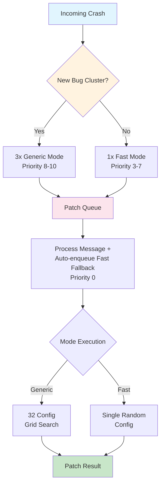

# Fast vs Generic Patch Modes: Strategic Dual-Mode Architecture

## Overview

The PatchAgent employs a **dual-mode patching strategy** to balance between thoroughness and speed, reflecting the AIxCC competition's time pressure and accuracy requirements. Every incoming crash is processed through a carefully orchestrated workflow that maximizes patch success rates while managing computational resources efficiently.

## Workflow for Each Incoming Crash



### 1. Triage Phase
([`components/triage/task_handler.py#L543-L552`](https://github.com/Team-Atlanta/42-afc-crs/blob/main/components/triage/task_handler.py#L543))

When a crash arrives, the triage component determines the patching strategy:
- **New bug clusters**: Enqueue **3× generic mode** messages (priority 8-10)
- **Existing bug clusters**: Enqueue **1× fast mode** message per active cluster (priority 3-7)

### 2. Patch Queue Processing
([`components/patchagent/patch_generator/main.py#L40-L62`](https://github.com/Team-Atlanta/42-afc-crs/blob/main/components/patchagent/patch_generator/main.py#L40))

The patch generator implements a **dual-queue architecture**:
- Every received message triggers immediate re-enqueue of a **fast mode fallback** (priority 0)
- Original message is processed with its designated mode and priority
- This ensures **automatic fallback** for every patch attempt

### 3. Total Patch Attempts
- **New clusters**: 6 attempts (3 generic + 3 auto-generated fast fallbacks)
- **Existing clusters**: 2 attempts per cluster (1 fast + 1 auto-generated fast fallback)

## Generic Mode: Exhaustive Parameter Search

### Implementation
([`components/patchagent/patchagent/agent/generator.py#L36-L46`](https://github.com/Team-Atlanta/42-afc-crs/blob/main/components/patchagent/patchagent/agent/generator.py#L36))

Generic mode performs a **systematic grid search** across 32 parameter combinations:

```python
for counterexample_num in [0, 3]:           # 2 options
    for temperature in [0, 0.3, 0.7, 1]:    # 4 options
        for auto_hint in [True, False]:     # 2 options
            # Total: 2 × 4 × 2 = 16 combinations per counterexample setting
            # Grand total: 32 different agent configurations
```

### Key Parameters

| Parameter | Values | Purpose |
|-----------|--------|---------|
| **counterexample_num** | {0, 3} | Number of previous failed patches to include as context |
| **temperature** | {0, 0.3, 0.7, 1} | LLM creativity/randomness setting |
| **auto_hint** | {True, False} | Whether to provide automatic vulnerability hints |
| **max_iterations** | 30 | Maximum LLM interaction rounds per configuration |

### Execution Strategy
- Tries each configuration sequentially
- Stops when a valid patch is found
- Exhausts all 32 combinations if no valid patch emerges

## Fast Mode: Random Single-Shot Attempt

### Implementation
([`components/patchagent/patchagent/agent/generator.py#L27-L35`](https://github.com/Team-Atlanta/42-afc-crs/blob/main/components/patchagent/patchagent/agent/generator.py#L27))

Fast mode uses a **single randomized configuration** for rapid patch generation:

```python
kwargs["auto_hint"] = random.choice([True, False])
kwargs["counterexample_num"] = 0  # Always 0 - no counterexamples
kwargs["max_iterations"] = 15     # Reduced from 30
kwargs["temperature"] = random.random()  # Random float [0, 1]
```

### Key Characteristics
- **Single configuration** instead of systematic search
- **No counterexamples** for faster processing
- **Reduced iterations** (15 vs. 30) for quicker termination
- **Random parameters** for diversity across attempts

## Mode Comparison

| Aspect | Generic Mode | Fast Mode |
|--------|--------------|-----------|
| **Configurations** | 32 systematic combinations | 1 random configuration |
| **Counterexamples** | 0 or 3 | Always 0 |
| **Temperature** | Fixed set: {0, 0.3, 0.7, 1} | Random [0, 1] |
| **Auto-hint** | Both True and False tested | Random choice |
| **Max Iterations** | 30 | 15 |
| **Priority** | High (8-10) for new clusters | Medium (3-7) or Low (0) |
| **Use Case** | Primary attempt for new vulnerabilities | Quick fallback or existing clusters |
| **Time Investment** | High (exhaustive search) | Low (single attempt) |

## Failure Handling and Retry Logic

### Generic Mode Failure
([`components/patchagent/patch_generator/main.py#L126-L131`](https://github.com/Team-Atlanta/42-afc-crs/blob/main/components/patchagent/patch_generator/main.py#L126))

When generic mode encounters an exception:
- Triggers `resend_to_patch_queue()` with **same mode** but **priority - 1**
- Only applies to generic mode (fast/none modes are not retried)
- Process exits with code 1, forcing container restart

### Fast Mode Fallback
- Automatically created for **every** message (both generic and fast)
- Always queued with **priority 0** (lowest)
- Ensures every bug gets at least 2 attempts with different strategies

## Strategic Design Rationale

### AIxCC Competition Constraints

The dual-mode architecture addresses three key competition factors:

1. **Time Pressure**:
   - Early submission yields 100% points
   - Score declines to 50% at deadline
   - Fast mode enables quick patches for known patterns

2. **Accuracy Requirements**:
   - Heavy penalties for false positives
   - Generic mode's exhaustive search increases success probability

3. **Resource Constraints**:
   - Limited compute resources for patch generation
   - Fast mode preserves resources for critical patches

### Priority System

The priority system ensures efficient resource allocation:
- **High Priority (8-10)**: New vulnerabilities requiring thorough analysis
- **Medium Priority (3-7)**: Known patterns from existing clusters
- **Low Priority (0)**: Automatic fallback attempts

### Success Optimization

The strategy optimizes for:
- **Thoroughness for new vulnerabilities** via generic mode
- **Speed for known patterns** via fast mode
- **Guaranteed coverage** via automatic fallback
- **Computational brute force** over algorithmic sophistication

## Performance Implications

### Expected Outcomes

| Scenario | Generic Mode | Fast Mode |
|----------|--------------|-----------|
| **New vulnerability type** | Higher success rate (exhaustive) | Lower success rate (single shot) |
| **Known vulnerability pattern** | Overkill (wastes resources) | Optimal (quick resolution) |
| **Complex multi-step fix** | Better suited (more iterations) | May timeout (limited iterations) |
| **Simple one-line fix** | Slower to find | Quick resolution |

### Resource Usage

- **Generic Mode**: Up to 32× more LLM API calls and compute time
- **Fast Mode**: Minimal resource usage, suitable for bulk processing
- **Fallback System**: Doubles the total attempts but at lower priority

## Implementation Details

### Message Format

Both modes receive identical message formats from the triage system:
- Challenge ID
- Vulnerability report (sanitizer output)
- Source code location
- Priority level
- Mode designation ("fast" or "generic")

### Agent Configuration

The generator creates agents with mode-specific configurations:
- Both modes use the same base agent class
- Configuration parameters are injected at instantiation
- Tool access (viewcode, locate, validate) remains consistent

### Validation Process

Both modes undergo identical validation:
1. Patch application to source code
2. Compilation verification
3. PoC replay to confirm vulnerability fix
4. Functional testing to prevent regressions

## Key Insights

1. **Brute Force Over Intelligence**: The system relies on parameter exploration rather than sophisticated failure analysis
2. **Automatic Coverage**: Every vulnerability gets multiple attempts through the fallback mechanism
3. **Priority-Based Resource Management**: Competition time pressure drives the priority system
4. **Mode Selection Heuristics**: New clusters get thorough treatment, existing patterns get quick attempts
5. **No Learning Between Attempts**: Each configuration is independent, no cross-pollination of insights