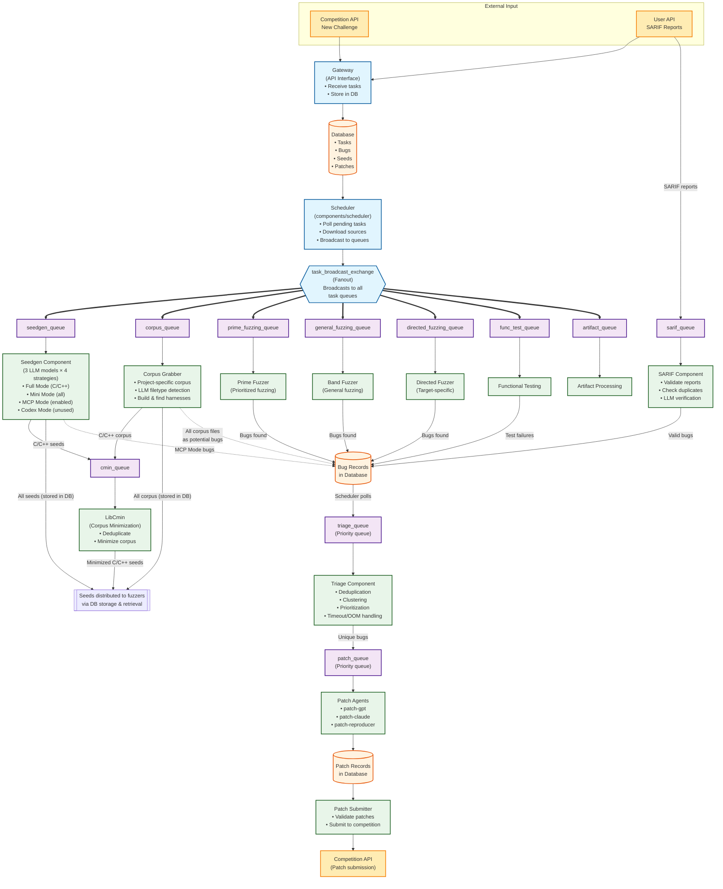

# Roadmap of the CRS study

## Overview

The [local copy of blog](blog.md) provides the overview of the 42-b3yond-6ug team's CRS (in section "About 42-b3yond-6ug").

The CRS consists of three main components:

## 1. Bug Finding
A comprehensive bug discovery pipeline with multiple complementary approaches:

- **[Fuzzing Components](fuzzing.md)** - Core fuzzing engines
  - [BandFuzz](bandfuzz.md) - Advanced ensemble fuzzing framework
  - [PrimeFuzz](primefuzz.md) - Prioritized fuzzing approach
  - [Directed Fuzzing](directed.md) - Target-specific fuzzing with AFL++ allowlist & Jazzer
- **[Seed Generation](seedgen.md)** - LLM-powered seed generation with multiple strategies
  - [Full Mode](seedgen-fullmode.md) - Compiler instrumentation and dynamic analysis for C/C++
  - [Mini Mode](seedgen-minimode.md) - Lightweight static analysis for all languages
  - [MCP Mode](seedgen-mcpmode.md) - Model Context Protocol for deep code analysis (currently enabled)
  - [Codex Mode](seedgen-codexmode.md) - Autonomous codebase exploration (not used in competition)
- **[Analysis Components](analysis.md)** - Bug analysis and corpus optimization
  - [Triage Component](triage.md) - Bug deduplication, clustering, and prioritization
  - [Slice Analysis](slice.md) & [JavaSlicer](javaslicer.md) - Program slicing for analysis
  - [Cmin++](cminplusplus.md) - Corpus minimization
- **[Corpus Management](corpus_grabber.md)** - Intelligent corpus acquisition with two-tier selection strategy
- **[Some Questions](some-questions.md)** - Analysis of LLM's role, seed flow, and fuzzer resource scheduling

## 2. Patch Generation
- [Patch Agent Component](patch_agent.md) - LLM-powered automated patch generation

## 3. Report Processing
- [SARIF Component](sarif.md) - Static analysis report validation and processing

Besides:
- A [tentative doc](./how-seeds-used.md) recording how seeds are used in fuzzers.
- The `prime fuzzing` & `directed fuzzing` in the following diagram seems not correctly reflect its usage, validate and fix them later
- The core fuzzer is bandfuzz, which seems like an advanced ensemble fuzzing framework? Need to check more detail in code & [paper](https://arxiv.org/pdf/2507.10845)

## Complete System Workflow

1. **Fanout Architecture**: The scheduler broadcasts tasks to all relevant queues simultaneously ([`scheduler/internal/messaging/initializer.go#L41-49`](https://github.com/Team-Atlanta/42-afc-crs/blob/main/components/scheduler/internal/messaging/initializer.go#L41)), enabling parallel processing across multiple components.

2. **Priority Queuing**: Critical queues (`triage_queue` and `patch_queue`) support priority levels ([`initializer.go#L50-53`](https://github.com/Team-Atlanta/42-afc-crs/blob/main/components/scheduler/internal/messaging/initializer.go#L50)) to ensure important bugs are processed first.

# references

- [blog](https://lkmidas.github.io/posts/20250808-aixcc-recap/), a good blog which summarizes their systems and their impressions of other systems
