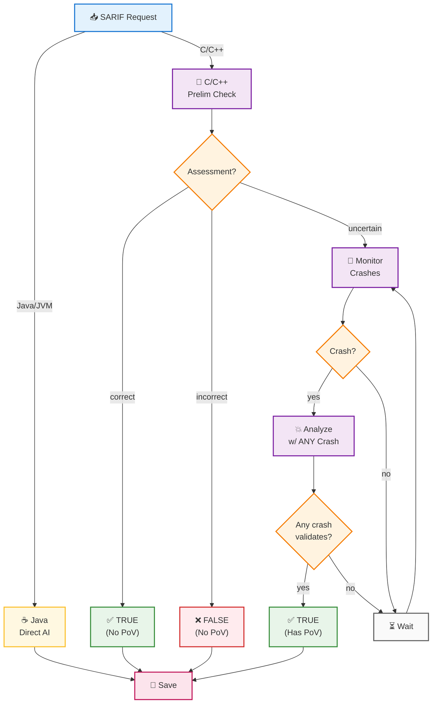

# SARIF Component: Validation Strategy

## Overview

The SARIF component validates [SARIF](https://sarifweb.azurewebsites.net/) (Static Analysis Results Interchange Format) reports to determine whether security vulnerability findings are true or false positives.

**Core Design: AI-First Strategy**
- All validation begins with LLM analysis regardless of language
- Java relies entirely on AI verdict
- C/C++ enhances AI analysis with crash correlation when available
- The system fundamentally trusts LLMs as the primary validation mechanism

## High-Level Validation Strategy

## Validation Strategies by Language

Language detection via OSS-Fuzz `project.yaml` [ossfuzz.py#L83-L104](https://github.com/Team-Atlanta/42-afc-crs/blob/main/components/sarif/src/ossfuzz.py#L83-L104), decision at [tasks.py#L89](https://github.com/Team-Atlanta/42-afc-crs/blob/main/components/sarif/src/tasks.py#L89).

### 1. Java/JVM Projects - Direct AI Validation (No PoV)
- **Implementation**: [tasks.py#L88-L145](https://github.com/Team-Atlanta/42-afc-crs/blob/main/components/sarif/src/tasks.py#L88-L145)
- **AI Evaluator Call Chain**:
  - `python3 -m evaluator.main` → [main.py#L138-L139](https://github.com/Team-Atlanta/42-afc-crs/blob/main/components/sarif/crs-prime-sarif-evaluator/evaluator/main.py#L138-L139)
  - → `main_cli()` → [main.py#L89-L136](https://github.com/Team-Atlanta/42-afc-crs/blob/main/components/sarif/crs-prime-sarif-evaluator/evaluator/main.py#L89-L136)
  - → `asyncio.run(run_sarif_eval())` → [main.py#L124-L131](https://github.com/Team-Atlanta/42-afc-crs/blob/main/components/sarif/crs-prime-sarif-evaluator/evaluator/main.py#L124-L131)
  - → `run_sarif_eval()` → [main.py#L25-L87](https://github.com/Team-Atlanta/42-afc-crs/blob/main/components/sarif/crs-prime-sarif-evaluator/evaluator/main.py#L25-L87)
- **AI Prompts**:
  - System prompt: [prompts.py#L1-L21](https://github.com/Team-Atlanta/42-afc-crs/blob/main/components/sarif/crs-prime-sarif-evaluator/evaluator/prompts.py#L1-L21)
  - Summary prompt: [prompts.py#L23-L26](https://github.com/Team-Atlanta/42-afc-crs/blob/main/components/sarif/crs-prime-sarif-evaluator/evaluator/prompts.py#L23-L26)
- **Tri-fold Result Strategy** ([tasks.py#L130-L138](https://github.com/Team-Atlanta/42-afc-crs/blob/main/components/sarif/src/tasks.py#L130-L138)):
  - **`assessment == 'correct'`** → Returns `True` (SARIF is valid)
  - **`assessment == 'incorrect'`** → Returns `False` (SARIF is invalid)
  - **Any other value** → Returns `None` with "Prefer not to report" (abstains from judgment)
- **Characteristics**:
  - Single-phase AI analysis using MCP Agent framework
  - **No PoV validation**: Relies entirely on static analysis without runtime evidence
  - No crash correlation available (no fuzzing for Java)
  - Up to 20 retry attempts for reliability

### 2. C/C++ Projects - Multi-Phase Validation
- **Implementation**: [checkers/seeds.py](https://github.com/Team-Atlanta/42-afc-crs/blob/main/components/sarif/src/checkers/seeds.py)

#### Phase 1: Preliminary Check (No PoV)
- **Location**: [seeds.py#L124-L170](https://github.com/Team-Atlanta/42-afc-crs/blob/main/components/sarif/src/checkers/seeds.py#L124-L170)
- **AI Configuration**:
  - Uses same AI evaluator as Java: [evaluator/main.py#L25-L87](https://github.com/Team-Atlanta/42-afc-crs/blob/main/components/sarif/crs-prime-sarif-evaluator/evaluator/main.py#L25-L87)
  - System prompt: [prompts.py#L1-L21](https://github.com/Team-Atlanta/42-afc-crs/blob/main/components/sarif/crs-prime-sarif-evaluator/evaluator/prompts.py#L1-L21)
  - With `--preliminary` flag modifier: [main.py#L64](https://github.com/Team-Atlanta/42-afc-crs/blob/main/components/sarif/crs-prime-sarif-evaluator/evaluator/main.py#L64)
  - Prompt addition: "only claim incorrect if confident enough" to reduce false negatives
  - Conservative approach to avoid missing real vulnerabilities
- **Outcomes** ([seeds.py#L152-L171](https://github.com/Team-Atlanta/42-afc-crs/blob/main/components/sarif/src/checkers/seeds.py#L152-L171)):
  - **`assessment == 'correct'`**: High confidence true positive → Return TRUE
  - **`assessment == 'incorrect'`**: High confidence false positive → Return FALSE
  - **Any other value**: Falls through to crash monitoring (line 171)
    - Note: Despite prompt requesting only "correct | incorrect", system handles unexpected values
    - Java explicitly returns "Prefer not to report" for such cases ([tasks.py#L136-L138](https://github.com/Team-Atlanta/42-afc-crs/blob/main/components/sarif/src/tasks.py#L136-L138))

#### Phase 2: Crash-Based Validation (Has PoV)
- **Location**: [seeds.py#L173-L377](https://github.com/Team-Atlanta/42-afc-crs/blob/main/components/sarif/src/checkers/seeds.py#L173-L377)
- **Trigger**: Only when preliminary check is uncertain

##### How Crash-SARIF Correlation Works:

**Important**: There's **no explicit one-to-one matching** between crashes and SARIF reports. Instead:

1. **Database Monitoring** ([seeds.py#L218-L231](https://github.com/Team-Atlanta/42-afc-crs/blob/main/components/sarif/src/checkers/seeds.py#L218-L231)):
   - Polls `BugProfiles` table for ALL crashes with same `task_id`
   - Iterates through each crash one by one
   - Each crash contains: `id`, `summary` (crash report text)

2. **AI-Based Matching** ([seeds.py#L279-L293](https://github.com/Team-Atlanta/42-afc-crs/blob/main/components/sarif/src/checkers/seeds.py#L279-L293)):
   - For each crash, saves `summary` to file
   - Passes to AI: `self.sarif_file` (the single SARIF) + `crash_report_path`
   - **The AI determines if THIS crash validates THIS SARIF**

3. **How MCP Agent Processes Files** ([main.py#L30-L34](https://github.com/Team-Atlanta/42-afc-crs/blob/main/components/sarif/crs-prime-sarif-evaluator/evaluator/main.py#L30-L34)):
   - Agent created with `server_names=["filesystem", "treesitter"]`
   - Has autonomous filesystem access ([prompts.py#L3](https://github.com/Team-Atlanta/42-afc-crs/blob/main/components/sarif/crs-prime-sarif-evaluator/evaluator/prompts.py#L3))
   - Prompt only mentions file paths: *"SARIF file(s) [path]"* and *"crash report file [path]"*
   - **The Agent autonomously reads both files** using its filesystem tools
   - Agent analyzes SARIF JSON structure and crash stack traces independently

4. **Matching Logic**:
   - **One SARIF → Many Crashes**: System tries each crash against the single SARIF
   - **First match wins**: Once any crash validates the SARIF, returns TRUE ([seeds.py#L353-L361](https://github.com/Team-Atlanta/42-afc-crs/blob/main/components/sarif/src/checkers/seeds.py#L353-L361))
   - **No explicit matching**: AI infers correlation from crash stack trace vs SARIF code locations

## AI-Powered Analysis Modes

### 1. Standard Analysis (Java)
- Direct SARIF validation against source code
- Binary assessment (correct/incorrect) + description

### 2. Preliminary Analysis (C/C++)
- Conservative filtering with `--preliminary` flag
- Accepts more uncertain cases for crash validation

### 3. Crash-Correlated Analysis (C/C++)
- Additional crash report via `--crash_path`
- Validates SARIF claims against empirical evidence

## Inactive Validation Strategies

### Directed Fuzzing (Commented Out)
- **Status**: Implemented but completely disabled in [tasks.py#L155-L158](https://github.com/Team-Atlanta/42-afc-crs/blob/main/components/sarif/src/tasks.py#L155-L158)
- **Implementation**: [src/checkers/directed_fuzzing.py](https://github.com/Team-Atlanta/42-afc-crs/blob/main/components/sarif/src/checkers/directed_fuzzing.py)
- **Separate Component**: Full implementation in [components/directed/](https://github.com/Team-Atlanta/42-afc-crs/blob/main/components/directed/)

#### What it was designed for:
1. Create targeted code slices containing SARIF-reported vulnerabilities
2. Use directed fuzzing to actively trigger reported vulnerabilities
3. Provide empirical evidence of exploitability

#### Two-stage process (when active):
- **Stage 1**: SliceChecker generates code slices (also commented out)
- **Stage 2**: DirectedFuzzingChecker sends slices to directed fuzzing service via `CRS_DF_QUEUE`

#### Why it's disabled:
- Computational expense - resource-intensive fuzzing
- Reliability issues - inconsistent results
- Simplified workflow preference - current AI + crash correlation is simpler and sufficient

**Note**: Infrastructure still exists (Docker services, message queues) but the workflow deliberately uses only AI analysis (Java) and crash-based validation (C/C++) for better reliability and performance.

## Implementation References

- **Main Orchestrator**: [src/tasks.py](https://github.com/Team-Atlanta/42-afc-crs/blob/main/components/sarif/src/tasks.py)
- **C/C++ Validator**: [src/checkers/seeds.py](https://github.com/Team-Atlanta/42-afc-crs/blob/main/components/sarif/src/checkers/seeds.py)
- **AI Evaluator**: [crs-prime-sarif-evaluator/evaluator/main.py](https://github.com/Team-Atlanta/42-afc-crs/blob/main/components/sarif/crs-prime-sarif-evaluator/evaluator/main.py)
- **Language Detection**: [src/ossfuzz.py](https://github.com/Team-Atlanta/42-afc-crs/blob/main/components/sarif/src/ossfuzz.py)