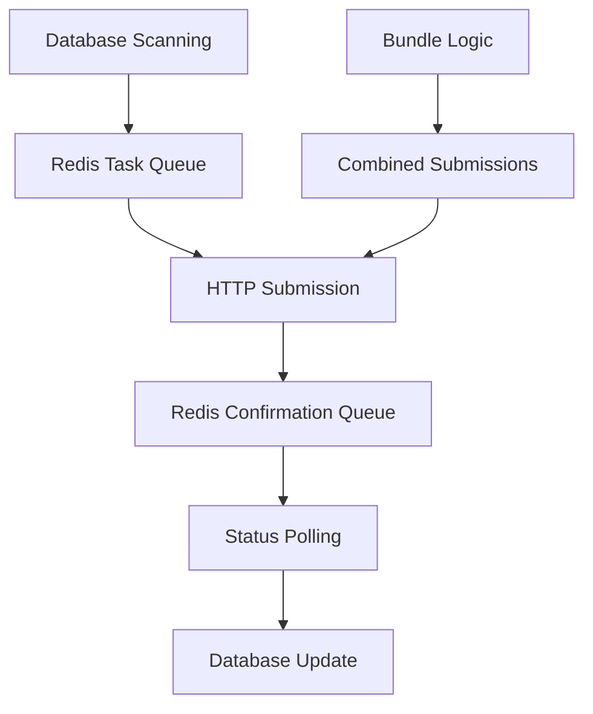

# Submitter Component Analysis

The **Submitter** component handles automated submission of discovered vulnerabilities, patches, and SARIF reports to the competition platform. It manages the entire submission lifecycle from preparation to confirmation.

## Purpose and Functionality

- **Automated Submission Pipeline**: Continuously monitors database for submission-ready items
- **Multi-Type Submission Support**: Handles POVs (Proof of Vulnerabilities), patches, and SARIF reports
- **Submission State Management**: Tracks submission status through multiple stages
- **Competition Integration**: Interfaces with external competition API endpoints

## Architecture Overview

### Core Technologies

- **Python 3.11+** with asyncio for concurrent processing
- **PostgreSQL** for data persistence and state management
- **Redis Sentinel** for message queues and coordination
- **aiohttp** for HTTP client operations
- **SQLAlchemy** for database ORM
- **OpenTelemetry** for distributed tracing

### Key Components

#### 1. Main Application ([`app.py`](../components/submitter/app.py))

Async main application orchestrating all workers:

```python
async def main():
    # Initialize database connections
    # Start four concurrent workers
    # Handle graceful shutdown and cleanup
    await asyncio.gather(
        db_worker(),
        submit_worker(),
        confirm_worker(),
        bundle_worker()
    )
```

#### 2. Worker Logic ([`workers.py`](../components/submitter/workers.py))

Core worker implementations for each stage:

```python
class SubmissionWorker:
    async def db_worker(self):
        # Scans database for submission-ready items
        # Prepares submission data and queues items

    async def submit_worker(self):
        # Takes items from queue and submits to API
        # Handles HTTP authentication and errors

    async def confirm_worker(self):
        # Polls submission status until confirmation
        # Updates database with results

    async def bundle_worker(self):
        # Creates bundled POV+patch submissions
```

#### 3. Submission Logic ([`submission.py`](../components/submitter/submission.py))

HTTP submission and confirmation handlers:

```python
def prepare_pov_submission_data(content):
    return {
        "architecture": content.architecture,
        "fuzzer_name": content.harness_name,
        "sanitizer": content.sanitizer,
        "testcase": base64.b64encode(pov_data).decode(),
        "engine": "libfuzzer",
    }

async def submit_to_competition_api(data, endpoint):
    # HTTP submission with authentication
    # Error handling and retry logic
```

## Worker Architecture

### Four-Worker Pipeline



#### 1. Database Worker (`db_worker`)

**Purpose**: Scans database for submission-ready items and queues them

```python
async def db_worker():
    while True:
        # Scan for ready bugs
        ready_bugs = await get_ready_bugs()
        for bug in ready_bugs:
            await queue_bug_submission(bug)

        # Scan for ready patches
        ready_patches = await get_ready_patches()
        for patch in ready_patches:
            await queue_patch_submission(patch)

        # Scan for ready SARIF reports
        ready_sarif = await get_ready_sarif()
        for sarif in ready_sarif:
            await queue_sarif_submission(sarif)

        await asyncio.sleep(SCAN_INTERVAL)
```

#### 2. Submit Worker (`submit_worker`)

**Purpose**: Takes items from task queue and submits to competition API

```python
async def submit_worker():
    while True:
        task = await redis.lpop("submission_task_queue")
        if task:
            try:
                result = await submit_to_api(task)
                await redis.lpush("confirmation_queue", result)
            except SubmissionError as e:
                await handle_submission_error(task, e)
```

#### 3. Confirm Worker (`confirm_worker`)

**Purpose**: Polls submission status until final confirmation

```python
async def confirm_worker():
    while True:
        submission = await redis.lpop("confirmation_queue")
        if submission:
            status = await poll_submission_status(submission.id)
            if status.is_final():
                await update_database_status(submission, status)
            else:
                await redis.lpush("confirmation_queue", submission)
```

#### 4. Bundle Worker (`bundle_worker`)

**Purpose**: Creates bundled submissions combining POV + patch

```python
async def bundle_worker():
    while True:
        # Find successful POV/patch pairs
        bundles = await find_bundle_candidates()
        for pov, patch in bundles:
            bundle_data = create_bundle_submission(pov, patch)
            await submit_bundle(bundle_data)
```

## Database Integration

### Models ([`db.py`](../components/submitter/db.py))

SQLAlchemy models for submission tracking:

```python
class Bug(Base):
    __tablename__ = 'bugs'
    id = Column(Integer, primary_key=True)
    task_id = Column(String)
    summary = Column(Text)
    poc = Column(Text)
    harness_name = Column(Text)
    sarif_report = Column(JSON)
    submission_status = Column(Enum(SubmissionStatus))

class Patch(Base):
    __tablename__ = 'patches'
    id = Column(Integer, primary_key=True)
    task_id = Column(String)
    diff = Column(Text)
    model = Column(String)
    submission_status = Column(Enum(SubmissionStatus))

class PatchStatus(Base):
    __tablename__ = 'patch_status'
    id = Column(Integer, primary_key=True)
    patch_id = Column(Integer, ForeignKey('patches.id'))
    status = Column(Enum(SubmissionStatusEnum))
    feedback = Column(Text)
    submission_time = Column(DateTime)
```

### Submission State Management

```python
# Submission status lifecycle
class SubmissionStatus(Enum):
    PENDING = "pending"
    SUBMITTED = "submitted"
    CONFIRMED = "confirmed"
    FAILED = "failed"
    INCONCLUSIVE = "inconclusive"
```

## Configuration and Environment

### Environment Variables

```bash
DATABASE_URL              # PostgreSQL connection
REDIS_SENTINEL_HOSTS      # Redis cluster configuration
REDIS_MASTER              # Redis master name
REDIS_PASSWORD            # Redis authentication
COMPETITION_API_URL       # Competition platform endpoint
COMPETITION_API_KEY       # API authentication key
SCAN_INTERVAL            # Database scan frequency (seconds)
CONFIRMATION_TIMEOUT     # Submission confirmation timeout
```

### Submission Configuration

```python
class SubmissionConfig:
    API_ENDPOINTS = {
        "pov": "/api/v1/pov",
        "patch": "/api/v1/patch",
        "sarif": "/api/v1/sarif",
        "bundle": "/api/v1/bundle"
    }

    RETRY_DELAYS = [1, 5, 15, 60]  # Exponential backoff
    MAX_RETRIES = 4
    CONFIRMATION_POLL_INTERVAL = 30  # seconds
```

## Submission Data Preparation

### POV Submission Format

```python
def prepare_pov_submission_data(bug):
    return {
        "architecture": bug.architecture,
        "fuzzer_name": bug.harness_name,
        "sanitizer": bug.sanitizer,
        "testcase": base64.b64encode(bug.poc).decode(),
        "engine": "libfuzzer",
        "metadata": {
            "task_id": bug.task_id,
            "discovery_time": bug.created_at.isoformat()
        }
    }
```

### Patch Submission Format

```python
def prepare_patch_submission_data(patch):
    return {
        "diff": patch.diff,
        "model": patch.model,
        "target_bugs": [bug.id for bug in patch.target_bugs],
        "metadata": {
            "task_id": patch.task_id,
            "generation_time": patch.created_at.isoformat()
        }
    }
```

### SARIF Submission Format

```python
def prepare_sarif_submission_data(sarif_result):
    return {
        "sarif_report": sarif_result.sarif_report,
        "validation_status": sarif_result.validation_status,
        "metadata": {
            "task_id": sarif_result.task_id,
            "analysis_time": sarif_result.created_at.isoformat()
        }
    }
```

## Error Handling and Resilience

### Retry Logic

```python
async def submit_with_retry(data, endpoint, max_retries=4):
    for attempt in range(max_retries):
        try:
            response = await submit_to_api(data, endpoint)
            return response
        except (aiohttp.ClientError, asyncio.TimeoutError) as e:
            if attempt == max_retries - 1:
                raise SubmissionError(f"Max retries exceeded: {e}")
            delay = RETRY_DELAYS[min(attempt, len(RETRY_DELAYS) - 1)]
            await asyncio.sleep(delay)
```

### Error Classification

```python
class SubmissionError(Exception):
    def __init__(self, message, error_type="unknown", retryable=True):
        self.message = message
        self.error_type = error_type
        self.retryable = retryable

# Error types
ERROR_TYPES = {
    "network": {"retryable": True, "delay": 60},
    "auth": {"retryable": False, "delay": 0},
    "validation": {"retryable": False, "delay": 0},
    "rate_limit": {"retryable": True, "delay": 300}
}
```

## Integration with Competition Platform

### Authentication

```python
async def authenticate_request(session, api_key):
    headers = {
        "Authorization": f"Bearer {api_key}",
        "Content-Type": "application/json",
        "User-Agent": "CRS-Submitter/1.0"
    }
    return headers
```

### Submission Tracking

```python
async def track_submission_status(submission_id):
    # Poll competition API for status updates
    status_url = f"{API_BASE}/submissions/{submission_id}/status"
    response = await session.get(status_url)

    if response.status == 200:
        status_data = await response.json()
        return SubmissionStatus(status_data["status"])
    else:
        raise StatusCheckError(f"Status check failed: {response.status}")
```

## Telemetry and Monitoring

### OpenTelemetry Integration

```python
from opentelemetry import trace

tracer = trace.get_tracer(__name__)

async def submit_with_telemetry(data, endpoint):
    with tracer.start_as_current_span("submission") as span:
        span.set_attribute("endpoint", endpoint)
        span.set_attribute("submission_type", data["type"])

        try:
            result = await submit_to_api(data, endpoint)
            span.set_attribute("success", True)
            return result
        except Exception as e:
            span.set_attribute("success", False)
            span.set_attribute("error", str(e))
            raise
```

### Metrics Collection

```python
# Key metrics tracked
SUBMISSION_METRICS = {
    "submissions_total": Counter("Total submissions attempted"),
    "submissions_success": Counter("Successful submissions"),
    "submissions_failed": Counter("Failed submissions"),
    "submission_duration": Histogram("Submission processing time"),
    "confirmation_duration": Histogram("Confirmation waiting time")
}
```

This Submitter component provides a robust, fault-tolerant system for automatically submitting competition results while maintaining comprehensive tracking and monitoring capabilities essential for the AIxCC competition environment.