# Triage Component: Crash Analysis and Bug Deduplication System

## Overview

The Triage component is a comprehensive bug analysis and classification system that processes crash reports from fuzzing campaigns. It builds projects, replays proof-of-concept (PoC) crashes, analyzes sanitizer reports, and performs intelligent deduplication to group similar bugs. The system ensures that each unique vulnerability is identified and categorized properly while eliminating redundant crash reports.

## Architecture

### Core Workflow
1. **Message Reception**: Receives crash tasks from RabbitMQ queue
2. **Project Building**: Compiles target projects with appropriate sanitizers
3. **Crash Replay**: Reproduces crashes using PoC files
4. **Report Parsing**: Analyzes sanitizer output to extract bug details
5. **Deduplication**: Groups similar crashes using AI-powered analysis
6. **Database Storage**: Stores bug profiles and cluster relationships

## Key Components

### Task Handler ([task_handler.py](../components/triage/task_handler.py))

**Main Entry Point**: [listen_for_tasks()](../components/triage/task_handler.py#L574-L937)
- Connects to RabbitMQ and processes incoming crash tasks
- Multi-threaded processing with configurable prefetch count
- Retry logic with exponential backoff (max 3 attempts)
- Task validation against Redis status

**Task Message Format**:
```json
{
    "bug_id": "unique_crash_identifier",
    "task_id": "challenge_task_id",
    "poc_path": "path_to_proof_of_concept",
    "harness_name": "target_fuzzer_binary",
    "sanitizer": "address|memory|undefined|*",
    "task_type": "full|delta",
    "project_name": "target_project",
    "focus": "primary_repository",
    "repo": ["list_of_repository_archives"],
    "fuzz_tooling": "oss_fuzz_archive",
    "diff": "patch_file_archive" // optional for delta mode
}
```

### Project Building System

#### Build Orchestration ([build_project()](../components/triage/task_handler.py#L68-L225))
- **Caching Strategy**: Redis-coordinated build caching per task/sanitizer/state
- **Archive Extraction**: Handles repository, fuzzing tooling, and diff archives
- **Diff Application**: Supports both file and directory patch formats
- **Container Management**: Launches persistent runner containers

#### OSS-Fuzz Integration ([infra/oss_fuzz.py](../components/triage/infra/oss_fuzz.py))
- **Docker-based Compilation**: Uses OSS-Fuzz Dockerfiles
- **Sanitizer Support**: Address, Memory, Undefined Behavior sanitizers
- **Harness Discovery**: Automatically finds fuzzer binaries with `LLVMFuzzerTestOneInput`
- **PoC Replay**: Executes crash reproduction in controlled environment

### Crash Analysis Pipeline

#### Task Processing Modes

**Full Mode** ([process_task_with_sanitizer()](../components/triage/task_handler.py#L694-L717)):
- Builds project with specified sanitizer
- Replays PoC against target harness(es)
- Analyzes crash output for vulnerability classification

**Delta Mode** ([task_handler.py#L719-L778](../components/triage/task_handler.py#L719-L778)):
- Builds both unpatched (base) and patched (delta) versions
- Compares crash behavior between states
- Only processes crashes that appear in delta but not base state
- Flags delta-only bugs for patch analysis

#### Universal Harness Support
- **Wildcard Processing**: `harness_name: "*"` discovers all available fuzzers
- **Multi-harness Analysis**: Processes each discovered harness independently
- **Harness Discovery**: Uses `find_fuzzers()` to locate valid fuzzing targets

### Sanitizer Report Parsing

#### Unified Parser ([parser/unifiedparser.py](../components/triage/parser/unifiedparser.py))
- **Multi-format Support**: Handles various sanitizer output formats
- **Pattern Matching**: Regex-based extraction of bug types and locations
- **Sanitizer Types**: AddressSanitizer, MemorySanitizer, UBSan, LeakSanitizer
- **Error Classification**: Extracts CWE categories and trigger points

**Parsing Logic**:
1. **Traditional Format**: `==PID==ERROR: SanitizerName: description`
2. **Simple Format**: `file:line:col: runtime error: description`
3. **Special Cases**: LeakSanitizer and timeout/OOM detection

#### Crash Report Structure
```python
class UnifiedSanitizerReport:
    sanitizer: Sanitizer      # Type of sanitizer
    content: str             # Full crash report
    cwe: str                 # Bug classification
    trigger_point: str       # Location/cause of crash
    summary: str            # Processed summary
```

### Deduplication System

#### Workflow ([dedup/workflow.py](../components/triage/dedup/workflow.py))

**Main Process** ([do_dedup()](../components/triage/dedup/workflow.py#L100-L186)):
1. **Repository Setup**: Extracts and prepares project files
2. **Crash Retrieval**: Gets crash report from database
3. **Cluster Query**: Finds existing bug clusters for task
4. **Comparison Logic**: Tests new crash against each cluster
5. **Association**: Either creates new cluster or joins existing

#### Deduplication Methods

**Codex-based Deduplication** ([dedup/codex_dedup.py](../components/triage/dedup/codex_dedup.py#L26-L98)):
- **AI-Powered Analysis**: Uses LLM to understand root causes
- **Code-Aware**: Analyzes stack traces against actual source code
- **Conservative Approach**: Only marks as duplicate with 100% confidence
- **Ultra-Thinking Mode**: Enhanced reasoning for complex cases

**Process**:
1. Formats base crashes and new crash for comparison
2. Prompts LLM to analyze root causes using code analysis tools
3. Requires exact location identification in source code
4. Returns binary YES/NO decision on duplication

**ClusterFuzz Deduplication** ([dedup/clusterfuzz_dedup.py](../components/triage/dedup/clusterfuzz_dedup.py)):
- Traditional stack trace-based comparison
- Fallback method when AI analysis unavailable

### Database Integration

#### Data Models
```sql
-- Bug profiles store unique crash characteristics
CREATE TABLE bug_profiles (
    id serial PRIMARY KEY,
    task_id text NOT NULL,
    harness_name text NOT NULL,
    sanitizer_bug_type text NOT NULL,
    trigger_point text NOT NULL,
    summary text NOT NULL,
    sanitizer text NOT NULL
);

-- Bug groups link individual crashes to profiles
CREATE TABLE bug_groups (
    id serial PRIMARY KEY,
    bug_id integer NOT NULL REFERENCES bugs(id),
    bug_profile_id integer NOT NULL REFERENCES bug_profiles(id),
    diff_only boolean DEFAULT false,
    created_at timestamp with time zone DEFAULT now(),
    UNIQUE(bug_id, bug_profile_id)
);
```

#### Clustering Logic ([dedup_and_update_db()](../components/triage/task_handler.py#L401-L565))
1. **Profile Creation**: Creates new bug profile for unseen crash signatures
2. **Redis Locking**: Prevents race conditions during profile creation
3. **Cluster Assignment**: Associates profiles with existing or new clusters
4. **Patch Queue Integration**: Sends prioritized patches for new clusters

### Message Queue Integration

#### Queue Management
- **Patch Queue**: High-priority patches for new bug clusters
- **Dedup Queue**: Secondary deduplication processing
- **Timeout Queue**: Specialized handling for timeout/OOM crashes

#### Priority System
- **New Clusters**: Priority 8-10 (highest)
- **Active Tasks**: Priority 3-7 (medium)
- **Timeout/OOM**: Priority 10 (critical)

### Specialized Processing

#### Timeout/OOM Triage
- **Dedicated Processing**: Separate pods for timeout/out-of-memory crashes
- **Routing Logic**: Environment-based sender/processor role assignment
- **Queue Isolation**: Prevents resource contention with regular crashes

#### Delta Analysis
- **Patch-Aware**: Identifies bugs introduced by specific changes
- **Base State Validation**: Ensures crashes don't exist in unpatched code
- **Diff-Only Flagging**: Marks vulnerabilities specific to patch changes

## Configuration

### Environment Variables
```bash
RABBITMQ_HOST          # Message queue connection
QUEUE_NAME            # Triage task queue name
DATABASE_URL          # PostgreSQL connection string
REDIS_SENTINEL_HOSTS  # Redis cluster endpoints
REDIS_MASTER          # Redis master name
STORAGE_DIR           # Persistent storage path
PREFETCH_COUNT        # Concurrent task processing limit
DEDUP_MODEL           # AI model for deduplication (o4-mini)
DEDUP_METHOD          # codex|clusterfuzz
TIMEOUT_OOM_TRIAGE    # sender|processor|none
LOG_BROKEN_REPORT     # Enable crash report logging
ULTRA_THINKING_MODE   # Enhanced AI reasoning
```

### Performance Tuning
- **Build Caching**: Redis-coordinated caching reduces compilation overhead
- **Container Reuse**: Persistent runner containers for PoC replay
- **Parallel Processing**: Configurable prefetch count for concurrent tasks
- **Lock Management**: Fine-grained Redis locks prevent resource conflicts

## Integration Points

### CRS System Flow
1. **Input**: Receives crash tasks from fuzzing components (BandFuzz)
2. **Processing**: Builds, replays, and analyzes crashes
3. **Output**: Stores bug profiles and triggers patch generation
4. **Feedback**: Updates Redis with cluster information for scheduling

### Patch Generation Integration
- **New Cluster Detection**: Triggers immediate patch attempts
- **Priority Scheduling**: High-priority patches for novel vulnerabilities
- **Active Task Monitoring**: Continuous patch attempts for ongoing tasks

## Triage Workflow Diagram

```mermaid
graph TB
    %% Input
    INPUT["INPUT<br/>━━━━━━━━━━━━━━━━━━━━━━━━━━━━<br/>• RabbitMQ Task Message<br/>• bug_id: Crash identifier<br/>• task_id: Challenge ID<br/>• poc_path: Proof of concept<br/>• harness_name: Target fuzzer<br/>• sanitizer: address/memory/undefined/*<br/>• task_type: full/delta<br/>• project_name: Target project<br/>• repo: Repository archives<br/>• fuzz_tooling: OSS-Fuzz setup"]

    %% Stage 1: Task Reception & Validation
    subgraph S1["STAGE 1: TASK RECEPTION & VALIDATION"]
        direction TB

        RECEIVE_MSG["Message Reception<br/>(task_handler.py:601-633)"]
        PARSE_TASK["Parse Task Data<br/>Extract task metadata"]
        VALIDATE_TASK["Task Status Validation<br/>Check Redis task status<br/>(task_handler.py:637-646)"]
        THREAD_SPAWN["Spawn Processing Thread<br/>Multi-threaded execution"]

        RECEIVE_MSG --> PARSE_TASK
        PARSE_TASK --> VALIDATE_TASK
        VALIDATE_TASK --> THREAD_SPAWN
    end

    OUT1["OUTPUT → STAGE 2<br/>━━━━━━━━━━━━━━━━━━━━━━━━━━━━<br/>• Validated TaskData object<br/>• Processing thread spawned<br/>• Task marked for processing"]

    %% Stage 2: Project Building & Compilation
    subgraph S2["STAGE 2: PROJECT BUILDING & COMPILATION"]
        direction TB

        subgraph "Build Coordination"
            REDIS_LOCK["Acquire Redis Build Lock<br/>(task_handler.py:86-89)"]
            CHECK_CACHE["Check Build Cache<br/>Redis build status<br/>(task_handler.py:91-101)"]
            EXTRACT_ARCHIVES["Extract Archives<br/>Repos, fuzz_tooling, diff<br/>(task_handler.py:106-129)"]
        end

        subgraph "Compilation Process"
            APPLY_DIFF["Apply Diff Patches<br/>Delta mode only<br/>(task_handler.py:132-162)"]
            COMPILE_OSS["OSS-Fuzz Compilation<br/>(oss_fuzz.py:89-100)<br/>Docker-based build"]
            CACHE_RESULTS["Cache Build Results<br/>Global cache storage<br/>(task_handler.py:171-191)"]
        end

        subgraph "Container Management"
            LAUNCH_RUNNER["Launch Runner Container<br/>(task_handler.py:200-215)"]
            CONTAINER_READY["Container Ready<br/>PoC replay environment"]
        end

        REDIS_LOCK --> CHECK_CACHE
        CHECK_CACHE --> EXTRACT_ARCHIVES
        EXTRACT_ARCHIVES --> APPLY_DIFF
        APPLY_DIFF --> COMPILE_OSS
        COMPILE_OSS --> CACHE_RESULTS
        CACHE_RESULTS --> LAUNCH_RUNNER
        LAUNCH_RUNNER --> CONTAINER_READY
    end

    OUT2["OUTPUT → STAGE 3<br/>━━━━━━━━━━━━━━━━━━━━━━━━━━━━<br/>• Compiled project binaries<br/>• Runner container active<br/>• Harness binaries available"]

    %% Stage 3: Sanitizer Processing
    subgraph S3["STAGE 3: SANITIZER & HARNESS PROCESSING"]
        direction TB

        SANITIZER_CHECK{"Sanitizer Type?<br/>(task_handler.py:648-656)"}
        MULTI_SANITIZER["Multi-Sanitizer Mode<br/>address, memory, undefined"]
        SINGLE_SANITIZER["Single Sanitizer Mode<br/>Specified sanitizer"]

        subgraph "Harness Discovery"
            HARNESS_CHECK{"Harness Name?<br/>(task_handler.py:700-704)"}
            FIND_HARNESSES["find_fuzzers()<br/>Discover all fuzzers<br/>(oss_fuzz.py:53-86)"]
            SINGLE_HARNESS["Use Specified Harness"]
        end

        SANITIZER_CHECK -->|"*"| MULTI_SANITIZER
        SANITIZER_CHECK -->|specific| SINGLE_SANITIZER
        MULTI_SANITIZER --> HARNESS_CHECK
        SINGLE_SANITIZER --> HARNESS_CHECK
        HARNESS_CHECK -->|"*"| FIND_HARNESSES
        HARNESS_CHECK -->|specific| SINGLE_HARNESS
    end

    OUT3["OUTPUT → STAGE 4<br/>━━━━━━━━━━━━━━━━━━━━━━━━━━━━<br/>• Sanitizer configuration set<br/>• Target harness(es) identified<br/>• Ready for crash replay"]

    %% Stage 4: Task Type Processing
    subgraph S4["STAGE 4: TASK TYPE PROCESSING"]
        direction TB

        TASK_TYPE{"Task Type?<br/>(task_handler.py:695-778)"}

        subgraph "Full Mode Processing"
            FULL_BUILD["Build with Sanitizer<br/>(task_handler.py:696-698)"]
            FULL_REPLAY["Replay PoC<br/>(task_handler.py:709-714)"]
            FULL_TRIAGE["Triage Output<br/>(task_handler.py:716-717)"]
        end

        subgraph "Delta Mode Processing"
            DELTA_BASE["Build Base State<br/>Unpatched version<br/>(task_handler.py:721-727)"]
            DELTA_PATCHED["Build Patched State<br/>With diff applied<br/>(task_handler.py:729-730)"]
            DELTA_COMPARE["Compare Crash Behavior<br/>(task_handler.py:741-778)"]
            DELTA_FILTER["Filter Base Crashes<br/>Skip if crashes in base<br/>(task_handler.py:748-757)"]
        end

        TASK_TYPE -->|full| FULL_BUILD
        TASK_TYPE -->|delta| DELTA_BASE

        FULL_BUILD --> FULL_REPLAY
        FULL_REPLAY --> FULL_TRIAGE

        DELTA_BASE --> DELTA_PATCHED
        DELTA_PATCHED --> DELTA_COMPARE
        DELTA_COMPARE --> DELTA_FILTER
    end

    OUT4["OUTPUT → STAGE 5<br/>━━━━━━━━━━━━━━━━━━━━━━━━━━━━<br/>• PoC replay completed<br/>• Crash output captured<br/>• Return codes available"]

    %% Stage 5: Crash Analysis & Parsing
    subgraph S5["STAGE 5: CRASH ANALYSIS & PARSING"]
        direction TB

        CRASH_CHECK{"Crash Detected?<br/>Return code != 0"}

        subgraph "Sanitizer Parsing"
            PARSER_SELECT["Select Parser<br/>Java vs C/C++<br/>(task_handler.py:781-784)"]
            UNIFIED_PARSER["UnifiedSanitizerReport<br/>(unifiedparser.py:53-169)"]

            subgraph "Pattern Matching"
                TRADITIONAL_PARSE["Traditional Format<br/>==PID==ERROR: Sanitizer"]
                SIMPLE_PARSE["Simple Format<br/>file:line:col: runtime error"]
                LEAK_PARSE["LeakSanitizer Special<br/>Memory leak detection"]
            end

            EXTRACT_INFO["Extract Bug Info<br/>• CWE classification<br/>• Trigger point<br/>• Summary text"]
        end

        CRASH_CHECK -->|yes| PARSER_SELECT
        CRASH_CHECK -->|no| NO_CRASH["No Crash Detected<br/>Skip processing"]

        PARSER_SELECT --> UNIFIED_PARSER
        UNIFIED_PARSER --> TRADITIONAL_PARSE
        UNIFIED_PARSER --> SIMPLE_PARSE
        UNIFIED_PARSER --> LEAK_PARSE
        TRADITIONAL_PARSE --> EXTRACT_INFO
        SIMPLE_PARSE --> EXTRACT_INFO
        LEAK_PARSE --> EXTRACT_INFO
    end

    OUT5["OUTPUT → STAGE 6<br/>━━━━━━━━━━━━━━━━━━━━━━━━━━━━<br/>• Parsed crash report<br/>• Bug type identified<br/>• Trigger point located<br/>• Summary generated"]

    %% Stage 6: Deduplication & Database
    subgraph S6["STAGE 6: DEDUPLICATION & DATABASE OPERATIONS"]
        direction TB

        TIMEOUT_CHECK{"Timeout/OOM Bug?<br/>(task_handler.py:419-429)"}
        TIMEOUT_ROUTE["Route to Timeout Queue<br/>Specialized processing"]

        subgraph "Profile Management"
            PROFILE_LOCK["Acquire Profile Lock<br/>Redis coordination<br/>(task_handler.py:442-443)"]
            PROFILE_CHECK["Check Existing Profile<br/>Pentuple signature<br/>(task_handler.py:446-447)"]
            CREATE_PROFILE["Create New Profile<br/>(task_handler.py:457-476)"]
            PROFILE_GROUP["Create Bug Group<br/>(task_handler.py:481-489)"]
        end

        subgraph "Deduplication Process"
            DEDUP_WORKFLOW["do_dedup()<br/>(workflow.py:100-186)"]
            SETUP_REPOS["Setup Repository<br/>Extract & patch files"]
            QUERY_CLUSTERS["Query Existing Clusters<br/>For current task"]

            subgraph "Dedup Methods"
                DEDUP_METHOD{"Dedup Method?<br/>(workflow.py:158-170)"}
                CODEX_DEDUP["Codex AI Deduplication<br/>(codex_dedup.py:26-98)"]
                CLUSTERFUZZ_DEDUP["ClusterFuzz Deduplication<br/>Stack trace comparison"]
            end

            CLUSTER_DECISION{"Is Duplicate?"}
            NEW_CLUSTER["Create New Cluster<br/>(workflow.py:183-185)"]
            JOIN_CLUSTER["Join Existing Cluster<br/>(workflow.py:177-179)"]
        end

        subgraph "Queue Integration"
            PATCH_QUEUE["Send to Patch Queue<br/>Priority-based routing<br/>(task_handler.py:543-553)"]
            ACTIVE_TASKS["Update Active Tasks<br/>Cluster management<br/>(task_handler.py:551-552)"]
        end

        TIMEOUT_CHECK -->|yes| TIMEOUT_ROUTE
        TIMEOUT_CHECK -->|no| PROFILE_LOCK

        PROFILE_LOCK --> PROFILE_CHECK
        PROFILE_CHECK -->|new| CREATE_PROFILE
        PROFILE_CHECK -->|existing| DEDUP_WORKFLOW
        CREATE_PROFILE --> PROFILE_GROUP
        PROFILE_GROUP --> DEDUP_WORKFLOW

        DEDUP_WORKFLOW --> SETUP_REPOS
        SETUP_REPOS --> QUERY_CLUSTERS
        QUERY_CLUSTERS --> DEDUP_METHOD
        DEDUP_METHOD -->|codex| CODEX_DEDUP
        DEDUP_METHOD -->|clusterfuzz| CLUSTERFUZZ_DEDUP
        CODEX_DEDUP --> CLUSTER_DECISION
        CLUSTERFUZZ_DEDUP --> CLUSTER_DECISION
        CLUSTER_DECISION -->|yes| JOIN_CLUSTER
        CLUSTER_DECISION -->|no| NEW_CLUSTER
        NEW_CLUSTER --> PATCH_QUEUE
        JOIN_CLUSTER --> ACTIVE_TASKS
    end

    OUT6["OUTPUT → STAGE 7<br/>━━━━━━━━━━━━━━━━━━━━━━━━━━━━<br/>• Bug profile stored in database<br/>• Cluster assignment complete<br/>• Patch queue updated<br/>• Redis cluster data updated"]

    %% Stage 7: Completion & Cleanup
    subgraph S7["STAGE 7: COMPLETION & CLEANUP"]
        direction TB

        UPDATE_REDIS["Update Redis Clusters<br/>Task bug cluster mapping<br/>(task_handler.py:499-506)"]
        LOG_TELEMETRY["Log Telemetry Events<br/>Bug discovery metrics"]
        ACK_MESSAGE["Acknowledge Message<br/>RabbitMQ completion<br/>(task_handler.py:658-659)"]
        CLEANUP["Cleanup Resources<br/>Release locks & containers"]

        UPDATE_REDIS --> LOG_TELEMETRY
        LOG_TELEMETRY --> ACK_MESSAGE
        ACK_MESSAGE --> CLEANUP
    end

    FINAL_OUT["FINAL OUTPUT<br/>━━━━━━━━━━━━━━━━━━━━━━━━━━━━<br/>• Bug profile in database<br/>• Cluster relationships established<br/>• Patch generation triggered<br/>• Telemetry data recorded<br/>• Task marked complete"]

    %% Main flow connections
    INPUT --> S1
    S1 --> OUT1
    OUT1 --> S2
    S2 --> OUT2
    OUT2 --> S3
    S3 --> OUT3
    OUT3 --> S4
    S4 --> OUT4
    OUT4 --> S5
    S5 --> OUT5
    OUT5 --> S6
    S6 --> OUT6
    OUT6 --> S7
    S7 --> FINAL_OUT

    %% Error and special case flows
    NO_CRASH --> FINAL_OUT
    TIMEOUT_ROUTE --> FINAL_OUT

    %% Styling
    classDef inputOutput fill:#e1f5fe,stroke:#01579b,stroke-width:3px,color:#000
    classDef stage fill:#fff8e1,stroke:#f57f17,stroke-width:2px
    classDef building fill:#e8f5e9,stroke:#388e3c,stroke-width:2px
    classDef processing fill:#f3e5f5,stroke:#7b1fa2,stroke-width:2px
    classDef parsing fill:#fff3e0,stroke:#ef6c00,stroke-width:2px
    classDef dedup fill:#ffebee,stroke:#c62828,stroke-width:2px
    classDef completion fill:#fce4ec,stroke:#c2185b,stroke-width:2px
    classDef decision fill:#e0f2f1,stroke:#00695c,stroke-width:2px
    classDef error fill:#ffcdd2,stroke:#d32f2f,stroke-width:2px

    class INPUT,OUT1,OUT2,OUT3,OUT4,OUT5,OUT6,FINAL_OUT inputOutput
    class S1,S2,S3,S4,S5,S6,S7 stage
    class REDIS_LOCK,COMPILE_OSS,CACHE_RESULTS,LAUNCH_RUNNER building
    class SANITIZER_CHECK,HARNESS_CHECK,TASK_TYPE,FULL_REPLAY,DELTA_COMPARE processing
    class PARSER_SELECT,UNIFIED_PARSER,EXTRACT_INFO parsing
    class DEDUP_WORKFLOW,CODEX_DEDUP,CLUSTER_DECISION,PATCH_QUEUE dedup
    class UPDATE_REDIS,ACK_MESSAGE,CLEANUP completion
    class CRASH_CHECK,TIMEOUT_CHECK,PROFILE_CHECK,DEDUP_METHOD decision
    class NO_CRASH,TIMEOUT_ROUTE error
```



## Performance and Scalability

### Optimization Strategies
- **Build Caching**: Reduces compilation time by 80-90% for repeated tasks
- **Container Reuse**: Persistent containers eliminate startup overhead
- **Parallel Processing**: Configurable concurrency based on system resources
- **Intelligent Deduplication**: AI-powered analysis reduces false positives

### Monitoring and Observability
- **OpenTelemetry Integration**: Distributed tracing across components
- **Redis Metrics**: Build cache hit rates and lock contention
- **Queue Monitoring**: Processing rates and retry patterns
- **Database Performance**: Profile creation and cluster query efficiency

The Triage component serves as a critical bridge between fuzzing discovery and vulnerability remediation, ensuring that each unique security issue is properly identified, classified, and prepared for automated patching.